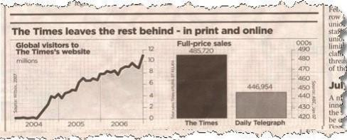



```{r}
#| eval: true
#| echo: false
#| output: false

library(ggplot2)

#opvulkleur <- "#ff7700" #opvulkleur
opvulkleur <- "#ff8f2e" #opvulkleur
lijnkleur1 <- "DarkOrchid"
lijnkleur2 <- "#C72C05"
lijnkleur3 <- "#0044FB"
lijnkleur4 <- "#65982B"

```

# Variabelen en hun verdelingen {#sec-variabelen-verdelingen}

## Leerdoelen

Na het bestuderen van dit hoofdstuk:

- kun je de verschillende typen variabelen onderscheiden;
- weet je wat de verdeling en cumulatieve verdeling van een variabele is;
- kun je verdelingen omschrijven met veelgebruikte termen;
- kun je verschillende centrum- en spreidingsmaten berekenen en interpreteren;
- kun je verdelingen samenvatten in frequentietabellen;
- weet je hoe je verschillende typen gegevens kunt visualiseren met grafieken en diagrammen.

## Beschrijvende statistiek

Je hebt maandenlang in het lab gestaan, en het resultaat is een Excel-bestand
met een enorme verzameling getallen. Je begrijpt
dat je in de cijferbrij patronen moet ontdekken, 
maar je ziet door de bomen het bos niet meer. Wat nu? 

**Beschrijvende statistiek** (*descriptive statistics*)
is het onderdeel van de statistiek dat zich bezighoudt met
methoden en technieken voor het creëren van overzicht in gegevens.

In de praktijk kunnen de gebruikte technieken worden onderverdeeld in
drie categorieën.

1.  **Kengetallen berekenen.** Met **kengetallen** bedoelen we
    getallen die een reeks gegevens karakteriseren.
    Een voorbeeld is het gemiddelde; dat typeert hoe groot de waarden in je
    reeks getallen zoal zijn. Kengetallen worden ook wel **statistieken** (*statistics*)
    genoemd.

2.  **Samenvatten in tabellen**, zoals
    frequentietabellen of kruistabellen. 
    Vaak zijn die veel overzichtelijker dan de lange lijst met individuele gegevens.

3.  **Visualiseren met grafieken en diagrammen.** 
    Ons visueel systeem is enorm goed in het
    analyseren van beelden van objecten in de ruimte. 
    Het idee van grafieken is om
    grootheden die eigenlijk helemaal geen ruimtelijke eigenschappen
    voorstellen, zoals gewicht of temperatuur, weer te geven als de
    coördinaten, vormen, kleuren, of maten van inktpatronen op papier.
    Structuur in de gegevens kan zo met het oog worden ontdekt.

Deze drie categorieën --- kengetallen, tabellen, visualisaties --- komen
hieronder allemaal aan bod. Je zult zien dat ze sterk met elkaar
samenhangen.

Maar hoe je gegevens kunt beschrijven hangt af van het soort
gegevens. Daarom moeten we eerst stilstaan bij
de verschillende typen gegevens die je kunt tegenkomen.

## Verschillende soorten variabelen {#sec-type-variabelen}

Een dataset is een verzameling meetwaarden of observaties van
eigenschappen. Die eigenschappen worden **variabelen** genoemd.
Bijvoorbeeld, mutanten van *Drosophila* (fruitvliegen) kunnen
verschillende kleuren ogen hebben; oogkleur is dus een variabele. Andere
voorbeelden zijn het aantal eieren in een vogelnest, de
dikte van een jaarring in een boomstam, of de beoordeling van een hotel
(1 tot 5 sterren).

Het is nuttig om variabelen in te delen in categorieën. Een
veelgebruikte indeling is weergegeven in @fig-variabelen.

```{mermaid}
%%| label: fig-variabelen
%%| fig-cap: "Indeling van typen variabelen."

flowchart TB
  A(Variabelen) --> B("Numeriek (Kwantitatief)")
  A --> C("Categorisch (Kwalitatief)")
  B --> F(Discreet)
  B --> G(Continu)
  C --> E(Nominaal)
  C --> D(Ordinaal)
```

Het diagram maakt eerst onderscheid tussen *numerieke* en *categorische*
variabelen.

**Numerieke variabelen** (*numerical*) stellen meetbare hoeveelheden voor,
uitgedrukt in een getal. Voorbeelden zijn het aantal dendrieten aan een neuron, of de
concentratie van cortisol in het speeksel van een varken.
Numerieke variabelen worden ook wel **kwantitatieve variabelen**
genoemd.

**Categorische variabelen** (*categorical*) hebben waarden die een
categorie of groep aanduiden. Ze stellen geen meetbare
hoeveelheden voor; je kunt ze dus ook niet optellen of aftrekken. 
De mogelijke waarden worden **niveaus** (*levels*) genoemd.
Voorbeelden van categorische variabelen 
zijn

- de genus van bacteriën betrokken bij een
blaasontsteking, met niveaus *Escherichia*, *Klebsiella*, etc.
- kankerstadia, met niveaus 0, I, II, III, of
IV. 

Categorische variabelen worden ook wel **kwalitatieve variabelen**
genoemd.

::: callout-warning
## Niet alle getallen zijn numeriek

Dat kankerstadium wordt uitgedrukt in een (Romeins) getal (0, I, II,
III, of IV) wil niet zeggen dat het een numerieke variabele is. Het
getal stelt namelijk geen meetbare hoeveelheid voor,
en het optellen van kankerstadia is onzinnig. We hadden de stadia
net zo goed kunnen aanduiden met letters A, B, C, D, en E.
:::

Binnen de numerieke variabelen onderscheiden we **discrete**
en **continue** variabelen. Een variabele is **discreet** als
deze alleen specifieke, afzonderlijke waarden kan aannemen. Dit is
bijvoorbeeld het geval bij tellingen, zoals het aantal plantensoorten
dat je op een vierkante meter heidegrond aantreft: deze variabele kan
alleen gehele getallen aannemen (0, 1, 2, ...). Een
numerieke variabele is **continu** als deze in theorie elke waarde uit
een interval van reële getallen kan aannemen. Een voorbeeld hiervan is
lichaamsgewicht, omdat een gewicht in principe elk positieve reële
waarde kan aannemen, zoals 86,143875 kg of zelfs 20$\pi$ kg.

::: {.callout-tip}
## Tijd als continue of discrete variabele

In de Introductie van het onderdeel Biologische modellen
ben je het verschil tussen continue en discrete variabelen
al tegengekomen toen de verschillen tussen different**ie**vergelijkingen
en different**iaal**vergelijkingen werden uitgelegd. 
Het belangrijkste verschil was of de variabele `tijd` 
als een discrete of als een continue variabele werd behandeld.
:::

Binnen de categorische variabelen onderscheiden we **ordinale** en
**nominale** variabelen. Bij **ordinale** variabelen hebben de niveaus
een natuurlijke volgorde. De kankerstadia (0, I, II, III, IV) zijn weer een goed voorbeeld. Bij
**nominale** variabelen hebben de niveaus géén natuurlijke rangorde. 
Het
zijn enkel namen of labels. Een voorbeeld is de
voedingsstrategie van organismen, met als niveaus "herbivoor",
"carnivoor", "omnivoor", of "detrivoor".

::: callout-tip
## Alternatieve indelingen van variabelen

De indeling van @fig-variabelen is niet de enige manier waarop
variabelen kunnen worden ingedeeld. 
Over andere indelingen kun je meer
lezen in het artikel [Statistical data
type](https://en.wikipedia.org/wiki/Statistical_data_type) op Wikipedia.
:::


::: {#exr-typen-vars .pepexr}
## Typen variabelen.
<br>
Van welk type zijn de volgende variabelen?

  a.  Bloedgroep (A, B, AB, of O).
  b.  Aantal chromosomen in een cel.
  c.  Opleidingsniveau. Het Centraal Bureau voor de Statistiek (CBS) hanteert vaak 5 niveaus:

      | Onderwijsniveau | Omschrijving          |
      |---------------:|:----------------------|
      | 1             | Basisonderwijs        |
      | 2             | Vmbo, havo-, vwo-onderbouw, mbo1  |
      | 3             | Havo, vwo, mbo2-4        |
      | 4             | Hbo-, wo-bachelor        |
      | 5             | Hbo-, wo-master, doctor  |

      : Onderwijsniveaus gebruikt door het CBS. {#tbl-CBS .striped .hover}

  d.  Hartslagfrequentie.
  e.  Verdubbelingstijd van een bacteriekolonie.
  f.  Fitness, gemeten als het aantal nakomelingen van een organisme in
      de volgende generatie.
:::

::: {#exr-NHANES .Rexr}
## Variabelen in de dataset NHANES van de US National Center for Health Statistics
<br>
Om de theorie in dit hoofdstuk te illustreren zullen we vaak gebruik
maken van een dataset met de naam
[NHANES](https://cran.r-project.org/web/packages/NHANES/). Deze dataset
is samengesteld door het *US National Center for Health Statistics*
(NCHS). Jaarlijks onderzoekt het NCHS de gezondheid van ongeveer 5000
Amerikanen van alle leeftijden.
De NHANES dataset bevat de gegevens van een groot aantal personen die
tussen 2009 en 2012 zijn onderzocht.

Je kunt de dataset ook gemakkelijk zelf onderzoeken met R.

  a.  De dataset is beschikbaar via een R-package 
      met de naam `NHANES`. 
      Installeer dat package, met het commando:
      
      ```{r}
      #| eval: false
      #| echo: true
      install.packages("NHANES", dependencies = TRUE)
      ```
  b.  Start een nieuw R-script. 
      Kopieer onderstaande code en plak die in je script.
      
      ```{r}
      #| eval: false
      library("NHANES") # laad de library 
      data("NHANES") # laad de dataset "NHANES" in een dataframe
      View(NHANES)   # open een tab in RStudio om de dataframe te bekijken
      ```
      Zorg dat je begrijpt waar de verschillende regels code goed voor zijn
      en voer ze dan uit.
  c.  Bekijk de gegevens in RStudio. 
      (Met het commando `View(NHANES)` is een tab geopend
      waar je door de gegevens heen kunt scrollen.)
      De dataset bestaat uit een groot aantal regels en kolommen. 
      Iedere regel beschrijft één persoon; 
      iedere kolom bevat de informatie voor één variabele.
  
      Een van de variabelen is burgerlijke staat (`MaritalStatus`).
      Zoek die kolom op.
      
      - Van welk type is deze variabele volgens het systeem van @fig-variabelen?
      - Wat zijn de niveaus?
  d.  Zoek ook de kolom voor variabele lichaamslengte (`Height`).
      
      - Van welk type is deze variabele?
      - Welke eenheid wordt gebruikt?
      
      (Tip: Bij twijfel gebruik je het commando `?NHANES` om de Help-files te bekijken;
      daar staat voor iedere variabele informatie.)
  e.  Zoek de kolom voor `nBabies`.
      Voor iedere vrouw vanaf 20 jaar is daar het aantal baby's weergegeven 
      dat zij op de wereld heeft gezet.
      
      - Van welk type is deze variabele?
      - Wat is er bij mannen ingevuld?
      - Wat is er bij vrouwen ingevuld als zij geen babies hebben?
  f.  Voer het volgende commando toe aan je script en voer het uit:
      
      ```{r}
      #| eval: false
      str(NHANES)
      ```
      De functie `str()` geeft de structuur van het data frame weer.
      
      - Van hoeveel personen is er informatie opgenomen in deze dataset?
      - Hoeveel variabelen zijn er?
:::

## De verdeling van een variabele

In de praktijk willen we vaak weten hoe de waarden van een variabele
over de mogelijke waarden zijn verspreid. We noemen dat de **verdeling** (*distribution*) van de variabele.

### Histogrammen

Als de variabele numeriek is, kunnen we zijn verdeling
visualiseren met een **histogram**. @Fig-histogram-agemonth hieronder
laat een voorbeeld zien voor variabele `AgeMonths`
(leeftijd in maanden) uit de dataset NHANES die we in
@exr-NHANES hebben bekeken

```{r}
#| code-fold: true
#| warning: false
#| fig.cap: "Histogram van leeftijd in de dataset NHANES."
#| label: fig-histogram-agemonth
#| fig.width: 4
#| fig.height: 3
#| out.width: "57%"


# Controleer of ggplot2 en NHANES zijn geladen
if (!("ggplot2" %in% .packages())) { 
  library(ggplot2) 
}
if (!("NHANES" %in% .packages())) { 
  library(NHANES) 
}

data("NHANES")

ggplot(
  data = NHANES, 
  aes(x = AgeMonths)
  ) +
  geom_histogram(
    fill = opvulkleur, 
    color = "black",
    binwidth = 36,
    boundary = 0,
    closed = "left"
    ) +
  labs(title = NULL,
    x = "Leeftijd (maanden)",
    y = "Frequentie"
  ) +
  theme_minimal()

```

Een histogram is opgebouwd uit staafjes. De hoogte van die staafjes
geeft weer hoe vaak een leeftijd binnen een bepaalde leeftijdscategorie
valt; dat wordt de **frequentie** van die categorie genoemd. We komen
in @sec-hist-en-freqpoly uitgebreider terug op histogrammen en andere manieren om
verdelingen te visualiseren.


### Kwalitatieve beschrijvingen van de verdeling van numerieke variabelen {#sec-terminologie}

Om de vorm van de verdeling van een numerieke variabele te omschrijven
worden vaak bepaalde woorden gebruikt. Het is handig als je die kent.

Een verdeling is **symmetrisch** als de vorm van het histogram (grofweg)
spiegelsymmetrisch is. Als dat niet zo is, dan is de verdeling
**scheef** (*skewed*). Het woord scheef wordt vooral gebruikt als de verdeling een
"staart" heeft naar links of naar rechts. Heeft de verdeling een staart
aan de linkerkant, dan is hij **links-scheef** (*left-skewed*);
zit de staart aan de rechterkant, dan is hij **rechts-scheef** (*right-skewed*). 
@Fig-symmetrisch laat voorbeelden zien.

```{r}
#| code-fold: true
#| warning: false
#| fig.width: 7
#| fig.height: 2.2
#| fig.cap: "Illustraties van scheve en symmetrische verdelingen."
#| label: fig-symmetrisch
#| out.width: "100%"

# Controleer of ggplot2 geladen is
if (!("ggplot2" %in% .packages())) { 
  library(ggplot2) 
}

# Stel een seed in voor reproduceerbaarheid
set.seed(123)

# Definieer parameters
aantal_punten <- 3 * 10^3  # Aantal punten per histogram
aantal_bins <- 25          # Aantal bins voor de histogrammen

# Genereer steekproeven uit gamma- en normale verdelingen
data <- data.frame(
  x = c(
    -rgamma(aantal_punten, shape = 3, scale = 1),  # Links-scheef
    rnorm(aantal_punten),                          # Symmetrisch
    rgamma(aantal_punten, shape = 3, scale = 1)    # Rechts-scheef
  ),
  groep = factor(
    rep(
      c("Links-scheef", "Symmetrisch", "Rechts-scheef"), 
      each = aantal_punten
    )
  )
)

# Plot de histogrammen per verdelingstype
ggplot(data, aes(x = x)) +
  geom_histogram(
    bins = aantal_bins, 
    fill = opvulkleur, 
    color = "black"
    ) +
  facet_wrap(~groep, nrow = 1, scales = "free_x") + 
  labs(
    x = "Waarde", 
    y = "Frequentie"
  ) +
  theme_minimal() +
  theme(
    strip.text = element_text(face = "bold"),  
    axis.text.y = element_text(size = 9),      
    axis.ticks.y = element_line(),             
    panel.spacing = unit(1, "lines")           
  )
```

Verdelingen binnen de biologie en daarbuiten hebben vaak de vorm van een
kerkklok (@fig-klok). We noemen ze dan **klokvormig** (*bell shaped*).
Klokvormige verdelingen spelen later in de cursus een grote rol.

::: {#fig-klok layout="[2.6, 4]" out-width="100%"}
{#fig-klok-a
width="2.5in"}

```{r}
#| code-fold: true
#| warning: false
#| fig.width: 4.4
#| fig.height: 3
#| fig.cap: "Klokvormige verdeling."
#| label: fig-klok-b

# kies een random seed om de figuur reproduceerbaar te maken
set.seed(125)

samplesize <- 10^4 # aantal punten per histogram
nr.bins <- 25

# genereer steekproef
data_klok <- rnorm(samplesize)

# histogram
ggplot(data.frame(x = data_klok), aes(x)) +
  geom_histogram(bins = nr.bins, fill = "#8c644e", color = "black") +
  theme_minimal() +
  theme(axis.ticks = element_blank(),
        axis.text = element_blank(),
        axis.title = element_blank()
        )

```

Veel verdelingen in de biologie hebben een klokvorm.
:::

Een verdeling wordt **uniform** genoemd als iedere uitkomst even vaak
voorkomt. 
Bijvoorbeeld, de verdeling in @fig-uniform 
heeft alleen waarden in het domein van 0 tot 1, 
en daar komen alle waarden ongeveer even vaak voor.
Deze verdeling is dus ongeveer uniform
in het domein tussen 0 en 1.

```{r}
#| code-fold: true
#| warning: false
#| fig.width: 4
#| fig.height: 2.5
#| out-width: "57%"
#| fig.cap: "Histogram van een ongeveer uniforme verdeling."
#| label: fig-uniform

# Laad benodigde bibliotheken
if (!("ggplot2" %in% loadedNamespaces())) { library(ggplot2) }

# Stel een seed in voor reproduceerbaarheid
set.seed(125)

samplesize <- 10^5  # Aantal punten per histogram

# Genereer steekproef
data_unif <- runif(samplesize)  # Uniforme verdeling

# Histogram plotten
ggplot(data.frame(x = data_unif), aes(x)) +
  geom_histogram(
    binwidth = 0.05, boundary = 0, fill = opvulkleur, color = "black"
  ) +
  labs(
    title = NULL, # Titel
    x = "Waarde",      # Label voor de x-as
    y = "Frequentie"   # Label voor de y-as
  ) +
  theme_minimal() +
  coord_cartesian(
    xlim = c(-0.5, 1.5),
    ylim = c(0, 6000)
  )
```

Een verdeling die één piek heeft noemen we **unimodaal**. Een verdeling
met twee pieken is **bimodaal** (zie @fig-bimodaal). Voor verdelingen
met nog meer pieken bestaan ook namen (trimodaal, quadrimodaal,
pentamodaal, ...), maar die worden in de praktijk zelden gebruikt.
Wel kom je soms **multimodaal** tegen voor verdelingen met meerdere pieken.

```{r}
#| code-fold: true
#| warning: false
#| fig.width: 6
#| fig.height: 2.5
#| out.width: "86%"
#| fig.cap: "Unimodale en bimodale verdelingen."
#| label: fig-bimodaal

# Controleer of ggplot2 geladen is
if (!("ggplot2" %in% loadedNamespaces())) { 
  library(ggplot2) 
}

# Stel een seed in voor reproduceerbaarheid
set.seed(123)

# Definieer parameters
aantal_punten <- 3 * 10^3  # Aantal punten per histogram
aantal_bins <- 30          # Aantal bins voor de histogrammen

# Genereer steekproeven van twee gamma-verdelingen
data_links_scheef <- -rgamma(
  round(aantal_punten * 0.55), 
  shape = 8, scale = 1
  ) + 3
data_rechts_scheef <- rgamma(
  round(aantal_punten * 0.45), 
  shape = 8, scale = 1
  ) - 3

# Combineer om een bimodale verdeling te maken
data_bimodaal <- c(data_links_scheef, data_rechts_scheef)

# Genereer een unimodale verdeling (Poisson)
data_unimodaal <- rpois(aantal_punten, lambda = 10)

# Combineer gegevens en voeg een groepsvariabele toe
data <- data.frame(
  x = c(data_unimodaal, data_bimodaal),
  groep = factor(
    rep(
      c("Unimodaal", "Bimodaal"), 
      each = aantal_punten
    ), 
    levels = c("Unimodaal", "Bimodaal")
  )
)

# Plot de histogrammen per verdelingstype
ggplot(data, aes(x = x)) +
  geom_histogram(
    data = subset(data, groep == "Unimodaal"),
    binwidth = 1, 
    fill = opvulkleur, 
    color = "black"
  ) +
  geom_histogram(
    data = subset(data, groep == "Bimodaal"),
    bins = aantal_bins, 
    fill = opvulkleur, 
    color = "black"
  ) +
  facet_wrap(~groep, nrow = 1, scales = "free_x") +  
  labs(
    x = "Waarde",  
    y = "Frequentie"
  ) +
  theme_minimal() +
  theme(
    strip.text = element_text(face = "bold"),  
    axis.text.y = element_text(size = 9),      
    axis.ticks.y = element_line(),             
    axis.text.x = element_text(size = 9),      
    axis.ticks.x = element_line(),             
    panel.spacing = unit(1, "lines")           
  )
```

Multimodale verdelingen ontstaan vaak als binnen een steekproef meerdere
deelpopulaties voorkomen met ieder een verschillend gemiddelde.
De variabele `Weight` (lichaamsgewicht) uit de dataset NHANES is een
voorbeeld.

::: {#exm-histogram}
## De verdeling van `Weight` is bimodaal in de dataset NHANES

De verdeling van `Weight` (lichaamsgewicht) in de dataset NHANES
ziet er als volgt uit:

```{r}
#| code-fold: true
#| warning: false
#| fig.cap: "Histogram van de lichaamsgewichten uit de NHANES-dataset."
#| label: fig-histogram
#| fig.width: 4.5
#| fig.height: 3
#| out.width: "64%"

ggplot(
  data = NHANES, 
  aes(x = Weight)
  ) +
  geom_histogram(
    fill = opvulkleur, 
    color = "black", 
    binwidth = 5,
    boundary = 0,
    closed = "left"
    ) +
  labs(title = NULL,
    x = "Lichaamsgewicht (kg)",
    y = "Frequentie"
  ) +
  theme_minimal()

```

Het histogram laat twee pieken zien: één rond 20 kg, en één in de buurt
van 75 kg. De verdeling is dus bimodaal. 
In @exr-pieken zul je zelf aantonen
waar die twee pieken vandaan komen.
:::


::: {#exr-termen .pepexr}
## Omschrijf de verdeling
<br>

```{r}
#| code-fold: true
#| warning: false
#| fig.cap: "Welke termen zijn van toepassing op deze verdelingen?"
#| label: fig-termen
#| fig-width: 6
#| fig-height: 4
#| out-width: "100%"

library(ggplot2)

# Aantal samples
n <- 9000

# Data genereren
set.seed(124)

driehoek <- {x <- runif(n); x[runif(n) < pmax(0, abs(2 * (x - 0.5)))] <- NA; na.omit(x)}

data <- data.frame(
  value = c(
    rnorm(n),
    rgamma(n, shape = 2, scale = 2),
    runif(n),
    c(rnorm(n/2), rnorm(n/2, mean = 3)),
    c(rnorm(n/3), rnorm(n/3, mean = 3), rnorm(n/3, mean = 6)),
    driehoek
  ),
  distribution = c(
    rep(c("Normaal", 
          "Gamma (shape=2)", 
          "Uniform", 
          "Bimodaal", 
          "Trimodaal"), 
        each = n), 
    rep("Driehoek", 
        length(driehoek))),
  label = c(
    rep(c("(a)", 
          "(b)", 
          "(c)", 
          "(d)", 
          "(e)"), 
        each = n), 
    rep("(f)", 
        length(driehoek)))
)

# Plot maken
ggplot(data, aes(x = value, fill = distribution)) +
  geom_histogram(bins = 40, color = "black", alpha = 1, fill= opvulkleur) +
  facet_wrap(~label, scales = "free") +
  theme_minimal() +
  theme(legend.position = "none") +
  labs(x = "Waarde", y = "Frequentie")

```

Bekijk @fig-termen. Zet vervolgens in onderstaande tabel vinkjes 
waar de omschrijving van toepassing is.

| | a. | b. | c. | d. | e. | f. |
|:-------------|:---:|:---:|:---:|:---:|:---:|:---:|
| Symmetrisch | <input type="checkbox"/> | <input type="checkbox"/> | <input type="checkbox"/> | <input type="checkbox"/> | <input type="checkbox"/> | <input type="checkbox"/> |
| Links-scheef | <input type="checkbox"/> | <input type="checkbox"/> | <input type="checkbox"/> | <input type="checkbox"/> | <input type="checkbox"/> | <input type="checkbox"/> |
| Rechts-scheef | <input type="checkbox"/> | <input type="checkbox"/> | <input type="checkbox"/> | <input type="checkbox"/> | <input type="checkbox"/> | <input type="checkbox"/> |
| Klokvormig | <input type="checkbox"/> | <input type="checkbox"/> | <input type="checkbox"/> | <input type="checkbox"/> | <input type="checkbox"/> | <input type="checkbox"/> |
| Uniform | <input type="checkbox"/> | <input type="checkbox"/> | <input type="checkbox"/> | <input type="checkbox"/> | <input type="checkbox"/> | <input type="checkbox"/> |
| Bimodaal | <input type="checkbox"/> | <input type="checkbox"/> | <input type="checkbox"/> | <input type="checkbox"/> | <input type="checkbox"/> | <input type="checkbox"/> |

:::


## De cumulatieve verdeling van een variabele {#sec-cumul}

De **cumulatieve verdeling** (*cumulative distribution*) van een variabele laat zien welke fractie van
de waarnemingen kleiner of gelijk is aan een bepaalde waarde. We leggen
dit uit aan de hand van een voorbeeld.

::: {#exm-cumul-weight}
## De cumulatieve verdeling van lichaamsgewicht

In @fig-cumul is de cumulatieve verdeling van `Weight`
(lichaamsgewicht) weergegeven (de [oranje]{style="color:darkorange;"}
curve). Voor elk lichaamsgewicht op de $x$-as geeft curve aan welke
proportie (deel, fractie) van de waarnemingen kleiner of gelijk is aan die waarde; 
dat wordt de **cumulatieve proportie** genoemd. 
De grafiek van de cumulatieve verdeling wordt de **cumulatieve frequentiepolygoon**
genoemd.

Je kunt uit deze
grafiek bijvoorbeeld aflezen (zie de [paarse]{style="color:darkorchid;"}
onderbroken lijnen) dat 86% van de mensen een gewicht heeft van hoogstens
100kg. De overige 14% weegt dus méér dan 100 kg.

```{r}
#| code-fold: true
#| warning: false
#| fig.cap: "Cumulatieve verdeling van lichaamsgewicht in de NHANES-dataset. 
#| De paarse onderbroken lijnen laten zien dat 86% van de mensen in de dataset 
#| hoogstens 100kg weegt."
#| label: fig-cumul
#| fig.width: 5
#| fig.height: 3
#| out.width: "71.4%"

# Maak een cumulatieve verdelingsplot
cumulplot <- ggplot(NHANES, aes(x = Weight)) +
  stat_ecdf(
    geom = "step", 
    color = opvulkleur, 
    size = 1, 
    bw = 2
  ) +
  labs(
    x = "Lichaamsgewicht (kg)",
    y = "Cumulatieve proportie"
  ) + 
  theme_minimal()

# Definieer het kruispunt van de lijnen
kruispunt <- c(100, 0.86)

cumulplot +
  # Voeg een horizontale stippellijn toe bij 0.86
  geom_segment(
    aes(
      x = 0, xend = kruispunt[1], 
      y = kruispunt[2], yend = kruispunt[2]
    ), 
    linetype = "dashed", 
    color = lijnkleur1, 
    size = 1
  ) +
  # Voeg een verticale stippellijn toe bij 100 kg
  geom_segment(
    aes(
      x = kruispunt[1], xend = kruispunt[1], 
      y = 0, yend = kruispunt[2]
    ), 
    linetype = "dashed", 
    color = lijnkleur1, 
    size = 1
  ) +
  # Voeg een punt toe op het kruispunt van de lijnen
  geom_point(
    aes(x = kruispunt[1], y = kruispunt[2]), 
    color = lijnkleur1, 
    size = 3
  ) +
  scale_y_continuous(
    breaks = c(0, 0.2, 0.4, 0.6, 0.8, 0.86, 1),  
    minor_breaks = c(0.1, 0.3, 0.5, 0.7, 0.9),  
    labels = function(breaks) ifelse(breaks == 0.86, "0.86", breaks)
  )
```
:::

De cumulatieve verdeling is altijd een
stijgende functie die loopt van 0 (bij de kleinste waarde binnen de
waarnemingen) tot 1 (bij de grootste waarde).

::: {#exr-cumul-verd .pepexr}
## De cumulatieve verdeling
<br>

Gebruik @fig-cumul om de antwoorden te schatten op de volgende vragen.

  a.  Welk percentage van de mensen weegt hoogstens 75kg?
  b.  Welk percentage van de mensen weegt meer dan 50kg?
  c.  Welk percentage van de mensen heeft een gewicht tussen 75 en 100kg?
  d.  Stel, we selecteren de lichtste 10% van deze populatie.
      Hoeveel weegt de zwaarste persoon in deze groep?
:::

## Ligging en spreiding van een verdeling

Om de verdeling van een variabele te karakteriseren kunnen we naast
woorden ook getallen gebruiken. Dat soort getallen worden
**kengetallen** of **statistieken** genoemd.

Om de verdeling van een numerieke variabele kort te omschrijven geven we
vaak twee getallen. De eerste waarde geeft de **ligging** (*location*) aan van de
verdeling. Daarmee geven we de plek aan op de $x$-as
waar de waarden van de variabele zich (ongeveer) bevinden.
We kunnen de ligging aangeven door een *typische* waarde voor de variabele te bepalen.

Het tweede getal geeft de **spreiding** (*spread*) van de verdeling weer. 
De spreiding drukt uit in hoeverre de
verschillende waarden van elkaar verschillen; 
dus in hoeverre ze *verspreid* zijn.

@fig-ligging-spreiding illustreert de begrippen ligging en
spreiding aan de hand van histogrammen. De twee histogrammen aan de
linkerkant zijn enkel ten opzichte van elkaar verschoven. Daarom
verschilt hun ligging maar is hun spreiding gelijk. De twee histogrammen
aan de rechterkant liggen ongeveer op dezelfde plek, gecentreerd op de
waarde 0, maar in het onderste histogram zijn de waarden over een groter
domein verspreid. (De piek is breder.) Daarom verschilt hun spreiding,
maar is hun ligging gelijk.

```{r}
#| code-fold: true
#| warning: false
#| fig.width: 8
#| fig.height: 4.2
#| out.width: "100%"
#| fig.cap: "Illustratie van de begrippen ligging en spreiding."
#| label: fig-ligging-spreiding

# Laad benodigde bibliotheken
if (!("ggplot2" %in% loadedNamespaces())) { library(ggplot2) }

# Stel een seed in voor reproduceerbaarheid
set.seed(124)

# Parameters
steekproefgrootte <- 10^4  # Aantal punten per histogram
gemiddelde1 <- 0           # Gemiddelde voor de eerste verdeling
gemiddelde2 <- gemiddelde1 + 1.5  # Gemiddelde voor de verschoven verdeling
standaardafwijking1 <- 1   # Standaardafwijking voor de eerste verdeling
standaardafwijking2 <- standaardafwijking1 * 2  # Verdubbelde standaardafwijking

# Data genereren
data <- data.frame(
  waarden = c(
    rnorm(steekproefgrootte, gemiddelde1 - 2.5, standaardafwijking1),  # Linksboven: verschoven naar links
    rnorm(steekproefgrootte, gemiddelde1, standaardafwijking1),        # Rechtsboven
    rnorm(steekproefgrootte, gemiddelde2 + 1, standaardafwijking1),    # Linksonder: verschoven naar rechts
    rnorm(steekproefgrootte, gemiddelde1, standaardafwijking2)         # Rechtsonder: grotere spreiding
  ),
  groep = factor(
    rep(
      c(
        "Zelfde spreiding, verschillende ligging", 
        "Zelfde ligging, verschillende spreiding",
        "Linksonder", 
        "Rechtsonder"
      ), 
      each = steekproefgrootte
    ),
    levels = c(
      "Zelfde spreiding, verschillende ligging", 
      "Zelfde ligging, verschillende spreiding", 
      "Linksonder", 
      "Rechtsonder"
    )
  )
)

# Paneltitels aanpassen
paneel_titels <- data.frame(
  groep = factor(
    c(
      "Zelfde spreiding, verschillende ligging", 
      "Zelfde ligging, verschillende spreiding", 
      "Linksonder", 
      "Rechtsonder"
    ),
    levels = levels(data$groep)
  ),
  titel = c(
    "Zelfde spreiding, verschillende ligging", 
    "Zelfde ligging, verschillende spreiding", 
    "", 
    ""
  )
)

annotatie_linksonder <- data.frame(
  x = c(gemiddelde1 - 2.5),
  xend = c(gemiddelde2 + 1),
  y = c(500),
  yend = c(500),
  groep = "Linksonder"
)

annotatie_rechtsboven <- data.frame(
  x = c(gemiddelde1 - 1.2 * standaardafwijking1),
  xend = c(gemiddelde1 + 1.2 * standaardafwijking1),
  y = c(1000),
  yend = c(1000),
  groep = "Zelfde ligging, verschillende spreiding"
)

annotatie_rechtsonder <- data.frame(
  x = c(gemiddelde1 - 1.1 * standaardafwijking2),
  xend = c(gemiddelde1 + 1.1 * standaardafwijking2),
  y = c(500),
  yend = c(500),
  groep = "Rechtsonder"
)

# plot
basis_plot <- ggplot(data, aes(x = waarden)) +
  geom_histogram(
    binwidth = 0.5, 
    boundary = 0,
    fill = opvulkleur, 
    color = "black"
  ) +
  geom_segment(
    data = annotatie_linksonder,
    aes(x = x, xend = xend, y = y, yend = yend),
    arrow = arrow(length = unit(0.3, "cm")), 
    color = lijnkleur3,  
    size = 1.2
  ) +
  geom_segment(
    data = annotatie_linksonder,
    aes(x = x, xend = x, y = y - 100, yend = yend + 100),
    color = lijnkleur3,  
    size = 1.2
  ) +
  geom_segment(
    data = annotatie_rechtsboven,
    aes(x = x, xend = xend, y = y, yend = yend),
    arrow = arrow(ends = "both", length = unit(0.3, "cm")), 
    color = lijnkleur1, 
    size = 1.2
  ) +
  geom_segment(
    data = annotatie_rechtsonder,
    aes(x = x, xend = xend, y = y, yend = yend),
    arrow = arrow(ends = "both", length = unit(0.3, "cm")),
    color = lijnkleur1, 
    size = 1.2
  ) +
  facet_wrap(
    ~factor(
      groep, c(
        "Zelfde spreiding, verschillende ligging", 
        "Zelfde ligging, verschillende spreiding",
        "Linksonder", 
        "Rechtsonder"
      )
    ), 
    ncol = 2, 
    scales = "free_y", 
    labeller = as_labeller(setNames(paneel_titels$titel, paneel_titels$groep))
  ) +
  scale_x_continuous(
    limits = c(-6, 6), 
    breaks = seq(-6, 6, by = 2)
  ) +  # Gelijke x-assen
  labs(
    x = "Waarde",
    y = "Frequentie"
  ) +
  theme_minimal() +
  theme(
    strip.text = element_text(face = "bold", size = 12),  # Paneltitels
    panel.spacing = unit(1, "lines"),                    # Ruimte tussen panelen
    axis.title.x = element_text(size = 12),
    axis.title.y = element_text(size = 12)
  )

basis_plot
```

## Maten voor de ligging van een verdeling


Om de ligging en spreiding van een verdeling in getallen uit te drukken 
worden verschillende maten gebruikt. 

Maten voor de ligging  worden ook wel **centrummaten**
genoemd (*measures of central tendency*). Hieronder bespreken we drie verschillende centrummaten: de
**modus**, de **mediaan**, en het **gemiddelde** (*mean*). Deze drie maten geven
allemaal een "typische" waarde voor de variabele, maar "typisch" is bij
iedere maat net anders gedefinieerd.

### De modus

Met de **modus** wordt de waarde bedoeld die het vaakst voorkomt. 
Bij categorische
variabelen kun je simpelweg tellen welke uitkomst dat is. 
Bij numerieke
variabelen wordt meestal het interval bedoeld dat hoort bij de hoogste
staaf van het histogram. Als er meerdere pieken zijn, dan zijn er
meerdere modi (meervoud van modus). Daar komen ook de woorden unimodaal,
bimodaal, etc. vandaan. 
In @fig-histogram, het histogram van `Weight`,
waren twee pieken te zien. Er zijn dan ook twee modi: het interval
$[15,20)$ en het interval $[75,80)$.

### De mediaan {#sec-mediaan}

De **mediaan** van een serie waarnemingen 
is een getal met de eigenschap
dat de helft van de waarnemingen kleiner is 
en de helft van de waarnemingen groter.
De berekening gaat als volgt:

- Sorteer de waarnemingen van klein naar groot. 
- Als het aantal waarnemingen $n$ oneven is,
  dan is de mediaan het middelste getal in de gesorteerde rij. 
- Als het aantal waarnemingen $n$ even is, dan bestaat zo'n middelste getal niet;
  in dat geval nemen we het gemiddelde van de middelste *twee* getallen.

In dit boek
noteren we de mediaan van een serie waarnemingen $x_1$, $x_2$, $\ldots, x_n$
als $\tilde{x}$.

::: {#exm-tentamencijfers}
## De mediaan van je tentamencijfers

Laten we een voorbeeld nemen. Stel dat je voor vijf tentamens de
volgende cijfers hebt gehaald:

$$7 \qquad 7{,}5 \qquad 1 \qquad 8{,}5 \qquad 9.$$ Wat is dan de mediaan van
je cijfers?  We sorteren de cijfers en krijgen

$$1 \qquad 7 \qquad {\color{darkorange}7{,}5} \qquad 8{,}5 \qquad 9.$$

Het getal midden in de rij is de ${\color{darkorange}7{,}5}$ en dus is de
mediaan $\tilde{x} = {\color{darkorange}7{,}5}$.

Als je voor het volgende tentamen een 10 haalt, verandert de gesorteerde
reeks als volgt:

$$1 \qquad 7 \qquad {\color{darkorange}7{,}5} \qquad {\color{darkorange}8{,}5} \qquad 9  \qquad 10.$$

Omdat het aantal tentamencijfers nu even is, is er geen middelste getal
meer. Als mediaan nemen we daarom het gemiddelde van de *twee* middelste
getallen:

$$\tilde{x}=\frac{{\color{darkorange}7{,}5} + {\color{darkorange}8{,}5}}{2} = 8.$$
:::

De mediaan is een typische of representatieve waarde in de zin dat
er evenveel waarden groter zijn als kleiner.

In @sec-cumul hebben we de cumulatieve verdeling besproken. 
Omdat de helft van de waarnemingen kleiner is dan de mediaan
is de cumulatieve proportie die hoort bij de mediaan gelijk aan $0{,}5$. 
Je kunt de mediaan daarom uit de cumulatieve verdeling 
aflezen door de waarde op de $x$-as te bepalen die hoort bij een
cumulatieve proportie van $0{,}5$. @Fig-cumul-2a laat dat zien 
voor de variabele `Weight` in de NHANES-dataset.

```{r}
#| code-fold: true
#| warning: false
#| fig.cap: "Cumulatieve verdeling van lichaamsgewicht in de NHANES-dataset. De mediaan is met een kruis op de $x$-as aangegeven. Per definitie is de helft van de waarnemingen kleiner dan de mediaan. Daarom bereikt de cumulatieve verdeling op dat punt precies een half."
#| label: fig-cumul-2a
#| fig.width: 5
#| fig.height: 2.5
#| out.width: "71.4%"

# Bereken de kwartielen van de Weight-variabele
quantiles <- quantile(
  NHANES$Weight, 
  probs = c(0.25, 0.5, 0.75), 
  na.rm = TRUE
)

# Voeg lijnen, punten en labels toe aan de cumulatieve plot
cumulplot_median <- cumulplot +
  # Horizontale lijn bij de mediaan
  geom_segment(
    aes(
      x = 0, xend = quantiles[2], 
      y = 0.5, yend = 0.5
    ),
    linetype = "dashed", 
    color = lijnkleur1, 
    size = 1
  ) +
  # Verticale lijn bij de mediaan
  geom_segment(
    aes(
      x = quantiles[2], xend = quantiles[2], 
      y = 0, yend = 0.5
    ),
    linetype = "dashed", 
    color = lijnkleur1, 
    size = 1
  ) +
  # Punt op het kruispunt van mediaan en cumulatieve proportie 0.5
  geom_point(
    aes(
      x = quantiles[2], 
      y = 0.5
    ),
    color = lijnkleur1, 
    size = 3
  ) +
  # Kruis op de x-as bij de mediaan
  geom_point(
    aes(
      x = quantiles[2], 
      y = 0
    ),
    color = "black", 
    shape = 4, 
    size = 2, 
    stroke = 2
  ) +
  # Labels voor titel en assen
  labs(
    title = NULL,
    x = "Lichaamsgewicht (kg)",
    y = "Cumulatieve proportie"
  )

# Toon de plot met de mediaan
cumulplot_median

```

### Het gemiddelde {#sec-gem}

De meest gebruikte maat voor de ligging van een verdeling is het
**gemiddelde**. Zoals je weet, is het gemiddelde de
optelsom van alle waarden, gedeeld door het aantal waarden.

Om de definitie van het gemiddelde wiskundig te kunnen noteren,
moeten we wat afspraken maken. 
Het aantal waarnemingen noemen we
$n$. Iedere individuele waarneming geven we een nummer van 1 tot $n$;
zo'n nummer wordt een **index** genoemd. 
De waarde van de waarneming met
index 1 noteren we als $x_1$, de waarde van de waarneming met index 2
als $x_2$, enzovoort. Het gemiddelde $\mean{x}$ van de waarnemingen 
kunnen we dan definiëren als: 
$$
\mean{x} = \frac{\sum_{i=1}^n x_i}{n}.
$$ {#eq-gemiddelde}
(Ken je het sommatieteken nog? Kijk anders terug naar
@sec-sommatieteken.)

Het is nu nuttig om je het gemiddelde voor te stellen als het
*zwaartepunt* van de waarden. Om dat concreet te maken stellen we ons
weer voor dat je voor vijf tentamens
de volgende cijfers hebt gehaald:

$$7 \qquad 7{,}5 \qquad 1 \qquad 8{,}5 \qquad 9.$$ 

Stel je die cijfers voor
als kralen die op een getallenlijn geprikt zijn, zoals in
@fig-zwaartepunt hieronder. 
Als je de getallenlijn precies bij het gemiddelde op het [oranje]{style="color:darkorange;"}
driehoekje plaatst, dan blijft het geheel in balans.
(We gaan er vanuit dat de getallenlijn zelf niets weegt.)

```{r}
#| code-fold: true
#| warning: false
#| fig.width: 7
#| fig.height: 2
#| out.width: "80%"
#| fig-cap: "Het gemiddelde als het zwaartepunt van de getallen"
#| label: fig-zwaartepunt
# Plot de volgende getallen
x <- c(1, 7, 7.5, 8.5, 9)
m <- mean(x)

# Genereer een data frame met zowel de getallen als hun labels
df <- data.frame(x = x, label = as.character(x))

# Teken de figuur
ggplot(df, aes(x = x, y = 0)) +
  geom_segment( # dunne as, "gewichtsloos"
    aes(x = min(x), xend = max(x), y = 0, yend = 0),
    size = 1, 
    color = "SlateGray"
    ) +
  geom_point( # plot de getallen als gevulde cirkels
    shape = 21, size = 6, fill = "SlateGray"
    ) + 
  geom_text( # geef ze labels
    aes(label = label), vjust = -1, size = 5
    ) +   
  annotate( # teken een driehoek onder het zwaartepunt / gemiddelde
    "polygon", 
    x = c(m, m - 0.2, m + 0.2),
    y = c(0, -0.3, -0.3), 
    fill = opvulkleur
    ) + 
  coord_cartesian(xlim = c(min(x), max(x)), ylim = c(-0.6, 0.5)) +
  annotate(
    "text", 
    x = m, 
    y = 0.2, 
    label = expression(
      bar(italic(x))), 
      size = 7, 
    vjust = 1, 
    color = opvulkleur
    ) +
  theme_void() + # geen y-as, geen ticks, geen labels
  theme(axis.line.x = element_blank())

```

Merk trouwens op dat alle tentamencijfers voldoende zijn, behalve één
trieste uitzondering: een 1. 
Zo'n waarneming die ver buiten de rest van de
reeks ligt noemen we een **uitbijter** (*outlier*). Uitbijters kunnen een groot
effect hebben op het gemiddelde. Dat zie je ook in @fig-zwaartepunt:
doordat de 1 zo ver van de andere cijfers ligt, kan deze in z'n eentje
als tegenwicht dienen voor alle andere getallen. Het is de
moeite waard om deze toets te herkansen.

::: {#exr-cijfer .pepexr}
## Gevoeligheid voor uitbijters
<br>

Je tentamencijfers zijn zoals weergegeven in @fig-zwaartepunt.
Stel dat je het tentamen waarvoor je een 1 had gehaald mag herkansen. Je
haalt voor het hertentamen een 7.

  a.  Wat is het effect op je gemiddelde cijfer?
  
  b.  Wat is het effect op de mediaan?
  
  c.  Welke waarde is gevoeliger voor uitbijters?
:::

Een andere nuttige manier om naar het gemiddelde te kijken
is @fig-res-1 hieronder. Dezelfde tentamencijfers zijn nu op de *verticale* as geplot.
(De horizontale positie van de punten is willekeurig.) De
[oranje]{style="color:darkorange;"} lijn markeert het gemiddelde
$\mean{x}$. 
Vanuit ieder punt is een verticale grijze lijn getekend 
die het verschil aangeeft tussen de waarneming en het gemiddelde.
Dat verschil wordt het **residu** (*residual*) genoemd.

```{r}
#| code-fold: true
#| warning: false
#| fig.width: 2
#| fig.height: 3.5
#| out.width: "30%"
#| fig-cap: "Elastiekjes trekken de oranje lijn precies naar het gemiddelde."
#| label: fig-res-1

# Maak een dataset met handmatige jitter
data <- data.frame(
  x = c(0, -0.04, 0.08, 0.03, -0.08), # handmatige jitter
  y = x
)

ggplot(data, aes(x = x, y = y)) +
  # Verticale lijnen naar het gemiddelde
  geom_segment(
    aes(
      x = x, xend = x, 
      y = y, yend = m
    ),
    color = "SlateGray",
    linetype = "solid",
    size = 1
  ) +
  # Punten
  geom_point(
    shape = 21, 
    fill = "SlateGray", 
    size = 4
  ) +
  # Gemiddelde lijn
  geom_segment(
    aes(
      x = -0.15, xend = 0.15, 
      y = m, yend = m
    ),
    color = opvulkleur,
    size = 1
  ) +
  # Label bij de gemiddelde lijn
  annotate(
    "text",
    x = 0.12, 
    y = m + 0.3,
    label = expression(bar(italic(x))),
    color = opvulkleur,
    hjust = 0,
    size = 6
  ) +
  # Y-as instellen
  scale_y_continuous(
    breaks = x, 
    limits = c(min(x), max(x)),
    labels = scales::number_format(accuracy = 0.1)
  ) +
  ylab("Tentamencijfers") +
  # Geen x-as, geen gridlijnen
  theme_classic() +
  theme(
    axis.title.x = element_blank(),
    axis.text.x = element_blank(),
    axis.line.x = element_blank(),
    axis.ticks.x = element_blank(),
    panel.grid.major.x = element_blank(),
    panel.grid.minor.x = element_blank()
  )
```

Intuïtief verwacht je misschien dat het gemiddelde de waarde is die zo
dicht mogelijk bij alle punten ligt. Dat zou betekenen dat de oranje
lijn precies op de hoogte ligt die de totale lengte van de grijze
lijntjes zo kort mogelijk maakt. Dat is helaas *niet* het geval.
Maar stel nu dat we de lengtes van de grijze lijntjes eerst *kwadrateren* voordat we ze optellen.
Deze som van deze kwadraten noemen we de **kwadratensom** (*sum of squares*, $\mathrm{SS}$):

$$ \mathrm{SS} = \sum_{i=1}^n \left( x_i - \mean{x}\right)^2.$$ {#eq-kwadratensom}

Het gemiddelde $\mean{x}$ is wél de waarde
die deze *kwadratensom* minimaliseert. Voor wie benieuwd is:
de afleiding kun je vinden in [de appendix](../Appendices/verdieping.qmd).

Je kunt je de grijze lijntjes voorstellen als *elastiekjes*
die zowel aan de oranje lijn als aan de datapunten vastgeknoopt zijn.
Alle datapunten trekken via hun elastiekje aan de [oranje]{style="color:darkorange;"} lijn, 
die daardoor omhoog of omlaag zal
bewegen totdat de krachten in evenwicht zijn.
De evenwichtspositie is precies het gemiddelde.

De trek-kracht van een elastiekje wordt groter 
als deze verder wordt uitgerekt. 
Punten die verder van de [oranje]{style="color:darkorange;"} lijn afliggen, trekken daardoor
harder.
De oranje lijn zal dus sterk naar uitbijters worden toegetrokken.
Op die manier kun je dus weer inzien dat het gemiddelde gevoelig is voor uitbijters.

::: {.callout-tip}

## Waarom werkt de metafoor van de elastiekjes?

Het is geen toeval dat de metafoor van de elastiekjes werkt.
De evenwichtspositie van de oranje lijn is
de positie waar de totale *potentiële energie* minimaal is.
Voor een "ideale" elastiek of veer geldt dat de potentiële energie
gelijk is aan $E(u) = \frac{1}{2} k u^2$, 
waarbij $u$ de uitrekking is en $k$ de veerconstante.
De energie hangt dus samen met het *kwadraat* van de uitrekking, 
en de totale energie is minimaal
op de positie waar de som van de *kwadraten* van $u$ minimaal is.
De oranje lijn komt dus inderdaad tot rust bij het gemiddelde.

:::

## Maten voor de spreiding van een verdeling

Na de centrummaten zijn nu de
spreidingsmaten aan de beurt.

### Het bereik

Het **bereik** (*range*) van een rij getallen is
het interval dat begint bij het kleinste getal en eindigt met
het grootste getal. Dus, het bereik van de vijf tentamencijfers uit
@exm-tentamencijfers is het interval $[1, 9]$.

### Kwantielen en de interkwartielafstand

Om de mediaan te bepalen, deelde
je de waarnemingen in twee groepen: de kleinere waarden en de grotere
waarden (@sec-mediaan). De mediaan is de scheidslijn tussen deze twee groepen.

Om de **kwartielen** (*quartiles*) te definiëren
splitsen we de twee helften nogmaals in
tweeën, waardoor we vier kwarten krijgen. De kwartielen
zijn de grenzen tussen deze vier delen.
Een kwart van de waarnemingen is kleiner dan het eerste kwartiel (Q1).
De helft van de waarnemingen is kleiner dan het tweede kwartiel (Q2);
die is dus precies gelijk aan de mediaan. Drie kwart van de waarnemingen
is kleiner dan het derde kwartiel (Q3). De kwartielen zijn in
@fig-kwartielen1 geïllustreerd.

```{r}
#| code-fold: true
#| fig.cap: "Illustratie van de kwartielen. De plot laat de verdeling van `Weight` (lichaamsgewicht) zien uit de NHANES dataset. De kwartielen Q1, Q2 en Q3 zijn bij de x-as aangegeven. Op die manier wordt de plot in vier stukken verdeeld met ieder 25% van de waarnemingen."
#| label: fig-kwartielen1
#| warning: false
#| fig.width: 7
#| fig.height: 3.5

# Laad de benodigde bibliotheken als ze nog niet beschikbaar zijn
if (!("ggplot2" %in% .packages())) { library("ggplot2") }
if (!("NHANES" %in% .packages())) { library("NHANES") }
if (!("dplyr" %in% .packages())) { library("dplyr") }

# Gebruik de Weight-variabele uit de NHANES dataset
data <- NHANES %>%
  filter(!is.na(Weight)) %>%
  select(Weight)

# Bereken kwartielen
quartiles <- quantile(data$Weight, probs = c(0.25, 0.50, 0.75, 1.0))
q1 <- quartiles[1]  # Q1 (25e percentiel)
q2 <- quartiles[2]  # Q2 (50e percentiel / Mediaan)
q3 <- quartiles[3]  # Q3 (75e percentiel)
q4 <- quartiles[4]  # Q4 (100e percentiel)

# Functie om een kleur lichter te maken
lighten_color <- function(color, percentage) {
  # Zorg ervoor dat het percentage tussen 0 en 1 ligt
  percentage <- max(0, min(percentage, 1))
  
  # Converteer de kleur naar RGB en meng met wit
  rgb <- col2rgb(color) / 255
  blended_rgb <- rgb + (1 - rgb) * percentage
  
  # Retourneer de kleur in HEX-formaat
  rgb(blended_rgb[1], blended_rgb[2], blended_rgb[3], maxColorValue = 1)
}

# Maak een density-plot met kwartielgebaseerde opvulling
ggplot(data, aes(x = Weight)) +
  # Volledige density-plot (achtergrondlaag) met bw = 2
  geom_density(
    aes(
      y = ifelse(after_stat(x) <= q1 + 5, after_stat(density), NA)
    ),
    color = opvulkleur,
    fill = lighten_color(opvulkleur, 0.8),
    bw = 2,
    size = 1
  ) +
  # Density-plot voor Q1 tot Q2
  geom_density(
    aes(
      y = ifelse(
        after_stat(x) >= q1 & after_stat(x) <= q2 + 5,
        after_stat(density),
        NA
      )
    ),
    color = opvulkleur,
    fill = lighten_color(opvulkleur, 0.6),
    bw = 2,
    size = 1
  ) +
  # Density-plot voor Q2 tot Q3
  geom_density(
    aes(
      y = ifelse(
        after_stat(x) >= q2 & after_stat(x) <= q3 + 5,
        after_stat(density),
        NA
      )
    ),
    color = opvulkleur,
    fill = lighten_color(opvulkleur, 0.4),
    bw = 2,
    size = 1
  ) +
  # Density-plot voor Q3 tot Q4
  geom_density(
    aes(
      y = ifelse(after_stat(x) >= q3, after_stat(density), NA)
    ),
    color = opvulkleur,
    fill = lighten_color(opvulkleur, 0.2),
    bw = 2,
    size = 1
  ) +
  # Voeg aangepaste x-as ticks en labels toe voor de kwartielen
  scale_x_continuous(
    breaks = c(q1, q2, q3),
    labels = c("Q1", "Q2", "Q3"),
    minor_breaks = NULL
  ) +
  # Voeg "25%" labels toe aan elk deel
  annotate(
    "text",
    x = (min(data$Weight) + q1) / 2,
    y = 0.002,
    label = "25%",
    color = "black",
    size = 4,
    fontface = "bold"
  ) +
  annotate(
    "text",
    x = (q1 + q2) / 2,
    y = 0.005,
    label = "25%",
    color = "black",
    size = 4,
    fontface = "bold"
  ) +
  annotate(
    "text",
    x = (q2 + q3) / 2,
    y = 0.005,
    label = "25%",
    color = "black",
    size = 4,
    fontface = "bold"
  ) +
  annotate(
    "text",
    x = (q3 + 0.15 * q4) / 1.15,
    y = 0.002,
    label = "25%",
    color = "black",
    size = 4,
    fontface = "bold"
  ) +
  labs(
    title = NULL,
    x = "Lichaamsgewicht (kg)",
    y = "Dichtheid"
  ) +
  geom_segment(
    aes(
      x = quantiles[1],
      xend = quantiles[3],
      y = 0.002,
      yend = 0.002
    ),
    arrow = arrow(ends = "both", length = unit(0.3, "cm")),
    color = "black",
    size = 0.8,
    lineend = "round"
  ) +
  theme_minimal()
```

De **interkwartielafstand** (IKA; *interquartile range*) wordt gedefinieerd als het verschil
tussen Q3 en Q1:

$$ \mathrm{IKA} = \mathrm{Q3} - \mathrm{Q1} $$ {#eq-ika}

In @fig-kwartielen1 is de IKA
weergegeven met een dubbele pijl
die van Q1 naar Q3 loopt.

De IKA is een maat voor de spreiding van de gegevens omdat het aangeeft
hoe breed het interval is waarin zich de "middelste" 50% van de
waarnemingen bevindt. 

Je kunt de kwartielen en de IKA ook bepalen met behulp van de
cumulatieve verdelingsfunctie. 
In @fig-cumul-IKA2 snijden de horizontale zwarte lijnen 
de $y$-as bij $0{,}25$ en $0{,}75$, en raken de cumulatieve verdeling daarom
precies bij Q1 en Q3.
De zwarte pijl geeft weer de IKA aan.

```{r}
#| code-fold: true
#| warning: false
#| eval: false
#| include: false
#| fig.cap: "Cumulatieve verdeling van lichaamsgewicht in de NHANES-dataset en het IKA. Het eerste, tweede, en derde kwartiel zijn op de $x$-as aangegeven.
#| Horizontale onderbroken lijnen laten zien dat de cumulatieve verdelingsfunctie daar gelijk is aan respectievelijk 0,25, 0,5, en 0,75. 
#| De zwarte pijl loopt van Q1 naar Q3; zijn lengte is dus de interkwartielafstand."
#| label: fig-cumul-IKA
#| fig.width: 5
#| fig.height: 2.5
#| out.width: "71.4%"

library(grid) # voor de pijl

cumulplot <- ggplot(NHANES, aes(x = Weight)) +
  stat_ecdf(geom = "step", color = opvulkleur, size = 1, bw = 2) +
  labs(
    title = NULL,
    x = "Lichaamsgewicht (kg)",
    y = "Cumulatieve proportie"
    ) + theme_minimal()

cumulplot +
  geom_segment(
    aes(
      x = min(NHANES$Weight, na.rm = TRUE), xend = quantiles[1], 
      y = 0.25, yend = 0.25
      ), 
    linetype = "dashed", color = lijnkleur1, size = 1
    ) +
  geom_segment(
    aes(
      x = min(NHANES$Weight, na.rm = TRUE), xend = quantiles[2], 
      y = 0.5, yend = 0.5
      ), 
    linetype = "dashed", color = lijnkleur2, size = 1
    ) +
  geom_segment(
    aes(
      x = min(NHANES$Weight, na.rm = TRUE), xend = quantiles[3], 
      y = 0.75, yend = 0.75
      ), 
    linetype = "dashed", color = lijnkleur1, size = 1
    ) +
  geom_segment(
    aes(
      x = quantiles[1], xend = quantiles[1], 
      y = 0, yend = 0.25
      ), 
    linetype = "dashed", color = lijnkleur1, size = 1
    ) +
  geom_segment(
    aes(
      x = quantiles[2], xend = quantiles[2], 
      y = 0, yend = 0.5
      ), 
    linetype = "dashed", color = lijnkleur2, size = 1
    ) +
  geom_segment(
    aes(
      x = quantiles[3], xend = quantiles[3], 
      y = 0, yend = 0.75
      ), 
    linetype = "dashed", color = lijnkleur1, size = 1
    ) +
  geom_point(
    aes(x = quantiles[1], y = 0.25), 
    color = "black", size = 3
    ) +
  geom_point(
    aes(x = quantiles[2], y = 0.5), 
    color = lijnkleur1, size = 3
    ) +
  geom_point(
    aes(x = quantiles[3], y = 0.75), 
    color = "black", size = 3
    ) +
  # geom_point(
  #   aes(x = quantiles[1], y = 0), 
  #   color = lijnkleur1, shape = 4, size = 3, stroke = 1.5
  #   ) +
  # geom_point(
  #   aes(x = quantiles[3], y = 0), 
  #   color = lijnkleur1, shape = 4, size = 3, stroke = 1.5
  #   ) +  
  geom_segment(
    aes(
      x = quantiles[1], xend = quantiles[3],
      y = 0.1, yend = 0.1
      ),
    arrow = arrow(ends = "both", length = unit(0.3, "cm")),
    color = "black", size = 0.8, lineend = "round"
    ) +
    # Add custom x-axis ticks and labels for quartiles
  scale_x_continuous(
    breaks = c(q1, q2, q3),
    labels = c("Q1", "Q2", "Q3"),
    minor_breaks = NULL
  ) +
  labs(
    title = NULL,
    x = "Lichaamsgewicht (kg)",
    y = "Cumulatieve proportie"
    ) + coord_cartesian(xlim = c(0, max(x)))
```

```{r}
#| code-fold: true
#| warning: false
#| fig.cap: "Cumulatieve verdeling van lichaamsgewicht in de NHANES-dataset en het IKA. Het eerste, tweede, en derde kwartiel zijn op de $x$-as aangegeven.
#| Horizontale onderbroken lijnen laten zien dat de cumulatieve verdelingsfunctie daar gelijk is aan respectievelijk 0,25, 0,5, en 0,75. 
#| De zwarte pijl loopt van Q1 naar Q3; zijn lengte is dus de interkwartielafstand."
#| label: fig-cumul-IKA2
#| fig.width: 5
#| fig.height: 2.5
#| out.width: "71.4%"

# Laad de benodigde bibliotheken als ze nog niet geladen zijn
if (!("ggplot2" %in% loadedNamespaces())) { library(ggplot2) }
if (!("dplyr" %in% loadedNamespaces())) { library(dplyr) }
if (!("NHANES" %in% loadedNamespaces())) { library(NHANES) }
if (!("dplyr" %in% loadedNamespaces())) { library(dplyr) }

# Gebruik de Weight-variabele uit de NHANES dataset
data <- NHANES %>%
  filter(!is.na(Weight)) %>%
  select(Weight)

# Bereken kwartielen
quartiles <- quantile(data$Weight, probs = c(0.25, 0.50, 0.75, 1.0))
q1 <- quartiles[1]  # Q1 (25e percentiel)
q2 <- quartiles[2]  # Q2 (50e percentiel / Mediaan)
q3 <- quartiles[3]  # Q3 (75e percentiel)
q4 <- quartiles[4]  # Q4 (100e percentiel)

# Maak een cumulatieve verdelingsplot met kwartielopvulling
ggplot(data, aes(x = Weight)) +
  # Opvulgebied voor Q1
  stat_ecdf(
    geom = "area",
    aes(
      y = after_stat(y),
      fill = "Q1"
    ),
    bw = 2
  ) +
  # Opvulgebied voor Q2
  stat_ecdf(
    geom = "area",
    aes(
      y = ifelse(
        after_stat(x) > q1 & after_stat(x) <= q2,
        after_stat(y),
        NA
      ),
      fill = "Q2"
    ),
    bw = 2
  ) +
  # Opvulgebied voor Q3
  stat_ecdf(
    geom = "area",
    aes(
      y = ifelse(
        after_stat(x) > q2 & after_stat(x) <= q3,
        after_stat(y),
        NA
      ),
      fill = "Q3"
    ),
    bw = 2
  ) +
  # Opvulgebied voor Q4
  stat_ecdf(
    geom = "area",
    aes(
      y = ifelse(
        after_stat(x) > q3,
        after_stat(y),
        NA
      ),
      fill = "Q4"
    ),
    bw = 2
  ) +
  # Volledige ECDF-curve (consistent over de hele dataset)
  stat_ecdf(
    geom = "step",
    size = 1,
    color = opvulkleur,
    bw = 2
  ) +
  # Voeg aangepaste x-as ticks en labels toe voor de kwartielen
  scale_x_continuous(
    breaks = c(q1, q2, q3),
    labels = c("Q1", "Q2", "Q3"),
    minor_breaks = NULL
  ) +
  # Voeg aangepaste kleuren toe voor de kwartielen
  scale_fill_manual(
    values = c(
      "Q1" = lighten_color(opvulkleur, 0.8),
      "Q2" = lighten_color(opvulkleur, 0.6),
      "Q3" = lighten_color(opvulkleur, 0.4),
      "Q4" = lighten_color(opvulkleur, 0.2)
    )
  ) +
  geom_segment(
    aes(
      x = min(NHANES$Weight, na.rm = TRUE),
      xend = quantiles[1],
      y = 0.25,
      yend = 0.25
    ),
    linetype = "dashed",
    color = "black",
    size = 0.8
  ) +
  geom_segment(
    aes(
      x = min(NHANES$Weight, na.rm = TRUE),
      xend = quantiles[2],
      y = 0.5,
      yend = 0.5
    ),
    linetype = "dashed",
    color = "black",
    size = 0.8
  ) +
  geom_segment(
    aes(
      x = min(NHANES$Weight, na.rm = TRUE),
      xend = quantiles[3],
      y = 0.75,
      yend = 0.75
    ),
    linetype = "dashed",
    color = "black",
    size = 0.8
  ) +
  geom_point(
    aes(
      x = quantiles[1],
      y = 0.25
    ),
    color = "black",
    size = 3
  ) +
  geom_point(
    aes(
      x = quantiles[2],
      y = 0.5
    ),
    color = lijnkleur1,
    size = 3
  ) +
  geom_point(
    aes(
      x = quantiles[3],
      y = 0.75
    ),
    color = "black",
    size = 3
  ) +
  geom_segment(
    aes(
      x = quantiles[1],
      xend = quantiles[3],
      y = 0.1,
      yend = 0.1
    ),
    arrow = arrow(ends = "both", length = unit(0.3, "cm")),
    color = "black",
    size = 0.8,
    lineend = "round"
  ) +
  labs(
    title = NULL,
    x = "Lichaamsgewicht (kg)",
    y = "Cumulatieve proportie",
    fill = "Kwartielen"
  ) +
  theme_minimal() +
  theme(legend.position = "none")  # Verwijder de legenda
```

Statistieken die nauw met de kwartielen samenhangen zijn de **percentielen** (*percentiles*). 
Omdat 25% van de
waarnemingen kleiner is dan Q1, wordt Q1 ook wel het vijf-en-twintigste
percentiel genoemd, of P25. Op dezelfde manier is 90% van de
waarnemingen kleiner dan P90, het negentigste percentiel.

In algemene termen worden statistieken zoals kwartielen en percentielen
samen aangeduid als **kwantielen** (*quantiles*). We komen die in latere hoofdstukken ook
nog tegen.

::: {.callout-note #nte-kwartielen icon=false}

## Exacte definities van kwantielen zijn gecompliceerd

Als je er dieper over nadenkt 
is het niet vanzelfsprekend hoe je kwantielen *precies* moet definiëren.
Bijvoorbeeld, 
  stel dat je de kwartielen Q1 en Q3 wilt berekenen
  maar het aantal waarnemingen niet deelbaar is door 4.
Hoe deel je de dataset dan in vier stukken,
  en waar trek je dan precies de grens tussen de kwartielen?

Voor berekeningen met de hand
  houdt men meestal deze berekening aan:

- Als het aantal getallen $n$ even is,
  dan sorteer je de rij getallen en splitst die vervolgens in twee delen:
  de grote en de kleine getallen.
  Q1 is dan de mediaan van de kleine getallen,
  Q3 de mediaan van de grote getallen.
  
  Een voorbeeld:
  
  $$ 1 \quad 3 \underset{\mathrm{Q1} = 3{,}5}{|} 4 \quad 5 \underset{\mathrm{Q2} = 5{,}5}{|} 6 \quad 8 \underset{\mathrm{Q3} = 8{,}5}{|} 9 \quad 10 $$
  
- Als het aantal getallen $n$ oneven is,
  dan sorteer je de rij getallen,
  haalt de mediaan (Q2) weg,
  en splitst vervolgens de overige getallen in twee delen:
  de grote en de kleine getallen.
  Q1 is dan de mediaan van de kleine getallen,
  Q3 de mediaan van de grote getallen. 
  
  Voorbeeld:
  
  $$ 1 \quad 2 \underset{\mathrm{Q1} = 2{,}5}{|} 3 \quad 4 \qquad \underset{\mathrm{Q2} = 5}{5\phantom{|}} \qquad 6 \quad 8 \underset{\mathrm{Q3} = 8{,}5}{|} 9 \quad 10 $$
 
Als je de berekening met software uitvoert (zie @sec-kwantielen-R),
  wordt meestal een subtielere berekening uitgevoerd.
Als de dataset niet heel klein is,
  dan zijn de verschillen tussen verschillende definities te verwaarlozen.
Maar kijk niet gek op als de kwantielen die R produceert
  afwijken van jouw eigen berekeningen.

:::

::: {#exr-kwantielen .mixedexr}
## Opgave: Ligging en spreiding van tentamencijfers
<br>

De scores van 16 studenten op een tentamen zijn als volgt (in volgorde van
laag naar hoog):

$$
12, 15, 18, 20, 21, 23, 25, 28, 30, 32, 35, 38, 40, 42, 45, 46.
$$

a.  Bereken met de hand de mediaan van deze dataset.

b.  Bereken Q1 (het eerste kwartiel) en Q3 (het derde kwartiel) met de hand.
    (Zie @nte-kwartielen.)

c.  Wat is de interkwartielafstand (IKA)? 

d.  Een student die bij de eerste toets ziek was haalt het tentamen in, 
    en krijgt score 19. Nu zijn er dus 17 cijfers.
    Wat zijn de Q1, Q2, en Q3 nu?
:::

### Variantie {#sec-variantie-steekproef}

De **variantie** (*variance*) van een rij waarnemingen is
het gemiddelde van de gekwadrateerde residuen. De formule:

$$
V_X = \frac{\sum_{i=1}^n \left(x_i - \mean{x}\right)^2}{n-1}.
$$ {#eq-variantie}

-   De teller is de kwadratensom die we in @fig-res-1 al
    tegenkwamen: de som van de gekwadrateerde afwijkingen ten
    opzichte van het gemiddelde ($\mean{x}$). Door de afwijkingen te
    kwadrateren, zorgen we ervoor dat positieve en negatieve afwijkingen
    elkaar niet opheffen.
-   In de noemer zou je misschien $n$ verwachten in plaats van $n - 1$.
    De reden waarom hier $n - 1$ wordt gebruikt kunnen we helaas pas in
    @sec-n-1 uitleggen; je zult het tot die tijd even moeten
    aannemen.

::: callout-warning
## Let op de dimensie en eenheid!

De dimensie van de variantie $V_X$ is het *kwadraat van de dimensie
van* $X$. Als $X$ bijvoorbeeld een gewicht is (de dimensie) en gemeten
wordt in kilogrammen (de eenheid), dan heeft $V_X$ de dimensie van
gewicht-kwadraat en wordt die uitgedrukt in vierkante kilogrammen
($\text{kg}^2$). Dit maakt de variantie lastig te interpreteren. 
Daarom gebruiken we vaak de
**standaarddeviatie** -- de volgende maat op onze lijst!
:::

### Standaarddeviatie

De **standaarddeviatie** (*standard deviation*, ook wel **standaardafwijking** genoemd)
is waarschijnlijk de meest gebruikte
spreidingsmaat. De definitie is eenvoudig: het
is de wortel van de variantie: $$
s_X = \sqrt{V_X}.
$$ {#eq-sd-var} Als we de definitie van de variantie invullen levert dat
op: $$
s_X = \sqrt{\frac{\sum_{i=1}^n \left(x_i - \overline{x}\right)^2}{n-1}}.
$$ {#eq-sd}

In de
formule worden de afwijkingen/residuen $(x_i - \mean{x})$ 
eerst gekwadrateerd en opgeteld, maar
uiteindelijk nemen we weer de wortel. Hierdoor heeft de
standaarddeviatie dezelfde dimensie als de variabele zelf. Meet je
dus een lengte in mm, dan is de standaarddeviatie ook een lengte in mm.
Dit maakt de standaarddeviatie gemakkelijker te interpreteren dan de
variantie.

Je kunt de standaarddeviatie interpreteren als een "typische"
afwijking van het gemiddelde. Het is dus niet verrassend als een
willekeurig gekozen waarneming een standaarddeviatie groter of kleiner
is dan het gemiddelde. Maar bij de meeste verdelingen is een waarneming
die meer dan twee standaarddeviaties van het gemiddelde
afligt vrij uitzonderlijk.

Als voorbeeld nemen we weer een variabele uit de dataset NHANES. Van de
mensen die onderzocht zijn is ook de rusthartslag bepaald (`Pulse`). 
In @fig-histogram-pulse is een histogram van die variabele weergegeven. 
Deze is unimodaal en redelijk klokvormig. Je kunt de standaarddeviatie dan grofweg inschatten
als de helft van de breedte van de piek van het histogram, 
gemeten iets boven de helft van de hoogte van het histogram. In de figuur is de
standaarddeviatie met een pijl aangegeven.

```{r}
#| code-fold: true
#| warning: false
#| fig.cap: "Histogram van `Pulse` (rusthartslag) in de NHANES dataset. De standaarddeviatie is aangegeven met een pijl. Deze komt ongeveer overeen met de helft van de breedte van de piek, gemeten iets boven de helft van de hoogte van de piek."
#| label: fig-histogram-pulse
#| fig.width: 5
#| fig.height: 2.5
#| out.width: "71%"

# Controleer of de benodigde pakketten zijn geladen
if (!("ggplot2" %in% .packages())) { library(ggplot2) }
if (!("NHANES" %in% .packages())) { library(NHANES) }
if (!("scales" %in% .packages())) { library(scales) }

# Laad de NHANES dataset
data("NHANES")

# Bereken het gemiddelde en de standaarddeviatie van Pulse
mean_pulse <- mean(NHANES$Pulse, na.rm = TRUE)
sd_pulse <- sd(NHANES$Pulse, na.rm = TRUE)

# Automatisch gegenereerde breaks met het gemiddelde toegevoegd
default_breaks <- extended_breaks()(range(NHANES$Pulse, na.rm = TRUE))
all_breaks <- sort(c(default_breaks, mean_pulse))
labels <- ifelse(
  all_breaks == mean_pulse, 
  expression(italic(bar(x))), 
  all_breaks
  )

# Maak een histogram met een binbreedte van 6
ggplot(NHANES, aes(x = Pulse)) +
  geom_histogram(
    binwidth = 6, 
    fill = opvulkleur, 
    color = "black", 
  ) +
  
  # Voeg een verticale stippellijn toe voor het gemiddelde
  #geom_vline(
  #  xintercept = mean_pulse, 
  #  linetype = "dashed", 
  #  color = "black", 
  #  size = 1
  #) +
  
  # Voeg een horizontale stippenlijn toe op de hoogte van de pijl
  geom_hline(
    yintercept = 850, 
    linetype = "dotted", 
    color = "black", 
    size = 0.8
  ) +
  
  # Voeg een horizontale pijl toe om de standaarddeviatie aan te geven
  geom_segment(
    aes(
      x = mean_pulse, 
      xend = mean_pulse + sd_pulse, 
      y = 850, 
      yend = 850
    ),
    arrow = arrow(
      length = unit(0.3, "cm"), 
      ends = "both"
    ), 
    color = "DarkOrchid", 
    size = 1
  ) +
  
  # Voeg een label toe voor de standaarddeviatie (s_X)
  annotate(
    "text", 
    x = mean_pulse + sd_pulse / 2.5 -1, 
    y = 960, 
    label = expression(italic(s[X])), 
    color = "DarkOrchid", 
    size = 4.5, 
    parse = TRUE
  ) +
  
  # Pas de x-as aan met automatische ticks en het gemiddelde als extra
  scale_x_continuous(
    name = "Hartslag in rust",
#    breaks = all_breaks, 
#    labels = labels,
    minor_breaks = NULL # Schakel minor ticks uit
  ) +
  
  # Pas de labels aan
  labs(
    y = "Frequentie"
  ) +
  
  # Gebruik een minimalistisch thema
  theme_minimal()
```

::: {#exr-poezen .pepexr}

## Oefenen met het sommatieteken en spreidingsmaten
<br>

Het wegen van $n = 3$ volwassen poezen levert de volgende gewichten op: 
$X_1 = 3{,}0\,$kg, $X_2 = 3{,}4\,$kg en $X_3=4{,}2$\,kg.

  a. Bereken $\sum_{i=1}^3 X_i$.
  b. Leg uit dat het gemiddelde gewicht $\mean{X}$ kan worden geschreven als: 
     $$\mean{X} = \frac{\sum_{i=1}^3 X_i}{3}.$$
     Bereken $\mean{X}$.
  c. Bereken $\sum_{i=2}^3 X_i$.
  d. Bereken $\sum^n_{i=1} X_i$.
  e. Bereken $\sum^n_{i=1} X_i^2$.
  f. Bereken $\left( \sum^n_{i=1} X_i\right)^2$.
  g. Bereken $\sum^n_{i=1} \left(X_i - \mean{X}\right)$.
  h. Bereken $\sum^n_{i=1} \left(X_i - \mean{X}\right)^2$.
  i. Bereken de variantie en de standaarddeviatie van de gewichten. Maak daarbij gebruik
     van je eerdere antwoorden.
:::

::: {#exr-schat-sd .pepexr}

## Standaarddeviaties inschatten
<br>

Schat van alle histogrammen in @fig-termen op het oog de standaarddeviatie.
Houd er rekening mee dat uitbijters en staarten van een verdeling
sterk bijdragen aan de standaarddeviatie. 

Het is geen probleem als je er, zeg, 25% naast zit;
het gaat erom dat je een gevoel ontwikkelt bij het concept standaarddeviatie.

Schat ook de interkwartielafstand door in gedachte de histogram in vier delen te verdelen,
zoals in @fig-kwartielen1.
:::


## Wanneer gebruik je welke centrum- en spreidingsmaat?

We hebben drie centrummaten besproken: de modus, de mediaan, en het
gemiddelde. Bovendien hebben we vier spreidingsmaten gezien: het bereik,
de IKA, de variantie en de standaarddeviatie. Wanneer gebruik je nu
welke maat om een rij gegevens samen te vatten?

Een belangrijk verschil tussen de verschillende maten is hoe ze reageren
op uitbijters. Het gemiddelde en de standaarddeviatie worden sterk beïnvloed door uitbijters, terwijl de modus, mediaan, en IKA daar vrijwel ongevoelig voor zijn.

Het gemiddeld en de standaarddeviatie worden ook
sterk beïnvloed door de symmetrie van de verdeling. Het histogram in
@fig-centrummaten hieronder is rechts-scheef. In
zo'n geval is de modus typisch kleiner dan de mediaan en de mediaan
kleiner dan het gemiddelde, doordat de rechterstaart een
sterk effect heeft op het gemiddelde maar nauwelijks op de andere
centrummaten.

```{r}
#| code-fold: true
#| warning: false
#| fig.width: 5
#| fig.height: 3
#| fig.out: "71%"
#| fig-cap: "Voorbeeld van een scheve verdeling, waarbij de modus, de mediaan, en het gemiddelde zijn aangegeven. Bij zo'n rechts-scheve verdeling is typisch de modus kleiner dan de mediaan,
#| en de mediaan kleiner dan het gemiddelde."
#| label: fig-centrummaten

# Installeer en laad ggplot2 als het niet al beschikbaar is
if (!("ggplot2" %in% .packages())) {
  library(ggplot2)
}

# Stel een seed in voor reproduceerbaarheid
set.seed(123)

# Parameters voor de Gamma-verdeling
shape <- 1.5        # Vormparameter (k)
scale <- 3          # Schaalparameter (θ)
sample_size <- 8000 # Aantal observaties

# Trek een steekproef uit de Gamma-verdeling
gamma_sample <- rgamma(sample_size, shape = shape, scale = scale)

# Bereken statistieken
mean_value <- mean(gamma_sample)
median_value <- median(gamma_sample)

# Modus berekening voor een Gamma-verdeling
mode_value <- (shape - 1) * scale

# Zet de data in een dataframe voor ggplot2
gamma_df <- data.frame(
  value = gamma_sample
)

# Maak een histogram en voeg verticale lijnen en labels toe
ggplot(gamma_df, aes(x = value)) +
  geom_histogram(
    binwidth = 0.5,
    boundary = 0,
    fill = opvulkleur,
    color = "black",
  ) +
  geom_vline(
    aes(xintercept = mean_value),
    color = lijnkleur1,
    linetype = "dashed",
    size = 1.2
  ) +
  geom_vline(
    aes(xintercept = median_value),
    color = lijnkleur4,
    linetype = "dashed",
    size = 1.2
  ) +
  geom_vline(
    aes(xintercept = mode_value),
    color = lijnkleur3,
    linetype = "dashed",
    size = 1.2
  ) +
  annotate(
    "text",
    x = 10,
    y = 630,
    vjust = 0,
    label = paste0("Gemiddelde = ", round(mean_value, 1)),
    color = lijnkleur1
  ) +
  annotate(
    "text",
    x = 10,
    y = 530,
    vjust = 0,
    label = paste0("Mediaan = ", round(median_value, 1)),
    color = lijnkleur4
  ) +
  annotate(
    "text",
    x = 10,
    y = 430,
    vjust = 0,
    label = paste0("Modus = ", round(mode_value, 1)),
    color = lijnkleur3
  ) +
  labs(
    title = NULL,
    x = "Waarden",
    y = "Frequentie"
  ) +
  theme_minimal()
```

Daarom gebruiken we de volgende richtlijnen.

**Situatie 1: De verdeling van gegevens is grofweg symmetrisch en er
zijn geen opvallende uitbijters.** In dat geval is het beste het
*gemiddelde* en de *standaarddeviatie* te rapporteren.

**Situatie 2: De verdeling van gegevens is scheef en/of er zijn
opvallende uitbijters.** In dat geval kun je het beste de *mediaan* en
de *IKA* rapporteren.

## Verdelingen samenvatten met frequentietabellen

De verdeling van een variabele wordt vaak samengevat door middel van een
**frequentietabel** (*frequency table*). Dat is een tabel die aangeeft hoe vaak een waarde
in een bepaalde categorie of klasse valt. De manier waarop je een
frequentietabel opstelt, hangt af van het type variabele.

### Frequentietabellen voor categorische variabelen

We beginnen met categorische variabelen.

De dataset NHANES bevat ook gegevens over de gezondheidsstatus van de
deelnemers aan het onderzoek (`HealthGen`). 
De niveaus zijn *Slecht*, *Matig*, *Goed*, *Zeer Goed*, of *Uitstekend*.
Gezondheidsstatus is hier dus een ordinale variabele.
De frequentietabel van deze variabele ziet er als volgt uit:

```{r}
#| echo: false
#| warning: false
#| label: tbl-gezondheid
#| tbl-cap: "Frequentietabel van gezondheidsstatus in de dataset `NHANES`."

data <- data.frame(
  "Gezondheidsstatus" = c("Slecht", "Matig", "Goed", "Zeer Goed", "Uitstekend"),
  "Absolute frequentie" = c(187, 1010, 2956, 2508, 878),
  "Relatieve frequentie" = c(0.02, 0.13, 0.39, 0.33, 0.12)
)

knitr::kable(
  data, 
  col.names = c(
    "Gezondheidsstatus", 
    "Absolute frequentie", 
    "Relatieve frequentie"
    ), 
  caption = NULL
  )
```

Voor elk niveau van gezondheidsstatus wordt zowel de frequentie
weer gegeven; in dit geval zowel de 
**absolute frequentie** als de **relatieve frequentie**. De
absolute frequentie geeft aan hoe vaak een niveau voorkomt;
de **relatieve frequentie** drukt dat uit 
als fractie van het totaal. 
Zo'n fractie of **proportie** is een getal tussen 0
en 1, soms uitgedrukt als een percentage.

Het nut van de frequentietabel: een dataset met
duizenden regels is samengevat in een tabel met 5 regels,
zonder dat daarbij informatie verloren ging. Bovendien zijn de gegevens
nu veel beter te overzien. Het valt nu op dat
meeste mensen hun eigen gezondheid positief beoordelen (Goed, Zeer Goed,
of Uitstekend). In de ruwe data springt die
conclusie niet direct in het oog.


### Frequentietabel voor continue variabelen

Het opstellen van een frequentietabel voor een numerieke variabele is minder vanzelfsprekend.

in de dataset `NHANES` is van alle deelnemers
ook hun gewicht gegeven in kg, tot op één decimaal. 
Er zijn erg veel
verschillende waarden gemeten; tellen hoe vaak iedere waarde
voorkomt levert dus geen nuttige samenvatting op. Dit probleem speelt bij alle continue variabelen.

De oplossing is om de gegevens op te delen in
intervallen, die **klassen** (*bins*) worden genoemd.
Voor iedere klasse tellen we hoe vaak een waarneming 
erin valt.
Voor de gewichten levert dat de volgende tabel op:

```{r}
#| echo: false
#| label: tbl-gewicht
#| warning: false
#| tbl-cap: "Frequentietabel van de lichaamsgewichten in de dataset `NHANES`."

# Controleer of benodigde pakketten geladen zijn
if (!("magrittr" %in% .packages())) { library(magrittr) }
if (!("knitr" %in% .packages())) { library(knitr) }
if (!("kableExtra" %in% .packages())) { library(kableExtra) }

# Definieer dataset met lichaamsgewichten en frequenties
gewicht_data <- data.frame(
  "lichaamsgewicht_kg" = c(
    "[0,10)", "[10,20)", "[20,30)", "[30,40)", "[40,50)", 
    "[50,60)", "[60,70)", "[70,80)", "[80,90)", "[90,100)", 
    "[100,110)", "[110,120)", "[120,130)", "[130,140)", 
    "[140,150)", "[150,160)", "[160,170)", "[170,180)", 
    "[180,190)", "[190,200)", "[200,210)", "[210,220)", 
    "[220,230)"
  ),
  "absolute_frequentie" = c(
    133, 618, 424, 288, 448, 1068, 1547, 
    1630, 1416, 939, 691, 355, 174, 86, 
    49, 11, 26, 6, 6, 2, 1, 0, 2
  )
)

# Maak een nette tabel met opmaak
knitr::kable(
  gewicht_data, 
  format       = "html",
  escape       = FALSE,
  table.attr   = "style='width:50%; margin:auto;'",
  col.names    = c("Lichaamsgewicht (kg)", "Absolute frequentie"),
  align        = "c"
) %>% 
  kable_styling(
    bootstrap_options = c("striped", "hover"), 
    full_width        = FALSE,
    position         = "center"
  )


```

De lastigste stap is het kiezen van de klassen. Je moet
namelijk besluiten hoe *breed* je de klassen maakt en op welke plek je ze
laat beginnen. Hiervoor zijn allerlei formele regels voorgesteld, maar
met gezond verstand kom je een heel eind.

-   Ronde getallen zijn overzichtelijk.
-   Als je heel brede intervallen gebruikt, veeg je veel gegevens op één
    hoop; dat kan belangrijke patronen in je data
    onzichtbaar maken. Aan de andere kant, als je heel smalle intervallen
    gebruikt, wordt de tabel onoverzichtelijk lang en het aantal
    waarnemingen per klasse erg klein. Het is dus zoeken naar een middenweg.

### Frequentietabellen voor discrete variabelen

Bij *discrete* variabelen hangt de aanpak af van het aantal mogelijke waarden. Als dat er weinig zijn (zoals het aantal kinderen per gezin: meestal 0 t/m 3), tel je de frequentie van iedere waarde, net als bij categorische variabelen. Als de waarden verspreid zijn over een groot bereik (zoals het aantal inwoners per land), deel je ze in klassen in, net als bij continue variabelen.

::: {.pepexr #exr-gewogen-gemiddelden}
## Gewogen gemiddelden
<br>

Deze opgave is bedoeld als voorbereiding voor
@exr-gemiddelde-frequentietabel.

Je hebt voor de tentamens van een vak een 5, een 8, en een 7 gehaald.
Het eerste cijfer telt mee voor 10%, het tweede voor 60%, en het derde
voor 30%. Bereken het (gewogen) gemiddelde. Schrijf op hoe je dat
berekent.
:::

::: {#exr-gemiddelde-frequentietabel .pepexr}
## Gemiddelden berekenen op basis van een frequentietabel.
<br>

Je bent een middagje naar de vogeltrek aan het kijken en wilt graag weten hoe groot de zwermen vogels meestal zijn. Telkens als er een zwerm overvliegt tel je het aantal vogels dat erin zit. Uiteindelijk heb je de volgende 10 waarnemingen: 

$$5 \quad 3\quad 6\quad 2\quad 4\quad 3\quad 3\quad 2\quad 2\quad 5$$

  a.  Bereken het gemiddeld aantal vogels in een zwerm. 
  
Je kunt de waarnemingen ook weergeven in een frequentietabel:

| Aantal vogels | Frequentie | Relatieve frequentie |
|-----------:|-----------:|---------------------:|
|          [2]{style="color:darkorange;"} |          3 |                  [0,3]{style="color:darkorchid;"} |
|          [3]{style="color:darkorange;"} |          3 |                  [0,3]{style="color:darkorchid;"} |
|          [4]{style="color:darkorange;"} |          1 |                  [0,1]{style="color:darkorchid;"} |
|          [5]{style="color:darkorange;"} |          2 |                  [0,2]{style="color:darkorchid;"} |
|          [6]{style="color:darkorange;"} |          1 |                  [0,1]{style="color:darkorchid;"} |
  
  b.  Leg uit dat het gemiddelde ook zo berekend kan worden:
      $$ \mean{x} = \frac{3\times {\color{darkorange}2} + 3\times {\color{darkorange}3} + 1\times {\color{darkorange}4} + 2\times {\color{darkorange}5} + 1 \times {\color{darkorange}6} }{10}.$$
      Wat stelt het eerste getal in de vermenigvuldigingen steeds voor?
  
  c.  Leg uit dat het gemiddelde ook zo berekend kan worden:
      $$ \mean{x} = {\color{darkorchid}0{,}3}\times {\color{darkorange}2} + 
      {\color{darkorchid}0{,}3}\times {\color{darkorange}3} + 
      {\color{darkorchid}0{,}1}\times {\color{darkorange}4} + 
      {\color{darkorchid}0{,}2}\times {\color{darkorange}5} + 
      {\color{darkorchid}0{,}1}\times {\color{darkorange}6}.$$
      Wat stelt het eerste getal in de vermenigvuldigingen nu voor?
  
  d.  Stel dat de relatieve frequentie van de waarde $x$ genoteerd wordt
      als ${\color{darkorchid}f(x)}$. Leg uit dat het gemiddelde dan altijd zo kan worden
      geschreven: 
      $$ \mean{x} = \sum_{\color{darkorange}x} {\color{darkorchid}f(x)} {\color{darkorange}x}.$$ {#eq-mean-rel-freq} 
      Met de notatie $\sum_x$ wordt gedoeld dat je moet sommeren 
      over alle waarden van $x$ die kunnen voorkomen.
      
  e.  Wat is de relatie tussen @eq-mean-rel-freq en @exr-gewogen-gemiddelden?
:::

::: callout-tip
## Relatieve frequenties en gewogen gemiddelden

In @exr-gemiddelde-frequentietabel heb je geleerd hoe je het gemiddelde
kan berekenen van waarnemingen die zijn samengevat in een
frequentietabel. @Eq-mean-rel-freq is eigenlijk gemakkelijk te
begrijpen: het is een *gewogen* gemiddelde, waarbij je voor het gewicht
van iedere mogelijke uitkomst de relatieve frequentie gebruikt.

Het is handig als je dit goed begrijpt: dat komt van pas als we het in
@sec-kans gaan hebben over het gemiddelde van kansverdelingen.
:::

## Het visualiseren van verdelingen van categorische variabelen

Het is bijna altijd nuttig om de verdeling van een variabele te
visualiseren. Daar zijn verschillende technieken voor. Welke techniek
gebruikt kan worden, hangt af van het type van de variabele.

### Staafdiagrammen

Als de variabele categorisch is, wordt vaak een **staafdiagram** (*bar graph*)
gebruikt. Het idee is
om de frequenties van ieder niveau weer te geven als de oppervlakte
van een staaf. Zo is het op het oog direct duidelijk
welke categorieën de hoogste frequentie hebben. 
@Fig-gezondheid-staaf is een staafdiagram voor de variabele gezondheidsstatus van de dataset `NHANES`.

```{r}
#| code-fold: true
#| fig.cap: "Staafdiagram van gezondheidsstatus (`HealthGen`) in de gegevensvan het NCHS-onderzoek."
#| label: fig-gezondheid-staaf
#| fig.width: 4
#| fig.height: 3
#| out.width: "57%"

# De gegevens zijn gepubliceerd in dit package:
library(NHANES)
library(ggplot2)
library(knitr)
library(dplyr)


# Laad de dataset in:
data(NHANES)

# Eerst: de variabele `HealthGen` (gezondheidsstatus)

# Vertaal de levels en zet ze in een logische volgorde:
NHANES$HealthGen <- factor(
  NHANES$HealthGen,
  levels = c("Poor", "Fair", "Good", "Vgood", "Excellent"),
  labels = c("Slecht", "Matig", "Goed", "Zeer Goed", "Uitstekend"),
  ordered = TRUE
  )

# We filteren de regels met missende waarden voor Gezondheidsstatus:
NHANES_filtered <- NHANES %>% filter(!is.na(HealthGen))

# Maak een frequentietabel en laat die zien.

freq_table <- table(NHANES$HealthGen)
tot_table <- addmargins(freq_table)

# Maak een staafdiagram:
ggplot(
  data = NHANES_filtered, 
  aes(x = HealthGen)
  ) +
  geom_bar(
    fill = opvulkleur, 
    color = "black"
    ) +
  labs(
    title = NULL,
    x = "Gezondheidsstatus",
    y = "Frequentie"
    ) +
  theme_minimal()
```

Let bij het maken van een staafdiagram op drie dingen.

1.  **Laat de** $y$-as altijd op 0 beginnen. Als je de $y$-as
    "afsnijdt", zijn de oppervlaktes van de staven niet meer
    representatief voor de frequenties die ze voorstellen. Op het oog
    lijken de verschillen tussen de frequenties dan veel groter dan ze
    daadwerkelijk zijn. Het volgende
    voorbeeld laat duidelijk zien hoe misleidend dat kan zijn.

::: {#exm-times}
## The Times leaves the rest behind

Het volgende krantenknipsel laat zien dat De Times beter verkoopt dan de
Daily Telegraph:

{width=80% fig-align="center"}

Maar kijk eens goed naar het staafdiagram aan de rechterkant. Op het
eerste gezicht lijkt het verschil in *full-price sales* enorm omdat
de staaf van The Times een veel groter oppervlakte heeft dan die van de
Telegraph. (Die indruk wordt ook nog versterkt door het verschil in de
kleur!) Pas als je naar de $y$-as kijkt, blijkt het verschil nogal mee te
vallen.
:::

2.  **Houd ruimte tussen de staven.** Dat laat zien dat de categorieën
    van een categorische variabele niet geleidelijk in elkaar overlopen
    maar los van elkaar staan.

3.  **Kies de volgorde van de staven verstandig.** Bij
    ordinale variabelen hou je de natuurlijke volgorde van de niveaus aan,
    zoals in @fig-gezondheid-staaf.
    Bij nominale variabelen is het vaak overzichtelijk om te sorteren op frequentie, 
    met de belangrijkste categorieën eerst, 
    maar soms is een alfabetische volgorde handiger.

### Taart- en stapeldiagrammen

Een alternatief is het **taartdiagram** (*pie chart*).
Een taartdiagram geeft de relatieve frequenties van de niveaus
weer als sectoren van een cirkel. @Fig-taart laat een voorbeeld zien:
de verdeling van burgerlijke staat in de dataset `NHANES`.
Meer dan de helft van de personen in de steekproef blijkt getrouwd te
zijn.

```{r}
#| code-fold: true
#| fig.cap: "Taartdiagram van burgerlijke staat in de dataset `NHANES`."
#| label: fig-taart
#| fig.width: 4
#| fig.height: 3
#| out.width: "64%"

NHANES$MaritalStatus <- factor(
  NHANES$MaritalStatus,
  levels = c("Married", "LivePartner", "Divorced", "Separated", "Widowed", "NeverMarried"),
  labels = c("Getrouwd", "Samenwonend", "Gescheiden", "Uit elkaar", "Weduwe/weduwnaar", "Nooit getrouwd"),
  ordered = TRUE
  )

table_MaritalStatus <- table(NHANES$MaritalStatus)

data <- data.frame(
  table_MaritalStatus
)
colnames(data) <- c("BurgerlijkeStaat", "Frequentie")

# Taartdiagram
ggplot(
  data, 
  aes( 
    x = "", 
    y = Frequentie, 
    fill = BurgerlijkeStaat
    )
  ) +
  geom_bar(
    stat="identity", 
    width = 1, 
    color = "white"
  ) +
  coord_polar( "y", start = 0 ) +
  labs( fill = "Burgerlijke staat") +
  theme_void()

```

Gebruik een taartdiagram alleen als je de *relatieve* frequenties van niveaus
wilt benadrukken, want de *absolute* frequenties zijn niet af te lezen.

Voor ordinale variabelen zijn taartdiagrammen niet erg geschikt:
die hebben van nature een eerste en een
laatste categorie,
wat niet te zien is bij een cirkelvormige weergave.
Een **stapeldiagram** is dan
een betere optie. Daarbij worden de frequenties
weergegeven als opgestapelde staven. @Fig-stapel laat als voorbeeld
het stapeldiagram zien voor de variabele gezondheidsstatus van de dataset `NHANES`.

```{r}
#| code-fold: true
#| label: fig-stapel
#| fig.cap: "Stapeldiagram van de variabele Gezondheidsstatus in de dataset `NHANES`."
#| fig.width: 4.5
#| fig.height: 3.5
#| out.width: "64%"

freq_df <- data.frame(
  freq_table
)
colnames(freq_df) <- c("Gezondheidsstatus", "Frequentie")

ggplot(
  freq_df, 
  aes( 
      x = "", 
      y = Frequentie/nrow(NHANES_filtered), 
      fill = Gezondheidsstatus
      )
  ) +
  geom_bar(
    position = "stack", 
    stat="identity", 
    width = 0.2, 
    color="black"
  ) + 
  theme_classic() + 
  labs( x = "", y = "Relatieve frequentie") +
  theme(
    axis.title.x = element_blank(),  # Remove x-axis title
    axis.text.x = element_blank(),   # Remove x-axis text/labels
    axis.ticks.x = element_blank(),   # Remove x-axis ticks
    axis.line.x = element_blank()
  ) +
  scale_y_continuous(limits = c(0, 1), expand = c(0, 0))

```

## Het visualiseren van verdelingen van numerieke variabelen

Na het verkennen van methoden voor categorische variabelen, richten we
ons nu op technieken om numerieke variabelen te visualiseren.

### Histogrammen en frequentiepolygonen {#sec-hist-en-freqpoly}

Histogrammen zijn we eerder in dit hoofdstuk al vaak tegengekomen. 
Histogrammen lijken op staafdiagrammen, maar zijn bedoeld voor numerieke
variabelen in plaats van categorische. 

zijn voor categorische
variabelen. 
Bij een staafdiagram laat je ruimte tussen de staven
om te laten zien dat de categorieën los van elkaar staan; 
bij een histogram juist niet, omdat de klassen in elkaar overlopen.

Net als bij staafdiagrammen is het belangrijk dat de $y$-as altijd bij 0
begint, omdat anders de oppervlaktes van de staven niet meer
proportioneel zijn met de frequenties die ze representeren.

Je kunt exact dezelfde gegevens ook presenteren als
**frequentiepolygoon**. @Fig-frequentiepolygoon is een voorbeeld, 
voor de variabele lichaamsgewicht. De frequentie van iedere gewichtsklasse wordt
uitgezet tegen het midden van die gewichtsklasse, en vervolgens wordt
een lijn getrokken tussen deze punten.

```{r}
#| code-fold: true
#| warning: false
#| fig.cap: "Frequentiepolygoon van de lichaamsgewichten uit de dataset `NHANES`."
#| label: fig-frequentiepolygoon
#| fig.width: 4.5
#| fig.height: 3.5
#| out.width: "56%"

ggplot(NHANES, aes(x = Weight)) +
  geom_freqpoly(binwidth = 5, color = opvulkleur, size = 1) +
  labs(title = "",
       x = "Lichaamsgewicht (kg)",
       y = "Frequentie") +
  theme_minimal()

```

### Vioolplot

Een **vioolplot** is aan andere grafische weergave die de verdeling van
een numerieke variabele toont. Als voorbeeld is in @fig-viool een
vioolplot weergegeven voor de variabele lichaamsgewicht.

-   Een vioolplot wordt meestal verticaal weergegeven. Dat wil zeggen,
    de variabele staat op de $y$-as.
-   De breedte van de "viool" geeft de frequentie aan: 
    hoe breder de viool op een bepaald punt, hoe meer
    waarnemingen er zijn bij die waarde.
-   De frequentie die bij een waarde hoort wordt niet direct geteld, 
    maar geschat door het aantal punten te tellen *in de buurt van die waarde*.
    Dat resulteert in een vloeiende vorm. Hoe groot de "buurt" is die
    wordt meegenomen wordt bepaald door een parameter die de
    **bandwidth** wordt genoemd. Software kiest vaak automatisch een
    geschikte waarde voor de bandwidth, maar je kunt deze aanpassen om
    meer of minder detail te laten zien, vergelijkbaar met
    de breedte van de staven in een histogram.

```{r}
#| code-fold: true
#| warning: false
#| fig.cap: "Vioolplot van lichaamsgewicht uit de dataset `NHANES`."
#| label: fig-viool
#| fig.width: 2.5
#| fig.height: 3.5
#| out.width: "36%"

ggplot(NHANES, aes(x = "", y = Weight)) +
  geom_violin(fill = "Bisque", color = opvulkleur) +
  labs(title = NULL,
       x = "",
       y = "Lichaamsgewicht (kg)") +
  theme_minimal()
```

### De boxplot

Voor het verkennen en vergelijken van
datasets worden vaak **boxplots** gebruikt.
Een boxplot is een compacte grafische weergave die een verdeling
samenvat aan de hand van vijf kengetallen plus eventuele uitbijters.

De anatomie van een boxplot is geïllustreerd in
@fig-anatomie-boxplot.
Aan de linkerkant zijn de ruwe data
weergegeven als een puntenwolk.
Dit wordt een **jitterplot** genoemd.
Aan de rechterkant zie je de bijbehorende boxplot.

```{r}
#| code-fold: true
#| warning: false
#| fig.cap: "Anatomie van een boxplot. Links is van een steekproef uit de dataset `NHANES` het lichaamsgewicht geplot als een jitterplot. Daarnaast is de bijbehorende boxplot weergegeven."
#| label: fig-anatomie-boxplot
#| out.width: "100%"

# Data voorbereiden
data <- NHANES[1:200, ]
data <- data[order(data$Weight), ]
kwantielen <- quantile(data$Weight)
kwantielen[1] <- kwantielen[1] - 1  # Aanpassing voor visualisatie
interkwartielafstand <- kwantielen[4] - kwantielen[2]
uitbijters <- c(
  kwantielen[2] - 1.5 * interkwartielafstand,
  kwantielen[4] + 1.5 * interkwartielafstand
)
grenzen <- c(kwantielen, uitbijters)

# Plot
ggplot(data, aes(x = "", y = Weight)) +
  # Boxplot
  geom_boxplot(
    aes(x = 3), 
    fill = "Bisque", 
    color = opvulkleur,
    size = 0.7,
    outlier.color = "red",
    outlier.alpha = 0.3
  ) +
  stat_boxplot(
    aes(x = 3),
    geom = "errorbar",
    colour = "DarkOrchid",
    size = 0.7,
    width = 0.15
  ) +
  geom_boxplot(
    aes(x = 3), 
    fill = "Bisque", 
    color = opvulkleur,
    coef = 0, 
    outlier.shape = NA
  ) +
  # Jitterplot
  geom_jitter(
    aes(
      x = 2, 
      col = cut(data$Weight, grenzen)
    )
  ) +
  # Annotaties
  annotate(
    "text", 
    y = kwantielen[2], 
    x = 3.47, 
    label = "Q1", 
    color = opvulkleur
  ) +
  annotate(
    "text", 
    y = kwantielen[4], 
    x = 3.47, 
    label = "Q3", 
    color = opvulkleur
  ) +
  annotate(
    "text", 
    y = kwantielen[3], 
    x = 3.8, 
    label = "interkwartiel-
afstand", 
    color = opvulkleur
  ) +
  annotate(
    "text", 
    y = mean(kwantielen[4:5]), 
    x = 3.45, 
    label = "snorhaar", 
    color = "DarkOrchid"
  ) +
  annotate(
    "text", 
    y = mean(kwantielen[1:2]), 
    x = 3.45, 
    label = "snorhaar", 
    color = "DarkOrchid"
  ) +
  annotate(
    "segment",
    y = kwantielen[2] + 5, 
    yend = kwantielen[4] - 5,
    x = 3.46,
    size = 0.7,
    color = opvulkleur
  ) +
  annotate(
    "text", 
    y = uitbijters + c(-3, 3), 
    x = 3.45, 
    label = "uitbijters", 
    color = "red"
  ) +
  annotate(
    "text", 
    y = kwantielen[3], 
    x = 1, 
    label = "50% van de data 
bevindt zich in de box"
  ) +
  annotate(
    "text", 
    y = mean(kwantielen[1:2]), 
    x = 1, 
    label = "25% van de data 
bevindt zich onder Q1"
  ) +
  annotate(
    "text", 
    y = mean(kwantielen[4:5]), 
    x = 1, 
    label = "25% van de data 
bevindt zich boven Q3"
  ) +
  # Labels en thema
  labs(
    title = NULL,
    x = "",
    y = "Lichaamsgewicht (kg)"
  ) +
  theme_minimal() +
  scale_x_continuous(
    breaks = NULL, 
    limits = c(0.5, 4)
  ) + 
  scale_colour_manual(
    values = c("red", "DarkOrchid", opvulkleur, opvulkleur, "DarkOrchid", "red")
  ) +
  theme(legend.position = "none")

```

Een boxplot bestaat uit verschillende elementen die elk een specifiek
aspect van de verdeling van de variabele weergeven.

1.  **De mediaan:**\
    De mediaan, oftewel Q2 wordt weergegeven met een horizontale streep.

2.  **De box:**\
    Om de mediaan wordt een rechthoek getekend -- de "box". Deze
    rechthoek loopt van Q1 naar Q3, waarbinnen de
    middelste 50% van de data zich bevindt. 
    De hoogte van de box
    vertegenwoordigt dus de interkwartielafstand (IKA).

3.  **Uitbijters:**\
    Waarden die meer dan $1{,}5$ keer de IKA buiten de box liggen,
    worden als uitbijters beschouwd. Deze datapunten worden afzonderlijk
    weergegeven, vaak als kleine stippen. Dit maakt uitbijters makkelijk
    herkenbaar.

4.  **Snorharen:**\
    De lijnen die vanuit het midden van de
    box naar boven en naar beneden lopen worden snorharen (*whiskers*) genoemd. 
    Ze eindigen bij de verste
    datapunten die géén uitbijters zijn. De uiteinden van de whiskers
    geven dus aan waar de "normale" gegevens ophouden en de uitbijters beginnen.

De boxplot laat in één oogopslag een aantal belangrijke kenmerken van de
verdeling zien, zoals de mediaan en de IKA.
Ook helpt een boxplot bij het beoordelen of een verdeling scheef is.
Bij een rechtsscheve verdeling zijn de snorharen aan de bovenkant vaak
langer dan aan de onderkant en ligt de mediaan onder het
midden van de box. Bovendien zijn er dan vaak meer uitbijters
aan de bovenkant dan aan de onderkant.

Naast deze voordelen hebben boxplots ook beperkingen.
Doordat boxplots grote datasets samenvatten met een klein
aantal kengetallen kunnen ze belangrijke details verbergen. Kijk als
voorbeeld eens naar @fig-box-gewicht, waarin de boxplot van de
lichaamsgewichten van de NHANES dataset is weergegeven. Eerder hebben we
in @fig-frequentiepolygoon gezien dat de verdeling van lichaamsgewicht
bimodaal is. Die belangrijke eigenschap is in de boxplot niet te zien.
Een histogram, vioolplot of frequentiepolygoon geeft in zulke gevallen
meer inzicht.

Een boxplot kan ook misleidend zijn bij datasets met weinig
waarnemingen. Het heeft niet veel zin om een dataset met zes datapunten
samen te vatten in vijf kengetallen (plus uitbijters). 
Bij kleine datasets is het vaak beter om
individuele datapunten weer te geven, bijvoorbeeld met een
jitterplot (zoals in @fig-anatomie-boxplot).

```{r}
#| code-fold: true
#| warning: false
#| fig.cap: "Boxplot van lichaamsgewicht in de dataset `NHANES`. De bimodaliteit is van de variabele is in deze representatie niet zichtbaar."
#| label: fig-box-gewicht
#| fig.width: 2.5
#| fig.height: 3.5
#| out.width: "40%"

ggplot(NHANES, aes(x = "", y = Weight)) +
  geom_boxplot(fill = "Bisque", color = opvulkleur) +
  labs(title = NULL,
       x = "",
       y = "Lichaamsgewicht (kg)") +
  theme_minimal()
```

::: {.pepexr #exr-tuinvogeltelling}
## Nationale Tuinvogeltelling
<br>

Een bioloog doet mee aan de Nationale Tuinvogeltelling
en telt hoeveel vogels van elke soort ze in een uur in haar tuin ziet.
Welke grafiek zou ze het best kunnen gebruiken om de verdeling van
vogelsoorten weer te geven?

**A** een histogram

**B** een cumulatieve frequentiepolygoon

**C** een boxplot

**D** een staafdiagram
:::

::: {.pepexr #exr-zetelverdeling}

## Zetelverdeling tweede kamer
<br>

Je wilt in een figuur laten zien hoe de zetels van de Tweede Kamer
verdeeld zijn over de partijen.

a.  Welk van de diagrammen die we in dit hoofdstuk behandeld hebben
    lijkt je daarvoor het meest geschikt?
  
b.  Zie de visualisatie hieronder, afkomstig van Wikipedia.
    Wat zijn de voor- en nadelen van deze representatie?
  
, CC BY-SA 4.0](figuren/Screenshot 2025-02-20 at 12.04.07.png){width=40%}

:::

## Alles samen: het beschrijven van de verdeling van een variabele

We hebben hierboven een groot aantal begrippen en technieken beschreven.
Hoe pas je die informatie nu specifiek toe bij het beschrijven van een verdeling?

### De verdeling van numerieke gegevens beschrijven

Als je een lijst numerieke gegevens wilt beschrijven
maak je tenminste gebruik van:

- **Een visualisatie.** Dat kan een jitterplot zijn (bij kleine datasets),
  een boxplot (als dit geen belangrijke eigenschappen van de gegevens verbergt),
  een histogram, een frequentiepolygoon, of een vioolplot. 
- **Een centrummaat.** Bij grofweg symmetrische verdelingen zonder extreme uitbijters
  is het gemiddelde het meest geschikt, en anders de mediaan of de modus.
- **Een spreidingsmaat.** Bij grofweg symmetrische verdelingen zonder extreme uitbijters
  is de standaarddeviatie het meest nuttig, en anders de IKA.

### De verdeling van categorische gegevens beschrijven

Wil je een lijst categorische gegevens beschrijven,
maak dan tenminste gebruik van:

- **Een visualisatie.** Als je alleen de *relatieve* frequenties wilt benadrukken
  en de variabelen nominaal is, dan is een taartdiagram geschikt. 
  Anders ligt een staafdiagram of stapeldiagram meer voor de hand.
- **Een frequentietabel.** 

## Beschrijvende statistiek in R {#sec-beschr-stats-R}

Hieronder geven we kort aan hoe je verschillende technieken 
uit dit hoofdstuk in R kunt toepassen.

### Typen variabelen in R

In @sec-type-variabelen-R heb je geleerd dat variabelen in R ook
verschillende types hebben, zoals `numeric`, `integer`, of
`character`. Deze typen komen niet één op één
overeen met de indeling van @fig-variabelen. Wat is de relatie tussen
@fig-variabelen en de data-typen van R?

Voor numerieke variabelen gebruik je het datatype `numeric`,
waarin getallen met decimalen ("kommagetallen", *floats*) kunnen worden opgeslagen. 
Op zich kan `numeric` ook voor discrete
numerieke variabelen worden gebruikt,
maar als de variabele alleen gehele getallen kan aannemen is `integer` geschikter. 

Voor categorische variabelen kan het type `character` worden gebruikt.
Maar in R bestaat ook in een datastructuur die speciaal bedoeld is voor
categorische data: de `factor`.

#### Categorische gegevens in R: de *factor*

Om te illustreren wat een factor is,
definiëren we in R eerst een vector van type
`character`:

```{r}
# Vector met de voedingsstrategie van 5 organismen:
voedingsstrategie <- c("herbivoor", "carnivoor", "omnivoor", "detrivoor", "herbivoor")
voedingsstrategie
```

Bekijk de uitvoer; je kunt daaraan zien dat `voedingsstrategie`
simpelweg een lijstje (vector) met strings is.

Deze vector van type `character` zetten we nu om naar een `factor` en
slaan die op onder de naam `factor.voedingsstrategie`:

```{r}
# Omzetten naar een factor-variabele:
factor.voedingsstrategie <- factor(voedingsstrategie)
factor.voedingsstrategie
```

De uitvoer ziet er subtiel anders uit. 
De vijf verschillende waarden worden weer getoond, 
maar er is nu een extra regel die begint met het woord "Levels". 
Op die regel worden de verschillende niveaus
van de categorische variabele weergegeven. 
In dit geval waren dat "carnivoor", "detrivoor", "herbivoor" en "omnivoor". 
Je kunt de niveaus ook rechtstreeks opvragen met de functie `levels()`:

```{r}
levels(factor.voedingsstrategie)
```

::: {.content-hidden}
R slaat factoren in het computergeheugen op 
met behulp van een soort code.
Ieder niveau van de variabele krijgt een nummer (`integer`);
in het voorbeeld levert dat de volgende codetabel op:

```{r}
#| warning: false
#| echo: false

# Controleer of gt is geladen
if (!("gt" %in% .packages())) { 
  library(gt) 
}

# Maak een dataframe met codes en voedingsstrategieën
df <- data.frame(
  Code = seq(1, 4), 
  Niveau = levels(factor.voedingsstrategie)
)

# Genereer een tabel met aangepaste kolombreedtes en uitlijning
gt(df) %>%
  cols_width(
    Code ~ px(50),    # Breedte instellen (in pixels of andere CSS-eenheden)
    Niveau ~ px(150)
  ) %>%
  cols_align(
    align = "left"    # Links uitlijnen van alle tekst
  )

```

Met behulp van die codetabel wordt de oorspronkelijke vector `voedingsstrategie`
efficiënt opgeslagen als de rij integers:
3,1,4,2,3.

Dat de gegevens nu opgeslagen zijn als integers heeft veel
voordelen. Integers gebruiken veel minder geheugen dan strings.
Bovendien, doordat factoren intern als integers
worden behandeld zijn operaties zoals groeperen, filteren en sorteren
ook vaak sneller dan bij vectoren van type `character`.
:::

::: {#exr-factoren .Rexr}
## Factors en niveaus
<br>

In de code hieronder wordt een dataframe geconstrueerd met daarin
gegevens over meerdere spelers van een videogame. Eerst worden de
gegevens opgeslagen in meerdere vectoren; daarna worden ze samengevoegd
tot een dataframe.

```{r}
#| execute: false

naam <- c("Mario", "Luigi", "Peach", "Toad", "Bowser")
level <- c(8, 1, 3, 2, 10)
totale_speeltijd <- c(57884, 14841, 7709, 5513, 109867)
klassement <- c("Goud", "Brons", "Zilver", "Zilver", "Goud")
console <- c("Switch", "Switch", "Wii", "Wii", "Switch")

df = data.frame(naam, level, totale_speeltijd, klassement, console)
```

  a.  Schrijf voor elke vector het type variabele op volgens het schema
      van @fig-variabelen.
      
  b.  Gebruik het commando `str(df)` om te zien welk datatype R gebruikt
      voor de verschillende kolommen in dataframe `df`. 
      
  c.  Om de data efficiënter te kunnen opslaan en analyseren 
      willen we sommige variabelen omzetten naar een factor. 
      Welke variabelen komen daar het meest voor in aanmerking?
      
  d.  Pas de code hierboven aan zodat de vector `klassement` een factor wordt. 
      Run de aangepaste code in R.
      
  e.  Gebruik de functie `levels()` om te bepalen 
      wat de levels zijn van de vector `klassement`.
:::

### Maten voor ligging en spreiding in R

#### Centrummaten

Voor het berekenen van gemiddelde en mediaan van een numerieke vector `v`
zijn in R functies ingebouwd:

```{r}
#| eval: false
mean(v)     # gemiddelde
median(v)   # mediaan
summary(v)  # verschillende statistieken voor vector v
```

#### Spreidingsmaten

Het bereik, de standaarddeviatie, de variantie, en de IKA van een vector bereken je zo:

```{r}
#| eval: false
range(v) # bereik
sd(v) # standaarddeviatie
var(v) # variantie
IQR(v) # interkwartielafstand (IKA)
```

#### Kwantielen {#sec-kwantielen-R}

Kwantielen bereken je met de functie `quantile()`. 
Als `v` een vector is, geeft 

```{r}
#| eval: false
quantile(v)
```
de kwartielen weer van die vector.
Je kunt ook een specifieke kwantiel opvragen, met het argument `prob`.
Bijvoorbeeld, Q1 of P25 kun je zo berekenen:

```{r}
#| eval: false
quantile(v, prob = 0.25)
```

### Frequentietabellen {#sec-freq-tab}

Met de functie `table()` maak je eenvoudig een frequentietabel voor een factor.
De frequentietabel voor de burgerlijke staat 
(`MaritalStatus`)
van de personen in de dataset `NHANES` maak je zo:

```{r}
#| echo: false
data(NHANES)
```

```{r}
table(NHANES$MaritalStatus)
```

:::: {#exr-freqtab .Rexr}
## Frequentietabellen voor een categoriale variabele met R
<br>

In deze opdracht ga je de frequentietabel @tbl-gezondheid van de variabele gezondheidsstatus reproduceren in R. 

Start een nieuw script en neem de onderstaande code over
om de gegevens te importeren:

```{r}
#| eval: false
library("NHANES")   # gebruik het package NHANES
data(NHANES)        # laad de gegevens in een dataframe
gezondheid <- NHANES$HealthGen # kopieer de kolom HealthGen naar een vector
```
  
a. Van welk type is variabele `gezondheid`? 
    Als welk type is deze variabele in R opgeslagen?
    
    Tip: Voeg `str(gezondheid)` en `levels(gezondheid)` toe aan je code.

b. Bekijk de eerste 20 waarden van `gezondheid` met het commando `head(gezondheid, 20)`. Wat valt je op?

In plaats van een gezondheidstoestand is vaak de waarde `NA` ingevuld. 
Dat staat voor "Not Available"; voor deze personen is de gezondheidsstatus dus onbekend.

c. Voeg `gezondheid <- na.omit(gezondheid)` onderaan je code toe. Wat is er veranderd? Wat doet de functie `is.omit()`? 

d. Voeg `gezondheid.t <- table(gezondheid)` toe aan je code. Bekijk `gezondheid.t`. Wat heeft de functie `table()` gedaan?

e. Bereken nu ook de *relatieve* frequenties van alle niveaus. 
   Sla deze op in een nieuwe variabele `gezondheid.f`. Hoe ziet `gezondheid.f` eruit? 

   Tip: Gebruik de functie `sum()` en het feit dat je een hele tabel kunt delen door een getal.
:::

### Grafieken en figuren in R

Een **spreidingsdiagram** waarin twee numerieke variabelen tegen elkaar worden uitgezet
maak je met de functie `plot()`:

```{r}
#| fig-width: 3
#| fig-height: 3
#| out-width: "43%"
x <- c(1, 2, 3)
y <- c(2, 1, 5)
plot(x, y)  # plot alleen punten
```

Voor een **lijndiagram** (punten verbonden door lijnen) gebruik je het argument `type = "l"` of `type = "b"`:

```{r}
#| fig-width: 3
#| fig-height: 3
#| out-width: "43%"
plot(x, y, type = "l") # plot alleen lijnen
```

```{r}
#| fig-width: 3
#| fig-height: 3
#| out-width: "43%"
plot(x, y, type = "b") # plot punten én lijnen
```

Een **histogram** op basis van een numerieke vector maak je zo:

```{r}
#| fig-width: 3
#| fig-height: 3
#| out-width: "43%"

hist( NHANES$Age, breaks = 20 ) # histogram van leeftijden in NHANES
```
Het argument `breaks` specificeert het aantal staven,
maar R kan daarvan afwijken om de ervoor te zorgen
dat de grenzen tussen de klassen een mooi rond getal zijn.

Een **staafdiagram** maak je op basis van een frequentietabel:

```{r}
#| fig-width: 5
#| fig-height: 5
#| out-width: "43%"

# Maak een frequentietabel
tabel <- table(NHANES$HealthGen)

# Teken het staafdiagram
barplot(tabel)
```

::: {#exr-staafdiagram-opleiding .Rexr}

## Staafdiagram van opleidingsniveau in NHANES
<br>

Schrijf een kort R-script om een staafdiagram te maken
van de variabele opleidingsniveau
(`Education`)
in de dataset NHANES.

:::


## Samenvatting

### Typen variabelen & bijbehorende datatypen in R

| Type variabele  |   | Datatype in R             |
|--------------|-------------|-------------------------|
| Numeriek     | Continu     | `numeric`               |
|              | Discreet    | `numeric`/`integer`     |
| Categorisch  | Nominaal    | `factor`                |
|              | Ordinaal    | `factor`                |

: Overzicht van typen variabelen {.striped .hover}

### Maten van ligging (centrummaten) van een reeks numerieke waarnemingen

-   **Modus:** Plaats van de piek in de verdeling.
    
-   **Mediaan:** Middelste waarde na sorteren (bij oneven aantal waarnemingen)
    of gemiddelde van de middelste twee waarden (bij even aantal waarnemingen).

-   **Gemiddelde:** 
    
    $$\mean{x} = \frac{\sum^n_{i=1}x_i}{n}.$$

### Maten van spreiding (spreidingsmaten) van een reeks numerieke waarnemingen

-   **Bereik:** Interval van kleinste tot grootste waarde.

-   **Kwartielen (Q1, Q2, Q3), percentielen, en kwantielen.** (Zie tekst.)

-   **IKA:** 

    $$\text{IKA} = \text{Q3} - \text{Q1}.$$

-   **Variantie:** 

    $$V_X = \frac{\sum_{i=1}^n \left(x_i - \mean{x}\right)^2}{n-1}.$$

-   **Standaarddeviatie / -afwijking:** 

    $$s_X = \sqrt{V_X}=\sqrt{\frac{\sum_i^n \left(x_i - \overline{x}\right)^2}{n-1}}.$$

### Frequentietabellen

-   **Categorische variabelen:** Tabel met de (relatieve of absolute) frequenties van ieder niveau.

-   **Numerieke variabelen:** Verdeel het domein eerst in *klassen* (intervallen);
    de frequentietabel geeft aan hoe vaak waarnemingen in iedere klasse vallen.
    
### Veelgebruikte diagrammen voor het visualiseren van verdelingen

| Methode | Type variabele | Opmerking |
|---------|--------|--------------------|
| Staafdiagram | categorisch |  | 
| Taartdiagram | nominaal | Met name geschikt voor relatieve frequenties. | 
| Stapeldiagram | categorisch |  |
| Jitterplot | numeriek | Goed voor kleine datasets. | 
| Histogram | numeriek | |
| Frequentiepolygoon | numeriek | | 
| Cumulatief frequentiepolygoon | numeriek | | 
| Vioolplot | numeriek | | 
| Boxplot | numeriek | Vooral geschikt voor unimodale verdelingen, en ongeschikt voor kleine datasets. | 

: Overzicht van veelgebruikte diagrammen {.striped .hover}

## Terminologie {#sec-term-beschrijvende-statistiek}

### Terminologie over variabelen

| Nederlands | Engels | Beschrijving |
|:-----------------|:--------------------|:--------------------------------|
| beschrijvende statistiek | descriptive statistics | Het onderdeel van statistiek dat zich bezig houdt met het beschrijven van gegevens d.m.v. grafieken, tabellen en kengetallen. |
| categorische variabele | categorical variable | Variabele met waarden die een groep, label of categorie aanduiden. Synoniem: kwalitatieve variabele. |
| continue variabele | continuous variable | Een numerieke variabele met reële waarden, zoals een tijdsduur of zoutconcentratie. |
| discrete variabele | discrete variable | Een numerieke variabel die alleen specifieke waardes kan hebben, zoals gehele getallen. |
| index | index | Een rangnummer dat we aan elementen uit een verzameling (zoals de waarden in een rij waarnemingen) geven zodat we ernaar kunnen verwijzen. |
| kengetal | descriptive statistic | Een getal dat een aspect van een reeks gegevens samenvat, zoals het gemiddelde, de som, een proportie, of de standaard deviatie. |
| kwadratensom | sum of squares | De som van gekwadrateerde afwijkingen van de meetwaarden ten opzichte van het gemiddelde. |
| nominale variabele | nominal variable | Een categorische variabele waarvan de waarden geen natuurlijke volgorde hebben, zoals soortnamen of kleuren. |
| numerieke variabele | numerical variable | Variabele die waarvan de waarden getallen zijn (waarmee betekenisvol gerekend kan worden). |
| ordinale variabele | ordinal variable | Een categorische variabele waarvan de waarden een natuurlijke volgorde hebben, zoals ontwikkelingsstadia. |
| proportie | proportion | Fractie of deel, aangegeven als een waarde tussen 0 en 1. |
| spreiding | spread | De mate waarin waarden van een variabele onderling verschillen. |
| variabele | variable | Een eigenschap van eenheden van een "populatie". |

: Woordenlijst @sec-variabelen-verdelingen (variabelen)
{#tbl-woorden-variabelen-verdelingen .striped .hover}

### Terminologie over verdelingen

| Nederlands | Engels | Beschrijving |
|:-----------------|:--------------------|:--------------------------------|
| absolute frequentie | absolute frequency | Hoe vaak een waarde voorkomt in een bepaalde dataset. |
| bereik | range | Het interval van de kleinste naar grootste waarde in een reeks waarnemingen. |
| bimodaal | bimodal | Een verdeling is bimodaal als die twee pieken heeft. |
| centrummaat | measure of central tendency | Een maat die de ligging van een distributie beschrijft, zoals de modus, de mediaan en het gemiddelde. |
| gemiddelde | mean | De som van alle waardes in een numerieke dataset, gedeeld door het aantal waarnemingen in die dataset. |
| ligging | location | Een omschrijving van de positie waar de verdeling van een variabele zich bevindt; wordt beschreven met centrummaten. |
| mediaan | median | In een georderde rij getallen (van laag naar hoog) de middelste waarde. Gelijk aan het tweede kwartiel Q2, het 50e percentiel P50, en de waarde waar de cumulatieve proportie 0,5 is. |
| modus | mode | De meest voorkomende waarde in een distributie, of de plek van de "piek" van een histogram. |
| percentiel | percentile | Kengetal dat gebruikt wordt voor de beschrijving van een verdeling. Per definitie is 75% van de waarden in een verdeling kleiner dan het 75e percentiel, genoteerd als P75. |
| relatieve frequentie | relative frequency | De frequentie van een waarde, uitgedrukt als proportie van het totaal aantal waarnemingen. |
| residuen | residuals | Het verschil tussen een datapunt en het gemiddelde van de verdeling. |
| standaarddeviatie | standard deviation | De "typische" afwijking van het gemiddelde, de meest gebruikte verspreidingsmaat. Synoniem: standaardafwijking |
| standaardafwijking | standard deviation | De "typische" afwijking van het gemiddelde, de meest gebruikte verspreidingsmaat. Synoniem: standaarddeviatie |
| scheef | skewed | Een verdeling is scheef als deze een dikkere en/of langer staart heeft in één van de richtingen en dus niet symmetrisch is. Een links-scheve variabele heeft een dikkere/langere staart naar links als deze in een histogram wordt bekeken. |
| uniform | uniform | Een verdeling waarin iedere uitkomst ongeveer even vaak voorkomt. |
| unimodaal | unimodal | Een verdeling die één piek heeft. |
| variantie | variance | De gemiddelde gekwadrateerde afwijking van de waarnemingen ten opzichte van hun gemiddelde. |
| verdeling (van een variabele) | distribution (of a variable) | De manier waarop de waarden van een variabele over de mogelijk waarden zijn verdeeld. |

: Woordenlijst @sec-variabelen-verdelingen (verdelingen)
{#tbl-woorden-variabelen-verdelingen .striped .hover}

### Terminologie over grafieken en diagrammen

| Nederlands | Engels | Beschrijving |
|:-----------------|:--------------------|:--------------------------------|
| bandbreedte | bandwidth | Een vioolplot geeft de dichtheid van waarnemingen weer in de omgeving van bepaalde waarde. De bandbreedte is de grootte van de omgeving die voor die berekening gebruikt wordt. |
| boxplot | boxplot | Een diagram dat de verdeling van een variable visualiseert d.m.v. een box (rechthoek) die de kwartielen weergeeft, snorharen, en uitbijters. |
| cumulatieve verdeling | cumulative distribution | Een functie die aangeeft welk deel van de waarnemingen kleiner is dan een bepaalde waarde. |
| frequentie | frequency | In een histogram: hoe vaak een variabele een bepaalde waarde aanneemt in de dataset. |
| frequentiepolygon | frequency polygon | Een lijngrafiek die de frequentie van klassen weergeeft van een numerieke variabele. Vergelijkbaar met een histogram, maar met een lijn in plaats van staven. |
| frequentietabel | frequency table | Een tabel waarin de frequenties worden weergegeven waarmee de verschillende waarden van een variabele in de waarnemingen voorkomen. |
| histogram | histogram | Een diagram dat de verdeling van een numerieke variabele visualiseert d.m.v. staven die frequenties weergeven. |
| interkwartielafstand (IKA) | interquartile range (IQR) | Het verschil in waarde tussen het eerste en het derde kwartiel van een dataset. |
| jitterplot | jitterplot | Een visualisatie die individuele datapunten toont met willekeurige horizontale of verticale verschuiving (jitter) om overlap te voorkomen. |
| klasse | bin | Intervallen waarin een continue numerieke variabele opgedeeld wordt om een frequentietabel of histogram te maken. |
| klokvormig | Bell-shaped | Een verdeling is klokvormig als het histogram de vorm heeft van een kerkklok: een gladde vorm met een hogere frequentie rondom het gemiddelde en aan beide kanten een staart. |
| kwantiel | quantile | Waarden zoals een percentiel of een kwartiel. |
| kwartiel | quartile | Een kengetal waarmee verdelingen worden beschreven. Per definitie is een kwart van de gegevens kleiner dan het eerste kwartiel, de helft kleiner dan het tweede kwartiel, en drie kwart kleiner dan het derde kwartiel. |
| snorharen | whiskers | In een boxplot, de lijnen die vanaf de box naar boven en naar beneden lopen. Ze eindigen bij de verste punten die geen uitbijters zijn. |
| staafdiagram | bar chart | Een diagram dat de frequenties van een categorische variabele weergeeft als de oppervlakte van staven. |
| stapeldiagram | stack chart | Een diagram dat de frequenties van een categorische variabele weergeeft als de oppervlakte van staven die op elkaar gestapeld zijn. |
| taartdiagram | pie chart | Een diagram dat de relatieve frequenties (proporties) van de categorieën van een categorische variabele weergeeft als delen van een cirkel. |
| uitbijter | outlier | Een waarde die sterk afwijkt van de rest van de verdeling. In een boxplot zijn deze gedefinieerd als waarden die meer dan 1,5 keer de IKA van de box verwijderd zijn. |
| vioolplot | violin plot | Een grafiek die de verdeling van een variabele weergeeft in een symmetrische figuur waarvan de breedte de dichtheid van waarnemingen aangeeft. |
| visualiseren | to visualise | In de statistiek: gegevens zichtbaar maken door ze als lengtes, oppervlaktes, kleuren, of vormen af te beelden. |

: Woordenlijst @sec-variabelen-verdelingen (grafieken en diagrammen)
{#tbl-woorden-variabelen-verdelingen .striped .hover}

## Opgaven

::: {.pepexr #exr-variab-bedenken}
## Twijfelachtige variabelen
<br>

We hebben geleerd dat variabelen kunnen worden
ingedeeld in verschillende categorieën: categoriale variabelen kunnen
nominaal of ordinaal zijn, en numerieke variabelen zijn discreet
of continu.

  a.  Kun je je variabelen voorstellen waarbij je kunt discussiëren over
      de vraag of ze numeriek en discreet zijn, of categoriaal en ordinaal?
      
  b.  Kun je je variabelen voorstellen waarbij je kunt discussiëren over
      de vraag of ze discreet of continu zijn?
      
  c.  Kun je je variabelen voorstellen waarbij je kunt discussiëren over
      de vraag of ze nominaal of ordinaal zijn?
:::

::: {.Rexr #exr-pieken}
## De twee pieken in de verdeling van lichaamsgewicht
<br>

@Fig-histogram liet zien dat de verdeling van lichaamsgewicht (`Weight`) in de
dataset NHANES bimodaal is.

Hoe zou dat komen?

Om dat te onderzoeken start je een nieuw script.

  a.  Schrijf de code die nodig is om de dataset NHANES in een dataframe te laden.
      (Kijk zo nodig terug naar @exr-freqtab.)

  b.  Maak nu eerst een histogram van `Weight`. Verifieer dat de verdeling bimodaal is. 
      Kies een geschikt aantal klassen (met argument `breaks`).

  c.  Voeg een regel code toe 
      om een spreidingsdiagram te maken met leeftijd in maanden (`AgeMonths`) op de $x$-as
      en lichaamsgewicht (`Weight`) op de $y$-as.
      Gebruik daarvoor de functie `plot()`; zie @sec-beschr-stats-R.
      
      Wat vertelt deze plot je over de oorsprong van de twee pieken?
:::


::: {.mixedexr #exr-sprinkhanen}

## De lengte van sprinkhanen
<br>

We bestuderen een aselecte steekproef van vijf sprinkhanen en meten de lichaamslengte van iedere sprinkhaan. 
We vinden: 3,5 inches, 2,4 inches, 3,4 inches, 3,9 inches, en 2,7 inches.

  a.  Bereken met de hand gemiddelde, variantie en standaardafwijking van deze waarden.
      Verifieer je resultaat met R.
 
  b.  Hoe veranderen gemiddelde, variantie en standaardafwijking als we
      van iedere lengte 2 inches aftrekken?
      Bedenk eerst wat je verwacht, en verifieer dan met R.

  c.  Hoe veranderen gemiddelde, variantie en standaardafwijking als
      we de lengte niet in inches maar in centimeters willen uitdrukken?
      (1 inch = 2,54 cm).
      Bedenk eerst aan de hand van de formules 
      van gemiddelde, variantie en standaardafwijking 
      wat het antwoord zou moeten zijn;
      verifieer dan met R.
:::


