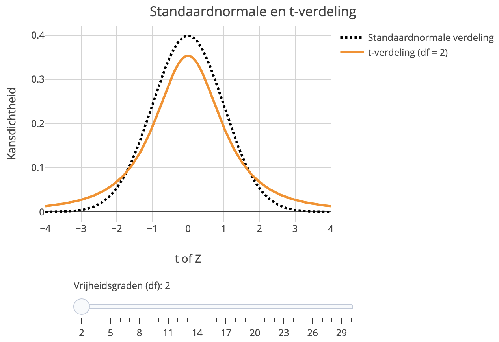



# Kansverdelingen {#sec-kansverdelingen}

In het vorige hoofdstuk hebben we de basisbegrippen en -regels besproken
voor het rekenen met kansen.
In dit hoofdstuk introduceren we *kansverdelingen*,
een begrip dat in de rest van het boek een grote rol speelt.

## Leerdoelen

Na het bestuderen van dit hoofdstuk kun je:

- uitleggen wat kansverdelingen en cumulatieve kansverdelingen zijn;
- uitleggen dat, bij numerieke kansvariabelen, 
  kansen kunnen worden gerelateerd aan
  oppervlakten onder de grafiek
  van de kansverdeling;
- uitleggen dat bij continue verdelingen 
  de kansverdeling de kansdichtheid weergeeft;
- verschillende centrum- en spreidingsmaten
  van kansverdelingen interpreteren;
- uitleggen wat de normale verdeling, de standaardnormale verdeling,
  en de $t$-verdeling zijn, en hoe die zich tot elkaar verhouden;
- normaalverdeelde kansvariabelen transformeren naar standaardnormaalverdeelde variabelen.
- kritieke waarden interpreteren en berekenen voor normale verdelingen en $t$-verdelingen;

## Wat zijn kansverdelingen? {#sec-wat-zijn-kansverdelingen}

We hebben het in het vorige hoofdstuk vaak gehad
over het werpen van een eerlijke dobbelsteen.
We kunnen de kansen weergeven in een grafiek:
  
```{r}
#| code-fold: true
#| warning: false
#| fig.cap: "Kansverdeling: de kansen bij het gooien van één dobbelsteen."
#| label: fig-uniform-dobbelsteen
#| fig.width: 4
#| fig.height: 3
#| out.width: 57%
 
# Controleer of de benodigde pakketten zijn geladen
if (!("ggplot2" %in% .packages())) {
  library("ggplot2")
}

# Parameters definiëren
min_ogen <- 1       # Minimum aantal ogen op een dobbelsteen
max_ogen <- 6       # Maximum aantal ogen op een dobbelsteen
kans <- 1 / max_ogen # Gelijke kans voor elke uitkomst
kleur <- "darkorange"   # Kleur voor de balken in de plot

# Genereer de uitkomsten en bijbehorende kansen
uitkomsten <- seq(min_ogen, max_ogen)
kansen <- rep(kans, length(uitkomsten))

# Maak een data frame met uitkomsten en kansen
kansen_dobbelsteen <- data.frame(
  uitkomsten = factor(uitkomsten),
  kansen = kansen
)

# Maak de plot
ggplot(kansen_dobbelsteen, aes(x = uitkomsten, y = kansen)) +
  geom_bar(
    stat = "identity",     # Balken representeren kanswaarden direct
    width = 1,             # Volledige breedte van de categorie
    fill = kleur,          # Kleur voor de balken
    color = "black"        # Randkleur voor de balken
  ) +
  labs(
    title = "",
    x = "Totaal aantal ogen",      # Titel voor de x-as
    y = "Kans"              # Titel voor de y-as
  ) +
  ylim(0, 0.2) +            # Zorg dat de y-as tot 0.02 loopt
  theme_minimal()
```
In dit geval zijn alle kansen gelijk.
Maar stel je nu voor dat we niet één maar twee dobbelstenen gooien,
    een blauwe en een rode.
We zijn geïnteresseerd in de som van het aantal ogen.
De kansruimte is nu de verzameling van de gehele getallen van 2 tot 12.
De verschillende uitkomsten 
  zijn nu niet meer even waarschijnlijk.
Er is namelijk maar één manier om de uitkomst 2 te krijgen ($1 + 1$),
  en *zes* manieren om 7 te gooien
  ($1 + 6$, $2 + 5$, $3 + 4$, $4 + 3$, $5 + 2$, $6 + 1$).
Je zult met twee dobbelstenen dus veel vaker 7 gooien dan 2.

Als we uitgaan van een kansmodel waarin 
beide dobbelstenen eerlijk en onafhankelijk zijn,
dan kunnen we de kansen uitrekenen en in een grafiek laten zien:

```{r}
#| code-fold: true
#| warning: false
#| fig.cap: "Kansverdeling voor het aantal ogen van twee dobbelstenen."
#| label: fig-kansverdeling-twee-dobbelstenen
#| fig.width: 4
#| fig.height: 3
#| out.width: 57%

# Controleer of de benodigde pakketten zijn geladen
if (!("ggplot2" %in% .packages())) {
  library("ggplot2")
}

# Parameters definiëren
min_som <- 2          # Minimum som bij twee dobbelstenen
max_som <- 2*max_ogen # Maximum som bij twee dobbelstenen
kleur <- rep("darkorange", 11) # Kleur voor de balken in de plot

# Genereer uitkomsten en bijbehorende kansen
uitkomsten <- seq(min_som, max_som)                     # Mogelijke uitkomsten
kansen <- pmin(uitkomsten - 1, 13 - uitkomsten) / max_ogen^2    # Kansen berekenen

# Maak een data frame met uitkomsten en kansen
kansen_dobbelsteen <- data.frame(
  uitkomsten = factor(uitkomsten),
  kansen = kansen
)

# Maak de plot
verdelingTweeDobbelstenen <- function(kleur)
  {
  ggplot(kansen_dobbelsteen, aes(x = uitkomsten, y = kansen)) +
  geom_bar(
    stat = "identity",     # Balken representeren kanswaarden direct
    width = 1,             # Volledige breedte van de categorie
    fill = kleur,          # Kleur voor de balken
    color = "black"        # Randkleur voor de balken
  ) +
  labs(
    title = "",
    x = "Totaal aantal ogen",      # Titel voor de x-as
    y = "Kans"              # Titel voor de y-as
  ) +
  theme_minimal()           # Minimalistisch thema voor de plot
}

verdelingTweeDobbelstenen(kleur)

```

De manier waarop kansen over alle mogelijke uitkomsten verdeeld zijn,
wordt de **kansverdeling** (*probability distribution*) genoemd.
Zowel @fig-uniform-dobbelsteen als @fig-kansverdeling-twee-dobbelstenen 
geven dus een kansverdeling weer.

::: {.callout-tip}

## Relatie tussen kansverdeling en histogram

@Fig-kansverdeling-twee-dobbelstenen lijkt op een histogram.
Dat is niet voor niets.
In @sec-frequentistisch hebben we de kans op een uitkomst gedefinieerd
    als de relatieve frequentie van die uitkomst
    in een héél lange 
    reeks identieke kansexperimenten.
De kansverdeling kun je dus interpreteren
    als het histogram dat je zou krijgen
    als je hetzelfde kansexperiment héél vaak 
    zou herhalen.
:::

::: {#exr-munten .pepexr}
## De kansverdeling van het aantal keer "kop"
<br>

Stel dat we twee munten gooien.
We gaan uit van een model waarbij de munten eerlijk zijn
en hun uitkomsten onafhankelijk.

Teken de kansverdeling van het aantal keer dat je "kop" gooit.
:::

::: {#exr-genotypes .pepexr}
## Genotypes
<br>

We kruisen twee heterozygote zoogdieren met genotype `aA`.
Om de kansen op de verschillende genotypes `aa`, `aA` en `AA` in de nakomelingen
in te schatten, gebruiken we een simpel kansmodel:

- Iedere ouder geeft met gelijke kans `a` of `A` aan de geslachtscellen mee.
- Het allel heeft geen invloed op de kans op conceptie.
- Het genotype heeft geen invloed op het succes van de zwangerschap.

a.  Wat is de kans dat een nakomeling genotype `aa` heeft?
b.  Wat is de kans dat een nakomeling genotype `aA` heeft?
c.  Wat is de kans dat een nakomeling genotype `AA` heeft?
d.  Wat is de relatie van deze opgave met @exr-munten?

:::

## De vorm van een verdeling kwalitatief beschrijven

In @sec-terminologie heb je verschillende termen geleerd 
waarmee je een verdeling kunt beschrijven:
**symmetrisch** en **scheef**, **klokvormig**, **uniform**, **unimodaal**, 
**bimodaal**, en **multimodaal**.
Die woorden kunnen net zo goed gebruikt worden voor kansverdelingen.
De kansverdeling van @fig-uniform-dobbelsteen is uniform;
die van @fig-kansverdeling-twee-dobbelstenen symmetrisch en unimodaal.

## Kansen als oppervlakten onder de grafiek van de kansverdeling

Kijk nog eens terug naar de kansverdeling 
voor het totaal aantal ogen bij het gooien met twee dobbelstenen (@fig-kansverdeling-twee-dobbelstenen).
Stel dat we de kans willen weten 
    op een aantal ogen $X$ groter dan 7
    maar kleiner dan 11, oftewel,
$7 < X < 11$.
Deze gebeurtenis 
    kunnen we ook anders uitdrukken,
    namelijk als
$$  X = 8 \textrm{ of } X = 9  \textrm{ of } X = 10.$$
Omdat de verschillende uitkomsten $X = 8$, $9$ en $10$ elkaar uitsluiten
    kunnen we de optelregel @eq-AofBspeciaal gebruiken om de kans te berekenen:
$$ \pr{7 < X < 11}  = \pr{X = 8} + \pr{X = 9} + \pr{X = 10}. $$

In de grafiek van de kansverdeling (@fig-kansverdeling-twee-dobbelstenen)
    was de kans op een uitkomst
    weergegeven als de oppervlakte van de bijbehorende staaf.
De kans $\pr{7 < X < 11}$ 
    komt dus overeen met de totale oppervlakte van de staven
    voor de uitkomsten 8, 9 en 10,
    hieronder in paars weergegeven:

```{r}
#| code-fold: true
#| warning: false
#| fig-cap: "Kansverdeling van het totaal aantal ogen van twee dobbelstenen."
#| label: fig-kansverdeling-twee-dobbelstenen-2
#| fig.width: 4
#| fig.height: 3
#| out.width: 57%

kleur <- rep("darkorange", 11)
kleur[7:9] <- "darkorchid"

verdelingTweeDobbelstenen(kleur)

```

In het algemeen geldt: de kans dat de uitkomst binnen een bepaald interval valt,
is gelijk aan de totale oppervlakte van de staven binnen dit interval.
In dit voorbeeld is de kansvariabele discreet,
maar we zullen straks zien dat ook voor continue variabelen geldt
dat de kans op een uitkomst in een bepaald interval
gegeven is door de "oppervlakte onder de grafiek"
binnen dat interval.
    
## De cumulatieve kansverdeling
    
De **cumulatieve kansverdeling** $F_X(x)$ van kansvariabele $X$ 
  is de functie die aangeeft wat de kans is dat de uitkomst kleiner of gelijk is 
  aan de waarde $x$:
$$ F_X(x) = \pr{X\le x}. $$ {#eq-cumverdeling}
@Fig-cumulverdeling-twee-dobbelstenen is een voorbeeld.
Dat is de cumulatieve kansverdeling die hoort bij
  de kansverdeling in @fig-kansverdeling-twee-dobbelstenen,
  voor het totaal aantal ogen van twee dobbelstenen.
De cumulatieve verdeling maakt in dit geval sprongen omdat de uitkomst 
  alleen een geheel aantal ogen kan zijn.
(De variabele is discreet.)
Bijvoorbeeld, $F_X(2{,}99) = \pr{X = 2}$,
maar $F_X(3) = \pr{X = 2} + \pr{X = 3}$.
  
```{r}
#| code-fold: true
#| warning: false
#| fig.cap: "Cumulatieve verdeling van de som van de ogen van twee dobbelstenen. Omdat de variabele discreet is, maakt de verdeling sprongen. Als je de functie afleest op een geheel getal, zoals $X = 3$, moet je de waarde bij het ingekleurde datapunt aflezen, niet die van het open datapunt."
#| label: fig-cumulverdeling-twee-dobbelstenen
#| fig.width: 4
#| fig.height: 3
#| out.width: 57%

# Controleer of de benodigde pakketten zijn geladen
if (!("ggplot2" %in% .packages())) {
  library("ggplot2")
}

# Voeg extra punten toe om de cumulatieve kansen buiten het bereik van 2-12 te tonen
kansen_dobbelsteen_cumulatief <- data.frame(
  uitkomsten = c(1, uitkomsten, 13), # Voeg 1 en 13 toe als grenzen
  kansen = c(0, cumsum(kansen), 1)   # Voeg 0 en 1 toe aan de kansen
)

# Genereer de datapunten voor de open cirkels
open_cirkels <- data.frame(
  uitkomsten = uitkomsten,
  kansen = c(0, cumsum(kansen)[-length(kansen)])
)

# Maak een data frame voor de horizontale lijnen (stappen van de cumulatieve kans)
lijnen_data <- data.frame(
  x_start = kansen_dobbelsteen_cumulatief$uitkomsten[-nrow(kansen_dobbelsteen_cumulatief)],
  x_end = kansen_dobbelsteen_cumulatief$uitkomsten[-1] - .1,
  y = kansen_dobbelsteen_cumulatief$kansen[-nrow(kansen_dobbelsteen_cumulatief)]
)

# Maak de plot
ggplot() +
  # Voeg de horizontale lijnen toe
  geom_segment(
    data = lijnen_data,
    aes(x = x_start, xend = x_end, y = y, yend = y),
    color = "darkorange",        # Kleur van de lijnen
    size = 1                     # Dikte van de lijnen
  ) +
  # Voeg gesloten cirkels (linkerkanten) toe, behalve bij (1, 0) en (13, 1)
  geom_point(
    data = kansen_dobbelsteen_cumulatief[-c(1, nrow(kansen_dobbelsteen_cumulatief)), ],
    aes(x = uitkomsten, y = kansen),
    shape = 16,                  # Gesloten cirkel
    size = 3,
    color = "darkorange"
  ) +
  # Voeg open cirkels (rechterkanten) toe
  geom_point(
    data = open_cirkels,
    aes(x = uitkomsten, y = kansen),
    shape = 1,                 # Open cirkel
    size = 1.8,
    stroke = 1.4,
    color = "darkorange"
  ) +
  scale_x_continuous(
    breaks = 2:12,               # Ticks alleen bij gehele getallen van 2 tot 12
    minor_breaks = NULL          # Verwijder alle minor ticks
  ) +
  labs(
    title = "",
    x = "Totaal aantal ogen",    # Titel voor de x-as
    y = "Cumulatieve kans"       # Titel voor de y-as
  ) +
  theme_minimal()                 # Minimalistisch thema
```

Hierboven lieten we zien dat je de kans $\pr{7<X<11}$ 
  kunt aflezen als de totale oppervlakte van de staven 
  voor $X=8$, $X =9$, en $X = 10$ in de kansverdeling.
Je kunt dezelfde kans ook zo berekenen:
  $$\pr{7<X<11} = F_X(10) - F_X(7).$$
De kans op $7 < X < 11$ is namelijk de kans dat $X$
  kleiner of gelijk is aan 10
  min de kans dan $X$ kleiner of gelijk is aan 7.
  
::: {#exr-cumul .pepexr}

## De cumulatieve verdeling van het aantal keer "kop"
<br>

Je gooit net als in @exr-munten met twee munten
en gaat weer uit van een model waarbij beide munten eerlijk zijn
en de uitkomsten van beide munten onafhankelijk.

Teken de cumulatieve verdeling van het aantal keer "kop".
Gebruik je resultaten uit @exr-munten, en
neem @fig-cumulverdeling-twee-dobbelstenen als voorbeeld.

:::


## Kansverdelingen voor continue variabelen

Tot nu toe hebben we alleen kansverdelingen gezien
  van discrete kansvariabelen.
Als een kansvariabele continu is,
  moeten we op een andere manier nadenken
  over de kans op een uitkomst.

Een continue kansvariabele heeft 
oneindig veel mogelijke uitkomsten.
(Om precies te zijn, *overaftelbaar oneindig*![^overaftelbaar])
Tussen elke twee getallen die je kiest
bestaan namelijk altijd weer oneindig veel andere getallen.
De kans op iedere *specifieke* uitkomst daarom 0.
Bijvoorbeeld, de kans dat een willekeurig gekozen persoon
  een lichaamslengte heeft van 180,00... cm, 
  *exact tot in oneindig veel decimalen*,
  is 0.
  
[^overaftelbaar]: Voor wie dat interessant vindt: 
    In de wiskunde bestaan er verschillende versies van het begrip *oneindig*.
    Van de natuurlijke getallen $\{0, 1, 2, \ldots\}$, bestaan er **aftelbaar oneindig** veel.
    Van de reële getallen bestaan er **overaftelbaar oneindig** veel.

    Een verzameling is onaftelbaar als het niet mogelijk is om de elementen
    in die verzameling ieder een eigen nummer te geven in een oneindige lijst.
    Als je dat probeert, kom je erachter dat iedere oneindige lijst 
    met reële getallen incompleet is. 
    Hoewel er oneindig veel natuurlijke getallen zijn,
    zijn er alsnog oneindig veel meer reële getallen dan natuurlijke getallen.

Bij continue variabelen zijn we daarom niet geïnteresseerd
in de kans op een specifieke uitkomst,
maar in de kans dat de uitkomst binnen een bepaald *interval* valt.
De kans dat de lichaamslengte van een willekeurig persoon
tussen 170 en 182cm ligt
is wél groter dan 0.
  
Bekijk @fig-interval hieronder eens.
Deze figuur toont (bij benadering) de kansverdeling 
van de lichaamslengte van volwassen Amerikaanse mannen. 
De verdeling laat zien dat een lengte in de buurt van 175cm
waarschijnlijker is dan een lengte rond 160cm.
Toch mogen we de waarde op de $y$-as
niet interpreteren als de *kans* op een bepaalde $x$-waarde,
want we hebben net geconcludeerd dat de kans op iedere specifieke waarde
gelijk is aan 0.
Wat is dan wél de juiste interpretatie?

```{r}
#| code-fold: true
#| warning: false
#| fig.cap: "Kansenverdeling van lichaamslengtes van volwassen Amerikaanse mannen. De kans op een lichaamslengte tussen 170cm en 182cm wordt gegeven door het paarse oppervlak onder de kansverdeling. (De kansverdeling is geschat m.b.v. de dataset NHANES.)"
#| label: fig-interval
#| fig.width: 4
#| fig.height: 3
#| out.width: 57%

# Controleer of de benodigde pakketten zijn geladen
if (!("ggplot2" %in% .packages())) { library(ggplot2) }
if (!("tidyverse" %in% .packages())) { library(tidyverse) }
if (!("NHANES" %in% .packages())) { library(NHANES) }

linkergrens <- 170
rechtergrens <- 182

# Selecteer alleen de volwassen mannen waarvoor een lengte bekend is
data_mannen <- NHANES %>%
  filter(Age >= 18 & Gender == "male" & !is.na(Height)) 

# Selecteer de mannen binnen het interval
data_mannen_in_interval <- data_mannen %>% filter(
  Height > linkergrens & Height < rechtergrens 
  )
# Kans in het interval
kans <- nrow(data_mannen_in_interval)/nrow(data_mannen)

# Selecteer de mannen >= rechtergrens
data_mannen_lang <- data_mannen %>% filter(
  Height >= rechtergrens 
  )
# Kans lang
kans_lang <- nrow(data_mannen_lang)/nrow(data_mannen)

# Selecteer de mannen <= linkergrens
data_mannen_kort <- data_mannen %>% filter(
  Height <= linkergrens 
  )
# Kans in het interval
kans_kort <- nrow(data_mannen_kort)/nrow(data_mannen)

# Bereken de dichtheid voor de gehele dataset
dichtheid_data <- density(data_mannen$Height, na.rm = TRUE)
dichtheid_df <- data.frame(
  Lengte = dichtheid_data$x,   
  Kansdichtheid = dichtheid_data$y 
)

# Selecteer alleen de dichtheidswaarden binnen het interval
dichtheid_interval <- dichtheid_df %>%
  filter(Lengte > linkergrens & Lengte < rechtergrens)

# Plot de figuur
ggplot(
  data = dichtheid_df, 
  aes(x = Lengte, y = Kansdichtheid)) +
  geom_area(
    data = dichtheid_interval, 
    aes(x = Lengte, y = Kansdichtheid),
    fill = "darkorchid", 
    alpha = 0.5) +
  geom_line(
    color = "darkorange", 
    linewidth = 1) +          
  annotate(
    "text", 
    x = linkergrens, 
    y = -0.003, 
    label = paste0(linkergrens), 
    size = 4, 
    color = "darkorchid"
    ) +          
  annotate(
    "text", 
    x = rechtergrens, 
    y = -0.003, 
    label = paste0(rechtergrens), 
    size = 4, 
    color = "darkorchid"
    ) +  
  annotate(
    "text", 
    x = (linkergrens + rechtergrens)/2, 
    y = 0.02, 
    label = paste0(round(kans,2)), 
    size = 4, 
    color = "black"
    ) +  
  labs(
    x = "Lengte (cm)",           
    y = "Kansdichtheid"          
  ) +
  theme_minimal()

```

Om dit te begrijpen, 
denken we terug aan @fig-kansverdeling-twee-dobbelstenen-2.
Daar zagen we al
dat de kans op een waarde binnen een bepaald interval 
overeenkomt met de oppervlakte onder de grafiek van de kansverdeling.
Dit principe geldt ook voor continue variabelen.
De kans dat een willekeurig gekozen man
een lengte heeft tussen
170cm en 182cm, 
wordt gegeven door de oppervlakte onder de grafiek
tussen die grenzen.
Dit gebied is in de grafiek ingekleurd met paars
en heeft een oppervlakte van 0,59.
Dat is dus de kans dat een Amerikaanse man een lengte heeft
tussen 170cm en 182cm.

De totale oppervlakte onder de curve,
van $-\infty$ tot $\infty$,
is bij iedere kansverdeling van een numerieke variabele gelijk aan 1,
want de kans dat een uitkomst *ergens* op de $x$-as ligt is 1.

Bij kansverdelingen van continue variabelen is de waarde op de $y$-as 
dus niet de kans op een specifieke waarde. 
In plaats daarvan spreken we over de **kansdichtheid**
(*probability density*).

In @sec-wat-zijn-kansverdelingen zagen we dat je over een kansverdeling 
kunt denken als over
een histogram van een *enorm* (oneindig) aantal waarnemingen.
Dat werkt ook bij continue variabelen.
Je kunt je voorstellen dat het aantal waarnemingen zo groot is
dat we de klassen van het histogram extreem smal hebben kunnen maken ---
zo smal dat de rechthoekige staven niet meer zichtbaar zijn
en het histogram een gladde curve wordt.

::: {.pepexr #exr-schat-kansen}
## Kansen schatten bij continue kansverdelingen
<br>

Zie @fig-kansen-schatten hieronder. 

a.  Het canvas van iedere grafiek is door grijze lijntjes verdeeld in vakjes.
    Hoeveel kans representeert de oppervlakte van één vakje?
    
b.  Schat voor ieder van de kansenverdelingen de kans op een uitkomst 
    binnen het paars gearceerde gebied.

```{r}
#| echo: false

library(ggplot2)

# Definieer de standaardnormale verdeling
x <- seq(-3.5, 3.5, length.out = 350)
data <- data.frame(x = x, y = dnorm(x))

oppervlak <- function(a, b){# Gebied tussen a en b kleuren
  geom_area(
    data = subset(data, x >= a & x <= b), 
    aes(x, y), 
    fill = "darkorchid", 
    alpha = 0.4
  ) 
} 

normaalGeneriek <- ggplot(
  data, 
  aes(x = x, y = y)) +
  geom_line(
    color = "darkorange", 
    linewidth = 1) +          
  theme_minimal() + xlab("Waarde") + ylab("Kansdichtheid")
#  theme(axis.text = element_blank(),
#        axis.title = element_blank())

# Gebruik qnorm om de de x-waarde bij een bepaalde kans te bepalen zodat de 
# antwoorden makkelijk gemaakt kunnen worden.
```

:::{#fig-kansen-schatten layout="[[1,1],[1,1]]" fig-cap="Wat zijn de kansen?"}

```{r}
#| echo: false
#| fig-width: 3
#| fig-height: 2
#| out-width: 100%
#| label: fig-kansen-schatten-a

normaalGeneriek + oppervlak(qnorm(0.5), qnorm(1))
```

```{r}
#| echo: false
#| fig-width: 3
#| fig-height: 2
#| out-width: 100%
#| label: fig-kansen-schatten-b

normaalGeneriek + oppervlak(qnorm(0.75), qnorm(1))
```

```{r}
#| echo: false
#| fig-width: 3
#| fig-height: 2
#| out-width: 100%
#| label: fig-kansen-schatten-c

normaalGeneriek + oppervlak(qnorm(0.25), qnorm(0.5))
```

```{r}
#| echo: false
#| fig-width: 3
#| fig-height: 2
#| out-width: 100%
#| label: fig-kansen-schatten-d

normaalGeneriek + oppervlak(qnorm(0.25), qnorm(0.75))
```

:::

:::

::: {#exr-complement .pepexr}
## Amerikaanse mannen
<br>

Kijk nog eens naar @fig-interval.

a.  Wat is de kans dat een Amerikaanse man kleiner is dan 170cm of groter dan 182cm?

b.  Schat op het oog de kans dat een Amerikaanse man kleiner is dan 170cm.

::: 


## Maten voor ligging en spreiding van kansverdelingen

In @sec-variabelen-verdelingen
heb je gezien dat de verdeling van een numerieke variabele in een dataset 
kan worden samengevat
door maten te geven voor de ligging en spreiding van die verdeling.

Op dezelfde manier kunnen we ook de *kans*verdeling van een *kans*variabele 
beschrijven
door maten van ligging en de spreiding te geven.
De maten die we hieronder bespreken
zijn dus volledig analoog aan de maten uit @sec-variabelen-verdelingen.

### Maten voor de ligging van een kansverdeling

We beginnen met de centrummaten.

De **modus** van een kansverdeling 
    is die uitkomst
    die de grootste kans of kansdichtheid heeft.
Als de kansverdeling één piek heeft,
  dan is de $x$-waarde die bij die piek hoort
  de modus.
  
De **mediaan** van een kansvariabele $X$
    is de waarde zodanig
    dat de kans op een uitkomst kleiner of gelijk aan die waarde
    precies gelijk is aan $\frac{1}{2}$.
Dat is dus de waarde waar de cumulatieve kansverdeling 
  gelijk is aan $\frac{1}{2}$.

Het **gemiddelde** van een kansverdeling van een kansvariabele $X$ 
  wordt ook wel de **verwachtingswaarde** (*expected value*) genoemd.
Een nette notatie is $\ev{X}$;
  die bijzondere $\mathbb{E}$ staat voor *Expectation*.
Vaak wordt ook het Griekse symbool $\mu$ (spreek uit: "mu") gebruikt,
  of $\mu_X$ as we willen benadrukken dat het gaat
  om de verwachtingswaarde van de variabele $X$.

Als de variabele discreet is
    dan kan de verwachtingswaarde berekend worden als
$$ \mu_X = \ev{X} = \sum_x \pr{X = x}\, x. $$ {#eq-verwachtingswaarde-discreet}
De sommatie gaat over alle mogelijke uitkomsten $x$.
@Eq-verwachtingswaarde-discreet wil dus zeggen:
we nemen het *gewogen* gemiddelde van alle mogelijke uitkomsten $x$,
waarbij uitkomsten met een grotere kans
een zwaarder gewicht krijgen.

::: {#exr-gemiddelde-herhalen .pepexr}

## De definitie van de verwachtingswaarde 
<br>

In @exr-gemiddelde-frequentietabel heb je een formule bestudeerd 
  (@eq-mean-rel-freq)
  waarmee je het gemiddelde kunt berekenen
  van een dataset 
  die beschreven is met een frequentietabel.

  a. Bestudeer die opgave nog een keer. 

  b. Vergelijk @eq-mean-rel-freq met @eq-verwachtingswaarde-discreet
en leg uit waarom ze zo op elkaar lijken.
  (Hint: In @sec-frequentistisch hebben we de kans op een uitkomst gedefinieerd 
  als de relatieve frequentie van die uitkomst
  in een zéér lange (oneindige) reeks herhalingen van het kansexperiment.)
:::
    
::: {#exr-verwachtingswaarde .pepexr}

## Verwachtingswaarde
<br>

In een experiment krijgen dieren 9 keer de gelegenheid om een taak uit te voeren.
De experimentatoren tellen hoe vaak dat lukt.

Vooraf is een kansmodel bedacht voor het aantal keer dat een dier
de taak succesvol weet uit te voeren. Dat model levert de volgende kansen op:

::: {#tbl-binom out.width="50%"}

```{r}
#| echo: false
#| warning: false

# Controleer of benodigde bibliotheken geladen zijn
if (!("dplyr" %in% .packages())) { library(dplyr) }
if (!("knitr" %in% .packages())) { library(knitr) }

# Parameters instellen
aantal_proeven <- 9
kans_succes <- 0.41

# Waarschijnlijkheden berekenen en afronden
resultaten <- data.frame(
  Aantal = 0:aantal_proeven,
  Kans = round(
    dbinom(
      x = 0:aantal_proeven,
      size = aantal_proeven,
      prob = kans_succes
    ),
    3
  )
)

# Controleer of de som der kansen 1 is
som_kansen <- sum(resultaten$Kans)

# Weergave als tabel
knitr::kable(resultaten)
```
:::

Bereken de verwachtingswaarde voor het aantal keer succes.
Het is handig om R als rekenmachine te gebruiken.
:::

Als een variabele continu is,
  dan kunnen we niet sommeren over alle mogelijke uitkomsten
  omdat er oneindig veel mogelijke uitkomsten zijn
  en iedere individuele uitkomst kans 0 heeft.
In plaats daarvan verandert de sommatie in een integraal:
$$ \mu_X = \ev{X} = \int_{-\infty}^\infty \pr{X = x}\, x\,  \diffn x. $$ {#eq-verwachtingswaarde-continu}
Gelukkig hoef je dit soort integralen in deze cursus niet zelf uit te voeren.
    
### Maten van spreiding

Dan nu de maten van spreiding.

De meest gebruikte maten van spreiding van een kansverdeling
    zijn de variantie
    en de standaarddeviatie / standaardafwijking.
  
In @sec-variantie-steekproef hebben we de definitie gezien
van de variantie $V_X$ van een reeks numerieke waarnemingen (@eq-variantie).
Kijk nog eens naar die definitie:
$$
V_X = \frac{\sum_{i=1}^n \left(x_i - \mean{x}\right)^2}{n-1}.
$$
Dat is dus het gemiddelde van de gekwadrateerde afwijkingen
van het gemiddelde.
(In @sec-n-1 heb je gezien waarom we in de noemer $n-1$ gebruiken.)

De **variantie** van een kansvariabele $X$
    wordt vaak genoteerd als $\var{X}$.
De definitie daarvan is weer de gemiddelde gekwadrateerde afwijking
    van het gemiddelde,
    maar nu gaat het om het gemiddelde van de kansverdeling,
    dus de verwachtingswaarde:
$$ 
    \var{X} = \ev{ \left( X - \mu_X \right)^2}.
$$ {#eq-variantie-verdeling}
Van iedere mogelijke uitkomst wordt dus het gemiddelde $\mu_X$ afgetrokken,
  en die afwijking wordt gekwadrateerd.
Vervolgens nemen we het gemiddelde van die gekwadrateerde afwijkingen,
  waarbij uitkomsten met een grotere kans zwaarder worden meegewogen.
Als $X$ een discrete kansvariabele is, dan komt dat neer op
$$ 
    \var{X} = \sum_x \pr{X = x} \left( x - \mu_X \right)^2.
$$ {#eq-variantie-discreet}
Bij een continue variabele wordt de sommatie weer een integraal.

De **standaarddeviatie** van $X$
    is de wortel van de variantie van $X$.
Deze wordt vaak genoteerd als de Griekse letter $\sigma$ of
    als $\sd{X}$:
$$
    \sd{X} = \sqrt{\var{X}}.
$$ {#eq-sd-var}

Omgekeerd is de variantie van $X$ dus
    het kwadraat van de standaarddeviatie:
$$
    \var{X} = \sd{X}^2.
$$ {#eq-var-sd}
Daarom wordt de variantie van een kansvariabele $X$
    ook vaak genoteerd
    als $\sigma^2$ of $\sd{X}^2$ in plaats van $\var{X}$.
    
    
::: {#exr-variantie .Rexr}

## Variantie en standaarddeviatie van een kansvariabele
<br>

In deze opgave gaan we verder met de kansverdeling uit @exr-verwachtingswaarde.
Je gaat voor deze kansverdeling de variantie en standaarddeviatie uitrekenen
aan de hand van de definities @eq-variantie-verdeling en @eq-sd-var.

De verwachtingswaarde $\ev{X}$ of $\mu_X$ 
van deze kansverdeling heb je in @exr-verwachtingswaarde al berekend.

a.  Bereken voor iedere mogelijke uitkomst de afwijking van de verwachtingswaarde.
    Dat gaat handig in R.
    Als de vector van mogelijke uitkomsten `uitkomsten` heet en de verwachtingswaarde `E`:
    
    ```{r}
    #| eval: false
    afwijkingen <- uitkomsten - E
    ```
b.  Bereken het kwadraat van alle afwijkingen.

c.  Vermenigvuldig nu de gekwadrateerde afwijkingen met hun kans.
    De kans van iedere uitkomt is gegeven in @exr-verwachtingswaarde.
    
d.  De variantie is nu de som van de getallen die je in onderdeel **c** hebt berekend.

e.  Bereken de standaarddeviatie.
:::


## De normale verdeling
  
Bepaalde kansverdelingen komen in theorie en praktijk steeds weer terug
en hebben daarom een naam gekregen.
De beroemdste is de **normale verdeling** (*normal distribution*), 
ook wel de **normaalverdeling**, **Gaussische verdeling** of **Gausscurve** genoemd,
naar de Wiskundige Carl Friedrich Gauss (1777--1855).

Eigenlijk gaat het niet om één specifieke kansverdeling
maar om een "familie" van kansverdelingen.
Leden van deze familie lijken precies op elkaar, 
behalve dat ze verschillen in gemiddelde $\mu$ 
en standaarddeviatie $\sigma$.
We noemen $\mu$ en $\sigma$ de **parameters** van de normale verdeling.

De verdelingen zien er als volgt uit (@fig-normale-verdeling):

```{r}
#| code-fold: true
#| warning: false
#| fig-cap: "De normale verdeling."
#| label: fig-normale-verdeling
#| fig.width: 4
#| fig.height: 3
#| out.width: 57%

# Controleer of ggplot2 geladen is, zo niet, laad het pakket
if (!("ggplot2" %in% .packages())) {
  library(ggplot2)
}
if (!("dplyr" %in% .packages())) { library(dplyr) }

# Definieer de standaardnormale verdeling
x <- seq(-3.5, 3.5, length.out = 350)
data <- data.frame(x = x, y = dnorm(x))

plotNormaal <- function(mu, sigma){
    # Plot maken
  ggplot(data, aes(x, y)) +
  geom_line(color = "darkorange", linewidth = 1) + # Curve van de standaardnormale verdeling
  scale_x_continuous(
    breaks = c(mu - 2*sigma, -mu - sigma, mu, mu + sigma, mu + 2*sigma), 
    labels = c(
      mu - 2 * sigma, 
      mu -sigma, 
      mu, 
      mu + sigma, 
      mu + 2 * sigma
    )
  ) + # Labels voor x-as
  labs(
    y = "Kansdichtheid", 
    x = expression(italic(X))
  ) + # Labels voor de assen
  theme_minimal() +
  theme(axis.text.x = element_text(size = 10))
}

normaalGeneriek <- 
  # Plot maken
  ggplot(data, aes(x, y)) +
  geom_line(color = "darkorange", linewidth = 1) + # Curve van de standaardnormale verdeling
  scale_x_continuous(
  breaks = c(-2, -1, 0, 1, 2), 
  labels = parse(text = c(
    "italic(mu) - 2 * italic(sigma)", 
    "italic(mu) - italic(sigma)", 
    "italic(mu)", 
    "italic(mu) + italic(sigma)", 
    "italic(mu) + 2 * italic(sigma)"
      )),
    minor_breaks = NULL
    ) + # Labels voor x-as
  scale_y_continuous(labels = NULL) + # getallen van y-as weglaten
  labs(
    y = "Kansdichtheid", 
    x = expression(italic(X))
  ) + # Labels voor de assen
  theme_minimal() +
  theme(axis.text.x = element_text(size = 12, angle = 45))

# Hoogte van de pijl bepalen
h <- exp(-0.5) / sqrt(2 * pi)

pijl <- geom_segment(
    aes(x = 0, xend = 1, y = h, yend = h), 
    arrow = arrow(length = unit(0.2, "cm")), 
    color = "black", 
    linewidth = 0.8
  ) # Pijl voor standaarddeviatie
  
oppervlak <- function(a, b){# Gebied tussen a en b kleuren
  geom_area(
    data = subset(data, x >= a & x <= b), 
    aes(x, y), 
    fill = "darkorange", 
    alpha = 0.4
  ) 
} 

normaalGeneriek + pijl +
  annotate(
  "text", 
  x = 0.5, 
  y = 0.9 * h, # Use the variable h to scale the y-coordinate
  label = expression(italic(sigma)), # Use expression() for mathematical notation
  color = "black", 
  size = 5, 
  hjust = 0.5, 
  vjust = 0.5
  )

```
Je ziet dat de verdeling een *klokvorm* heeft en volledig *symmetrisch* is.
Daardoor is $\mu$ het gemiddelde, de mediaan, én de modus.
De meeste kans ligt binnen twee standaarddeviaties van $\mu$.

De precieze formule voor de normale verdeling zul je in deze cursus
niet nodig hebben,
maar het is toch handig deze een keer gezien te zien hebben:
$$ \pr{X = x} = \frac{1}{\sqrt{2\pi\sigma^2}} e^{-\frac{(x - \mu)^2}{2\sigma^2}}.$$
De normale verdeling heeft dus een precieze wiskundige definitie.
Niet iedere verdeling die een klokvorm heeft is ook een normale verdeling
(maar iedere normale verdeling heeft wel dezelfde klokvorm).

### Vuistregels voor de normale verdeling {#sec-vuistregels}

Het is heel nuttig om de volgende twee eigenschappen
uit je hoofd te leren; je hebt ze vaak nodig.

Als $X$ normaal verdeeld is, dan geldt:

1.  De kans dat de uitkomst
binnen één standaarddeviatie van het gemiddelde valt is iets meer dan $\frac{2}{3}$.
Om precies te zijn:
$$\pr{\mu - \sigma < X < \mu + \sigma} = 0{,}683\ldots.$$ {#eq-vuistregel-1-precies}
2.  De kans dat de uitkomst
binnen twee standaarddeviaties van het gemiddelde valt is *iets* groter dan 0,95.
Om precies te zijn:

$$\pr{\mu - 2\sigma < X < \mu + 2\sigma} = 0{,}954\ldots.$$ {#eq-vuistregel-2-precies}
@Fig-vuistregels laat beide eigenschappen zien.

```{r}
#| code-fold: true
#| warning: false
#| label: fig-vuistregels
#| fig-cap: "Vuistregels voor de normale verdeling."
#| layout-ncol: 2
#| fig-subcap: 
#|   - "Iets meer dan 2/3 van de kans valt binnen één standaarddeviatie van het gemiddelde."
#|   - "Iets meer dan 95% van de kans valt binnen 2 standaarddeviaties van het gemiddelde."
#| fig.width: 3.5
#| fig.height: 2.7
#| out.width: 100%

proportie <- function(prop){
  annotate(
  "text", 
  x = 0, 
  y = 0.15, 
  label = prop, # Dynamically include the variable
  color = "black", 
  size = 5, 
  hjust = 0.5, 
  vjust = 0.5
)
}

normaalGeneriek + oppervlak(-1,1) + proportie("0,68...")

normaalGeneriek + oppervlak(-2, 2) + proportie("0,954...")
```

::: {#exr-normale-verdeling .pepexr}
  
## Het toepassen van de vuistregels voor de normale verdeling
<br>

Als je nadenkt over kansverdelingen
helpt het om de situatie te schetsen. 
Maak daar een gewoonte van!

a.  Schets @fig-normale-verdeling na. Arceer het oppervlak onder de curve
    dat overeenkomt $\pr{X < \mu}$. Wat is die kans?
    
b.  Maak nog zo'n schets, maar nu voor $\pr{X > \mu + \sigma}$. 
    Bepaal die kans met behulp van de vuistregel uit @sec-vuistregels.
    
c.  Wat is de kans $\pr{X < \mu - 2 \sigma}$? 
    Maak weer gebruik van een schets en de vuistregels.
    
d.  Idem, maar nu voor $\pr{X < \mu - 2 \sigma \text{ of } X > \mu + 2 \sigma}$.

:::

::: {#exr-normale-verdeling-babies .pepexr}
## Hoofd-omtrek van pasgeboren babies
<br>

De verdeling van de hoofdomtrek van pasgeboren babies die voldragen zijn (d.w.z., niet prematuur geboren),
is klokvormig.
Een redelijk model is een normale verdeling met gemiddelde $\mu = 34{,5}$cm
en standaarddeviatie $\sigma = 1{,}75$cm. 

a.  Hoeveel standaarddeviaties boven het gemiddelde is een hoofdomtrek van 38 cm?

b.  Wat is de kans dat een baby een hoofdomtrek heeft van *meer* dan 38 cm?

    (Tip: Maak weer een schets!)
:::

### Waarom de normale verdeling? De centrale limietstelling. {#sec-centrale-limietstelling}

De normale verdeling neemt in de waarschijnlijkheidsleer
en statistiek een heel bijzondere plek in.
Dat heeft verschillende redenen.

Om te beginnen hebben veel variabelen binnen en buiten de biologie een klokvorm.
Voor zulke variabelen kan de normale verdeling een goed model zijn.
Voorbeelden zijn de lichaamslengte en het IQ van volwassen mannen of vrouwen
die onder vergelijkbare omstandigheden zijn opgegroeid;
de gemiddelde CITO-score op verschillende basisscholen in Nederland;
maar ook de afstand die een molecuul in een oplossing door diffusie aflegt in een vaste tijd.

Dat we de normale verdeling zowel in theorie als in de praktijk 
vaak terugzien, heeft een wiskundige reden.
Je kunt namelijk aantonen dat
een kansvariabele die beïnvloed wordt
door een groot aantal andere kansvariabelen vaak ongeveer normaal verdeeld zal zijn.
Dat geldt bijvoorbeeld als een variabele de *optelsom* is
van een groot aantal kansvariabelen.
De wiskundige stelling die dat bewijst
wordt de **Centrale Limietstelling** (*Central Limit Theorem*) genoemd. 
In @sec-centrale-limiet komen we daar nog even op terug.

In de praktijk worden veel variabelen beïnvloed
door een groot aantal factoren.
Lichaamslengte is bijvoorbeeld het resultaat van een groot aantal genen
en allerlei omgevingsfactoren tijdens de groei,
zoals voeding, slaap, en hygiëne.
Omdat al die variabelen per individu verschillen
valt te verwachten dat het resultaat ongeveer normaal verdeeld is.

## De standaardnormale verdeling
  
De **standaardnormale verdeling** (*standard normal distribution*) (@fig-std-normaal) 
is een speciaal geval van de normale verdeling:
het is de normale verdeling met $\mu = 0$ en $\sigma = 1$.
Deze verdeling is hieronder (@fig-std-normaal) weergegeven.

```{r}
#| code-fold: true
#| warning: false
#| label: fig-std-normaal
#| fig-cap: "Standaardnormale verdeling"
#| fig.width: 4.5
#| fig.height: 3
#| out.width: 64%

# Plot de standaardnormale verdeling
plotNormaal(0, 1) +
  # Labels voor de assen
  labs(
    y = "Kansdichtheid", 
    x = expression(italic(Z))
  ) +
  # Voeg de pijl toe
  pijl +
  # Annotatie toevoegen met sigma
  annotate(
    "text", 
    x = 0.5, 
    y = 0.88 * h,        # Gebruik de variabele h voor de y-positie
    label = expression(italic(sigma) == 1),  # Wiskundige notatie voor sigma
    color = "black", 
    size = 5, 
    hjust = 0.47, 
    vjust = 0.5
  )
```

Eerder hebben we kansvariabelen vaak $X$ genoemd.
Voor een standaardnormaal verdeelde variabele wordt vaak de letter $Z$ gebruikt. 
Dit is niet meer dan een gewoonte, maar toch is het handig: kom je in een statistische formule een kansvariabele $Z$ tegen,
dan is dat een hint dat die variabele waarschijnlijk standaardnormaal verdeeld is.

### Transformeren naar de standaardnormale verdeling {#sec-transformeren}

Alle normale verdelingen hebben dezelfde klokvorm,
maar ze verschillen in hun gemiddelde 
en hun standaarddeviatie.
Als twee normale verdelingen verschillen in hun gemiddelde,
dan zijn ze ten opzichte van elkaar verschoven.
Verschillen ze in hun standaarddeviatie,
dan zijn de klokvormen ten opzichte van elkaar horizontaal uitgerekt of samengedrukt.
Ondanks die verschillen is de totale oppervlakte onder de grafiek altijd gelijk aan 1,
want de kans op een uitkomst tussen $-\infty$ en $\infty$ is altijd 1.
Horizontaal uitrekken gaat dus altijd samen met verticaal samendrukken.

Bekijk @fig-transformeren eens.
Deze laat twee normale verdelingen zien.

-   De bovenste figuur toont de verdeling van een variabele $X$ 
    met gemiddelde $\mu_X = 170$ en standaarddeviatie $\sd{X} = 6$.
    Het zou een model kunnen zijn voor de lichaamslengte 
    van Nederlandse volwassen vrouwen, in centimeters.
-   Het onderste figuur toont de verdeling van variabele $Z$,
    die standaardnormaal verdeeld is (dus $\mu_Z=0$ en $\sd{Z} = 1$).

Hoewel de parameters van beide verdelingen verschillen, 
hebben ze exact dezelfde vorm. 
(De $x$- en $y$-assen van de figuren zijn wel 
ten opzichte van elkaar uitgerekt en verschoven.)

```{r}
#| code-fold: true
#| warning: false
#| label: fig-transformeren
#| fig-cap: "Kansen voor een normaal verdeelde variabele $X$ hangen samen 
#| met kansen voor standaardnormaal verdeelde variabele $Z$."
#| fig.width: 3.75
#| out.width: 55%

# Laad benodigde pakketten
if (!("ggplot2" %in% loadedNamespaces())) { 
  library(ggplot2) 
}
if (!("cowplot" %in% loadedNamespaces())) { 
  library(cowplot) 
}

# Basisparameters instellen
mu_x <- 170             # Gemiddelde voor X
sigma_x <- 6            # Standaarddeviatie voor X
x_threshold <- mu_x + sigma_x    # Drempelwaarde voor X

mu_z <- 0               # Gemiddelde voor Z
sigma_z <- 1            # Standaarddeviatie voor Z
z_threshold <- mu_z + sigma_z      # Drempelwaarde voor Z

nr_sd <- 3.5            # Aantal standaarddeviaties om te tonen

# Berekeningen op basis van parameters
x_range <- c(mu_x - nr_sd * sigma_x, mu_x + nr_sd * sigma_x)   # Bereik voor X
z_range <- c(mu_z - nr_sd * sigma_z, mu_z + nr_sd * sigma_z)   # Bereik voor Z
n_points <- 50 * nr_sd                                        # Aantal datapunten

# Domeinen voor X en Z
x_values <- seq(x_range[1], x_range[2], length.out = n_points)
z_values <- seq(z_range[1], z_range[2], length.out = n_points)

# Bereken kansdichtheden
x_data <- data.frame(
  x = x_values,
  y = dnorm(x_values, mean = mu_x, sd = sigma_x)
)

z_data <- data.frame(
  x = z_values,
  y = dnorm(z_values, mean = mu_z, sd = sigma_z)
)

# Gebied waar X > x_threshold
x_fill <- data.frame(
  x = seq(x_threshold, x_range[2], length.out = 100),
  y = dnorm(seq(x_threshold, x_range[2], length.out = 100), 
            mean = mu_x, sd = sigma_x)
)

# Gebied waar Z > z_threshold
z_fill <- data.frame(
  x = seq(z_threshold, z_range[2], length.out = 100),
  y = dnorm(seq(z_threshold, z_range[2], length.out = 100), 
            mean = mu_z, sd = sigma_z)
)

# Plot voor X
plot_x <- ggplot(x_data, aes(x = x, y = y)) +
  geom_line(size = 1, color = "darkorange") +
  geom_area(
    data = x_fill, aes(x = x, y = y),
    fill = "darkorange", alpha = 0.5
  ) +
  labs(
    x = expression(italic(X)),
    y = "Kansdichtheid"
  ) +
  theme_minimal()

# Plot voor Z
plot_z <- ggplot(z_data, aes(x = x, y = y)) +
  geom_line(size = 1, color = "darkorange") +
  geom_area(
    data = z_fill, aes(x = x, y = y),
    fill = "darkorange", alpha = 0.5
  ) +
  labs(
    x = expression(italic(Z)),
    y = "Kansdichtheid"
  ) +
  theme_minimal()

# Combineer de twee plots met cowplot
combined_plot <- plot_grid(
  plot_x, plot_z, 
  ncol = 1, align = "v"
)

# Voeg een verticale lijn toe over beide plots
final_plot <- ggdraw(combined_plot) +
  draw_line(
    x = c(0.675, 0.675),  # Relatieve positie op de x-as (0-1 schaal)
    y = c(0.09, 1),  # Relatieve positie op de y-as (0-1 schaal)
    color = "DarkOrchid", 
    size = 1, 
    linetype = "dashed"
  )

# Toon de finale plot
print(final_plot)

```

Stel nu dat we geïnteresseerd zijn in de kans dat $X > 176$, 
dus $\pr{X > 176}$. 
In de *bovenste* grafiek van @fig-transformeren is dat de oppervlakte van het oranje gekleurde gebied.
Omdat de twee grafieken dezelfde vorm hebben, kunnen we exact hetzelfde oppervlak
ook intekenen in de *onderste* grafiek; dat hebben we weer met oranje gedaan.
De paarse stippellijn laat zien 
dat de grenzen van de oranje gebieden in beide plots
precies zijn uitgelijnd.

In de bovenste plot is het gemiddelde $\mu_X = 170$ en de standaarddeviatie $\sd{X} = 6$.
De grens van het oranje gebied, 176 cm,
is dus precies één standaarddeviatie boven het gemiddelde.
In de onderste plot moet de grens dus ook getrokken worden
op één standaarddeviatie boven het gemiddeld, 
en dat is $Z = 1$.
Hieruit kunnen we concluderen dat
$$ \pr{X > 176} = \pr{Z > 1}. $$

Dit werkt in het algemeen: 
kansen voor iedere
normaal verdeelde variabele $X$ kunnen worden gerelateerd 
aan kansen voor de standaardnormaal verdeelde variabele $Z$.
De grens voor $Z$ moet dan steeds
gelijk zijn aan het aantal standaarddeviaties
dat $X$ van het gemiddelde afligt.
Dat wil zeggen:
$$ Z = \frac{X - \mu_X}{\sd{X}}. $$ {#eq-trans}
In het statistisch jargon zeggen we dat $X$ in deze vergelijking
wordt **getransformeerd**
naar een standaardnormaal verdeelde variabele.
Die transformatie wordt in het volgende hoofdstuk heel belangrijk.

::: {#exr-kansen-normaal .mixedexr}

## Kansen voor de normale verdeling in R
<br>

Met R kun je de kansen voor een normale verdeling opvragen 
met de functie `pnorm()`. 
Die functie geeft de cumulatieve verdeling van de normale verdeling.
Neem bijvoorbeeld:

```{r}
#| eval: false

pnorm(0)
```
Dit commando geeft de kans op een waarneming kleiner dan 0
volgens de standaardnormale verdeling.

a.  Maak eerst een schets van de standaardnormale verdeling. 
    Bedenk wat de waarde van de cumulatieve verdelingsfunctie moet zijn bij $Z = 0$,
    en voer dan het commando `pnorm(0)` uit
    om dat te controleren.

b.  Maak weer een schets van de standaardnormale verdeling.
    Arceer het gedeelte $Z < -1$.
    Wat is volgens de vuistregels de kans op een waarneming in dat interval?
    Bereken die kans vervolgens met de functie `pnorm()`.

c.  Bereken met `pnorm()` de kans dat $Z > 0{,}5$. Een schets helpt.
    Hint: gebruik de complement-regel (@eq-complementregel).
    
d.  Maak weer een schets van de standaardnormale verdeling.
    Arceer het gedeelte tussen $Z = -1$ en $Z = 1$.
    Wat is volgens de vuistregels de kans op een waarneming in dat interval?
    Bereken de kans vervolgens met de functie `pnorm()`.
    
    Hint: je hebt de functie twee keer nodig... 
   
Hierboven gingen de vragen steeds over de standaardnormale verdeling,
maar je kunt `pnorm()` ook gebruiken voor andere normale verdelingen.
Je moet de functie dan vertellen welk gemiddelde en welke standaarddeviatie
gebruikt moeten worden.
    
Bijvoorbeeld, als $\mu = 170$ en $\sigma = 6$ is dit de kans op een waarneming 
$X < 176$:

```{r}
#| eval: true
pnorm(176, mean = 170, sd = 6)
```
    
e.  De variabele IQ is ongeveer normaal verdeeld met gemiddelde $\mu = 100$
    en $\sigma = 15$. Wat is de kans dat een willekeurige persoon
    een hoogbegaafd IQ heeft van meer dan 140?

:::

## De $t$-verdeling {#sec-t}

Later in de cursus komen we ook een andere belangrijke verdeling tegen:
de ***t*-verdeling**.

Ook de $t$-verdeling is niet één verdeling
maar een familie van verdelingen.
Deze verdelingen hebben een index: 
  de eerste heet $t_1$, de tweede $t_2$, enzovoort.
De index wordt het aantal **vrijheidsgraden** genoemd.
Je kunt $t_8$ dus ook omschrijven als de $t$-verdeling 
met 8 vrijheidsgraden,
of met df = 8.
(Hier staat df voor **degrees of freedom**.)
Een variabele met een $t$-verdeling wordt vaak $t$ genoemd.

De $t$-verdelingen lijken behoorlijk op de standaardnormale verdeling.
In @fig-t hieronder kun je de $t$-verdeling (oranje)
vergelijken met de standaardnormale verdeling (zwart).
Gebruik de slider om het aantal vrijheidsgraden te veranderen.

```{r}
#| label: fig-t-2
#| fig-cap: "Verschillende $t$-verdelingen en de standaardnormale verdeling"
#| warning: false
#| fig-height: 3
#| fig-width: 6
#| out-width: 86%
#| eval: false
#| echo: false

# Genereer t-waarden
t_values <- seq(-3.5, 3.5, by = 0.1)

# Maak een dataframe voor de kansdichtheden
dataframe <- data.frame(
  t = c(
    t_values, 
    rep(t_values, 3)
  ),
  prob = c(
    dnorm(t_values),              # Standaard-normale verdeling
    dt(t_values, df = 2),         # t-verdeling met df = 2
    dt(t_values, df = 5),         # t-verdeling met df = 5
    dt(t_values, df = 20)         # t-verdeling met df = 20
  ),
  df = factor(
    rep(
      c("standaardnormaal", "df = 2", "df = 5", "df = 20"), 
      each = length(t_values)
    ),
    levels = c("df = 2", "df = 5", "df = 20", "standaardnormaal")
  )
)

# Plot de verdelingen
ggplot(
  dataframe, 
  aes(
    x = t, y = prob, 
    group = df, color = df, linewidth = df, linetype = df
  )
) +
  # Voeg de lijnen toe
  geom_line() +
  # Pas de kleuren aan
  scale_color_manual(
    values = c(rep("black", 3), "darkorange")
  ) +
  # Pas de lijndiktes aan
  scale_linewidth_manual(
    values = c(1, 1, 1, 1.2)
  ) +
  # Pas de lijnstijlen aan
  scale_linetype_manual(
    values = c(
      "df = 2" = "dotted", 
      "df = 5" = "dashed", 
      "df = 20" = "longdash",
      "standaardnormaal" = "solid"
    )
  ) +
  # Labels toevoegen
  labs(
    x = expression(italic(t) ~ "of" ~ italic(Z)),
    y = "Kansdichtheid",
    color = "Legenda",
    linewidth = "Legenda",
    linetype = "Legenda"
  ) +
  # Thema toepassen
  theme_minimal()
```


:::{.print-only}



<center>*(interactieve versie online)*</center>

:::


:::{.screen-only}

```{r}
#| echo: false
#| fig-height: 4.5
#| fig-width: 7
#| out-width: 86%
#| warning: false
#| fig-cap: "Vergelijking tussen verschillende $t$-verdelingen en de standaardnormale verdeling. Hoe groter het aantal vrijheidsgraden, hoe kleiner het verschil."
#| label: fig-t

if (!("plotly" %in% .packages())) { library(plotly) }
if (!("stats" %in% .packages())) { library(stats) }

# Reeks x-waarden
x_waarden <- seq(-4, 4, length.out = 200)
vrijheidsgraden <- 2:30

# Normale verdeling
y_normaal <- dnorm(x_waarden)

# Begin plot
fig <- plot_ly()

# Voeg standaardnormale verdeling toe
fig <- fig %>% add_lines(
  x = x_waarden,
  y = y_normaal,
  name = "Standaardnormale verdeling",
  line = list(color = "black", dash = "dot", width = 3),
  visible = TRUE
)

# Voeg t-verdelingen toe
for (i in seq_along(vrijheidsgraden)) {
  df <- vrijheidsgraden[i]
  y_t <- dt(x_waarden, df = df)

  fig <- fig %>% add_lines(
    x = x_waarden,
    y = y_t,
    name = paste0("t-verdeling (df = ", df, ")"),
    line = list(color = "darkorange", width = 3),
    visible = i == 1
  )
}

# Sliderstappen
steps <- lapply(seq_along(vrijheidsgraden), function(i) {
  visible_vec <- c(TRUE, rep(FALSE, length(vrijheidsgraden)))
  visible_vec[i + 1] <- TRUE

  list(
    method = "update",
    args = list(
      list(visible = visible_vec),
      list(
        title = paste0("Standaardnormale en t-verdeling (df = ", 
                       vrijheidsgraden[i], ")")
      )
    ),
    label = as.character(vrijheidsgraden[i])
  )
})

# Layout met latex in titels, mooie rasterlijnen
fig <- fig %>% layout(
  title = list(
    text = "Standaardnormale en t-verdeling",
    x = 0.5
  ),
  xaxis = list(
    title = list(text = "t of Z"),  # LaTeX-style titel
    tickmode = "array",
    tickvals = -4:4,
    gridcolor = "lightgray",
    zeroline = TRUE,
    zerolinewidth = 1
  ),
  yaxis = list(
    title = "Kansdichtheid",
    gridcolor = "lightgray"
  ),
  sliders = list(list(
    active = 0,
    currentvalue = list(prefix = "Vrijheidsgraden (df): "),
    steps = steps,
    x = 0.1,
    xanchor = "left",
    y = -0.2
  ))
)

fig
```
:::

Net als bij de standaardnormale verdeling
is het gemiddelde altijd 0.
Vergeleken met de standaardnormale verdeling
heeft de $t$-verdeling wel een lagere piek
en "dikkere staarten".
De spreiding van de $t$-verdeling is daardoor groter.^[De variantie van de $t$-verdeling hangt af
van het aantal vrijheidsgraden en is gelijk aan $\mathrm{df}/(\mathrm{df} - 2)$.
In de limiet waarbij het aantal vrijheidsgraden naar oneindig gaat,
convergeert dit naar 1. Dat moet ook,
want in die limiet convergeert de $t$-verdeling naar de 
standaardnormale verdeling, en die heeft variantie $\sigma^2 = 1$.]
Maar, het verschil tussen de $t$-verdeling en de standaardnormale verdeling
wordt kleiner naarmate het aantal vrijheidsgraden groter wordt.
Dat kun je in @fig-t duidelijk zien:
bij $\text{df} = 20$ zijn de $t$-verdeling en de standaardnormale verdeling
op het oog al moeilijk te onderscheiden.
In de limiet van $\text{df}\rightarrow \infty$ convergeert de $t$-verdeling
ook echt naar de standaardnormale verdeling.

::: {#exr-t-verdeling .pepexr}

## Dijken
<br>

Om te berekenen hoe hoog de zeedijken moeten zijn
maken we gebruik van een model
dat veronderstelt dat de waterstand bij vloed
normaal verdeeld is.

Stel dat in werkelijkheid de verdeling 
meer lijkt op een $t$-verdeling.
Welk effect heeft dat op onze risico-berekeningen?

(Je hoeft niets te berekenen,
alleen te beredeneren.)

:::

## Kritieke waarden {#sec-kritieke-waarde}

### Kritieke waarden van de standaardnormale verdeling

In figuur @fig-krit-1 is weer 
de standaardnormale verdeling weergegeven.
In beide staarten van de verdeling is een gebied oranje gekleurd.
De oppervlakte van elk van deze gebieden is 0,1; 
samen representeren ze dus een kans van 0,2.

Om ervoor te zorgen dat die kans precies 0,2 is,
is de grens van het rechtergebied ingesteld op (afgerond) 1,28
en de grens van het linkergebied op (afgerond) -1,28.
De kans op een waarneming die extremer is (meer afwijkt van het gemiddelde)
dan 1,28 is dus precies 0,2,
en de kans op een waarneming die minder extreem is 1 - 0,2 = 0,8.

::: {#fig-krit layout-nrow=2}

```{r}
#| code-fold: true
#| warning: false
#| label: fig-krit-1
#| fig-cap: "De kritieke waarde van de standaardnormale verdeling $Z_{0{,}2(2)} \\approx 1{,}28$."
#| fig.width: 3.75
#| fig.height: 2.75
#| out.width: 100%
# Functie om een plot te maken van de kritieke waarde
crit_plot <- function(alpha) {
  # Kritieke waarde van Z
  Z_crit <- qnorm(1 - alpha / 2)  # Bereken de kritieke waarde
  
  # Coördinaten voor de pijlen
  xstart <- (Z_crit + 3.5) / 2         # Beginpunt x-coördinaat
  ystart <- dnorm(0) / 4               # Beginpunt y-coördinaat
  xend <- Z_crit + (3.5 - Z_crit) / 7  # Eindpunt x-coördinaat
  yend <- dnorm(xend) / 3              # Eindpunt y-coördinaat
  
  # Plot de standaardnormale verdeling met staarten en annotaties
  plotNormaal(0, 1) +
    # Labels voor de assen
    labs(
      y = "Kansdichtheid", 
      x = expression(italic(Z))
    ) +
    # Ingekleurd oppervlak onder de curve
    oppervlak(-10, -Z_crit) +
    oppervlak(Z_crit, 10) +
    # Schaalinstellingen voor de x-as
    scale_x_continuous(
      breaks = c(-Z_crit, 0, Z_crit), 
      labels = c(
        paste0(round(-Z_crit, 2), "..."), 
        "0", 
        paste0(round(Z_crit, 2), "...")
      ),
      minor_breaks = NULL  # Verwijder minor ticks
    ) +
    # Kromme pijltjes toevoegen
    geom_curve(
      aes(x = -xstart, y = ystart, xend = -xend, yend = yend), 
      curvature = 0.2, 
      arrow = arrow(length = unit(0.2, "cm")), 
      color = "black", 
      size = 0.7
    ) +
    geom_curve(
      aes(x = xstart, y = ystart, xend = xend, yend = yend), 
      curvature = -0.2, 
      arrow = arrow(length = unit(0.2, "cm")), 
      color = "black", 
      size = 0.7
    ) +
    # Annotaties toevoegen
    annotate(
      "text", 
      x = -xstart, 
      y = ystart + 0.02,  # Plaats annotatie net boven de pijl
      label = gsub("\\.", ",", round(alpha / 2, 3)), 
      color = "black", 
      hjust = 0.5, 
      size = 4
    ) +
    annotate(
      "text", 
      x = xstart, 
      y = ystart + 0.02,  # Plaats annotatie net boven de pijl
      label = gsub("\\.", ",", round(alpha / 2, 3)), 
      color = "black", 
      hjust = 0.5, 
      size = 4
    ) +
    # Label in het midden
    proportie(gsub("\\.", ",", round(1 - alpha, 2)))
}

# Voorbeeld: plot voor alpha = 0.2
crit_plot(0.2)
```

```{r}
#| code-fold: true
#| warning: false
#| label: fig-krit-2
#| fig-cap: "De kritieke waarde van de standaardnormale verdeling $Z_{0{,}05(2)} \\approx 1{,}96$."
#| fig.width: 3.75
#| fig.height: 2.75
#| out.width: 100%

crit_plot(0.05)
```

```{r}
#| code-fold: true
#| warning: false
#| label: fig-krit-3
#| fig-cap: "De kritieke waarde van de $t$-verdeling $t_{0{,}2(2)4} \\approx 1{,}53$."
#| fig.width: 3.75
#| fig.height: 2.75
#| out.width: 100%

# Functie om een plot te maken van de kritieke waarde
crit_plot_t <- function(alpha, df) {
  # Kritieke waarde van t
  t_crit <- qt(1 - alpha / 2, df = df)  # Bereken de kritieke waarde
  
  # Coördinaten voor de pijlen
  xstart <- (t_crit + 3.5) / 2         # Beginpunt x-coördinaat
  ystart <- dt(0, df) / 4               # Beginpunt y-coördinaat
  xend <- t_crit + (3.5 - t_crit) / 7  # Eindpunt x-coördinaat
  yend <- dt(xend, df) / 3              # Eindpunt y-coördinaat

  # Plot de t-verdeling met staarten en annotaties
  dataT <- data.frame(x = x, y = dt(x, df = df))
  plotT <- ggplot(dataT, aes(x, y)) +
    geom_line(color = "darkorange", linewidth = 1) + # Curve van de t-verdeling
    labs(
      y = "Kansdichtheid", 
      x = expression(italic(t))
    ) + # Labels voor de assen
    theme_minimal()
  
  oppervlakT <- function(a, b){# Gebied tussen a en b kleuren
    geom_area(
      data = subset(dataT, x >= a & x <= b), 
      aes(x, y), 
      fill = "darkorange", 
      alpha = 0.4
    ) 
    } 
  
  plotT +
    # Ingekleurd oppervlak onder de curve
    oppervlakT(-10, -t_crit) +
    oppervlakT(t_crit, 10) +
    # Schaalinstellingen voor de x-as
    scale_x_continuous(
      breaks = c(-t_crit, 0, t_crit), 
      labels = c(
        paste0(round(-t_crit, 2), "..."), 
        "0", 
        paste0(round(t_crit, 2), "...")
      ),
      minor_breaks = NULL  # Verwijder minor ticks
    ) +
    # Kromme pijltjes toevoegen
    geom_curve(
      aes(x = -xstart, y = ystart, xend = -xend, yend = yend), 
      curvature = 0.2, 
      arrow = arrow(length = unit(0.2, "cm")), 
      color = "black", 
      size = 0.7
    ) +
    geom_curve(
      aes(x = xstart, y = ystart, xend = xend, yend = yend), 
      curvature = -0.2, 
      arrow = arrow(length = unit(0.2, "cm")), 
      color = "black", 
      size = 0.7
    ) +
    # Annotaties toevoegen
    annotate(
      "text", 
      x = -xstart, 
      y = ystart + 0.02,  # Plaats annotatie net boven de pijl
      label = gsub("\\.", ",", round(alpha / 2, 3)), 
      color = "black", 
      hjust = 0.5, 
      size = 4
    ) +
    annotate(
      "text", 
      x = xstart, 
      y = ystart + 0.02,  # Plaats annotatie net boven de pijl
      label = gsub("\\.", ",", round(alpha / 2, 3)), 
      color = "black", 
      hjust = 0.5, 
      size = 4
    ) +
    # Label in het midden
    proportie(gsub("\\.", ",", round(1 - alpha, 2)))
}

# Voorbeeld: plot voor alpha = 0.2 en df = 4
crit_plot_t(0.2, 4)
```

```{r}
#| code-fold: true
#| warning: false
#| label: fig-krit-4
#| fig-cap: "De kritieke waarde van de $t$-verdeling $t_{0{,}05(2)4} \\approx 2{,}78$."
#| fig.width: 3.75
#| fig.height: 2.75
#| out.width: 100%

crit_plot_t(0.05, 4)
```

Kritieke waarden van de standaardnormale verdeling en de $t$-verdeling.

:::

De grenswaarde van het rechter gebied wordt een **kritieke waarde** (*critical value*) van de verdeling genoemd.
In dit geval gaat het om de kritieke waarde die hoort bij een kans van 0,2
(voor beide oranje gebieden samen).
Deze kritieke waarde wordt daarom genoteerd als $Z_{0{,}2(2)}$.
Hierin verwijst 0,2 naar de totale oppervlakte van de oranje gebieden,
en de (2) geeft aan dat daarbij beide staarten worden meegeteld.

Op dezelfde manier is $Z_{0{,}05(2)}$ de grenswaarde 
die hoort bij oranje gebieden met een totale oppervlakte van 0,05. 
Deze situatie is weergegeven in @fig-krit-2.
De kritieke waarde is nu $Z_{0{,}05(2)} \approx 1{,}96$. 
Dat deze kritieke waarde dicht bij 2 ligt,
had je kunnen inschatten.
De tweede vuistregel uit @sec-vuistregels
stelt dat bij een normale verdeling ietsje meer dan 95% van de kansmassa
zich binnen 2 standaarddeviaties van het gemiddelde bevindt,
en de overige 5% dus daarbuiten.
Dan moet de kritieke waarde $Z_{0{,}05(2)}$ dus erg dicht bij 2 liggen.
Onthoud de waarde $Z_{0{,}05(2)}=1{,}96$; 
  deze kritieke waarde komt in de statistiek keer op keer terug.

Er bestaan kritieke waarden voor elke keuze
van de totale oppervlakte van de oranje gebieden.
Als we deze oppervlakte noteren met de Griekse letter $\alpha$ (spreek uit als "alfa"),
is er een kritieke waarde $Z_{\alpha(2)}$ voor iedere waarde van $\alpha$
tussen 0 en 1. Samengevat:

::: {.callout-important appearance="default" icon=false}

## Definitie: Kritieke waarden van de standaardnormale verdeling

De kritieke waarde $Z_{\alpha(2)}$ is de grenswaarde zodat
de kans op een waarneming extremer dan $Z_{\alpha(2)}$ gelijk is aan $\alpha$.

Je kunt dit schrijven als

$$\pr{Z < -Z_{\alpha(2)} \text{ of } Z > Z_{\alpha(2)}} = \alpha. $${#eq-crit-norm}

Binnen de grenzen ligt juist een kans $1 - \alpha$:

$$\pr{-Z_{\alpha(2)} < Z < Z_{\alpha(2)}} = 1 - \alpha. $${#eq-crit-norm-2}

:::


### Kritieke waarden van de $t$-verdeling

Kritieke waarden kunnen ook worden gedefinieerd voor $t$-verdelingen.
Het grote verschil is dat de kritieke waarde die hoort bij een bepaalde kans
$\alpha$ nu ook afhangt van het aantal vrijheidsgraden (df) van de $t$-verdeling.
In @fig-krit-3 is de $t$-verdeling met $\mathrm{df} = 4$ weergegeven.
Net als in @fig-krit-1 hebben de oranje gebieden in totaal
een oppervlakte van 0,2.
De grenzen van deze gebieden zijn de kritieke waarden 
voor de kans 0,2 en $\mathrm{df} = 4$.
We noteren dat als $\ct{0{,}2}{2}{4}$.

::: {.callout-important appearance="default" icon=false}

## Definitie: Kritieke waarden van de $t$-verdeling

De kritieke waarde $\ct{\alpha}{2}{df}$ voor de $t$-verdeling
met df vrijheidsgraden is de waarde waarvoor geldt:

$$\pr{t < -\ct{\alpha}{2}{df} \text{ of } t > \ct{\alpha}{2}{df}} = \alpha. $$ {#eq-crit-t}

Binnen de grenzen ligt juist een kans $1 - \alpha$:

$$\pr{-\ct{\alpha}{2}{df} < t < \ct{\alpha}{2}{df}} = 1 - \alpha. $$ {#eq-crit-t-2}
:::


Doordat de $t$-verdeling dikkere staarten heeft dan de standaardnormale verdeling
(meer kansmassa in de staarten)
zijn bij gelijke $\alpha$ de kritieke waarden van de $t$-verdeling groter.
Vergelijk bijvoorbeeld @fig-krit-1 met @fig-krit-3:
$Z_{0.2(2)}\approx 1{,}28$, terwijl $\ct{0{,}2}{2}{4} \approx 1.53$.
Of vergelijk @fig-krit-2 met @fig-krit-4:
$Z_{0.05(2)}\approx 1{,}96$, terwijl $\ct{0{,}05}{2}{4} \approx 2.78$.

In @sec-t zagen we ook 
dat de $t$-verdeling naar de standaardnormale verdeling convergeert
als het aantal vrijheidsgraden groot wordt.
Dat betekent dat ook de kritieke waarden van de $t$-verdeling 
convergeren naar de kritieke waarden van de standaardnormale verdeling.
@Fig-convergentie-krit laat dit zien: $t_{0{,}05(2)\mathrm{df}}$ 
convergeert naar $Z_{0{,}05(2)}=1{,}96$ in de limiet van grote df.

```{r}
#| code-fold: true
#| warning: false
#| fig-cap: "Kritieke $t$-waarde bij $\\alpha = 0.05$ als functie van het aantal vrijheidsgraden df. Voor grote df convergeert de kritieke waarde naar de kritieke waarde van de standaardnormale verdeling, 1,96."
#| label: fig-convergentie-krit
#| fig.width: 3.75
#| fig.height: 2.75
#| out.width: 54%

# Laad ggplot2 indien nodig
if (!("ggplot2" %in% loadedNamespaces())) { 
  library(ggplot2) 
}

# Parameters
alpha <- 0.05                # Significatieniveau
vrijheidsgraden <- 1:30      # Aantal vrijheidsgraden
kritieke_t <- qt(1 - alpha / 2, df = vrijheidsgraden)  # Kritieke $t$-waarden
kritieke_normaal <- qnorm(1 - alpha / 2)

# Data voorbereiden
data <- data.frame(
  df = vrijheidsgraden,
  kritieke_t = kritieke_t
)

# Plot
ggplot(data, aes(x = df, y = kritieke_t)) +
  geom_point(color = "darkorange", size = 2) +    # Punten
  geom_line(color = "darkorange", size = 1) +     # Lijnen
  geom_hline(
    yintercept = kritieke_normaal, 
    color = "DarkOrchid", 
    linetype = "dashed", 
    size = 1
  ) +
  annotate(
    "text", 
    x = 6, 
    y = kritieke_normaal - 0.4, 
    label = expression(italic(Z)[0.05 * "(" * 2 * ")"] == 1.96), 
    color = "DarkOrchid", 
    size = 4
  ) +
  annotate(
    "text", 
    x = 6, 
    y = 3.75, 
    label = expression(italic(t)[0.05 * "(" * 2 * ")"*"df"]), 
    color = "darkorange", 
    size = 4
  ) +
  coord_cartesian(ylim = c(0, 5)) +  # Stel het bereik van de y-as in
  labs(
    x = "Vrijheidsgraden (df)",
    y = expression(Kritieke~italic(t)-waarde),
    title = NULL
  ) +
  theme_minimal()
```

De kritieke waarden van de standaardnormale verdeling
en de $t$-verdeling
zullen een belangrijke rol spelen in @sec-schatten en @sec-hypothesetoetsen.

### Kritieke waarden bepalen met R {#sec-krit-R}

Om de kritieke waarden van een verdeling te bepalen
zullen we in deze cursus gebruik maken van R.

Kijk nog eens naar @fig-krit-1,
waarin de kritieke waarde is geïllustreerd voor $\alpha = 0{,}2$.
De kritieke waarde is de grenswaarde van $Z$
zodanig het gebied rechts ervan een oppervlakte heeft van $\alpha/2 = 0{,}1$,
en het hele gebied links ervan dus een oppervlak van $1 - \alpha/2 = 0{,}9$.
Dat betekent dat de kritieke waarde gelijk aan kwantiel 0,9, 
oftewel het 90e percentiel, van de standaardnormale verdeling.
Die waarde kunnen we aan R vragen met de functie `qnorm()`.
In de naam van die functie staat `q` voor *quantile*, en `norm` voor 
de normale verdeling. Het werkt zo:

```{r}
qnorm(0.9)
```
Het resultaat is precies de grenswaarde van (afgerond) 1,28
die je in @fig-krit-1 aan de $x$-as ziet staan.

Voor iedere willekeurige waarde van alfa 
kun je het als volgt aanpakken:

```{r}
alfa <- 0.2
qnorm(1 - alfa/2)
```

::: {#exr-krit-norm-R .mixedexr}

## Kritieke waarden voor de normale verdeling.
<br>

a.  Bekijk @fig-krit-1 nog eens. 
    Dat is een illustratie voor de kritieke waarde
    bij $\alpha = 0{,}2$.
    
    Schets net zo'n plaatje, maar nu voor
    $\alpha = 0{,}1$.
    
    Gebruik `qnorm()` om de kritieke waarde uit te rekenen
    en geef die aan op de $Z$-as.
    
b.  Beredeneer zonder te rekenen: is $Z_{0{,}5(2)}$ groter of kleiner
    dan $Z_{0{,}1(2)}$?
    
    Tip: Schetsen helpt!

c.  Beredeneer: wat is $Z_{1(2)}$?

:::

@Fig-krit-3 illustreert de kritieke waarde van de $t$-verdeling
met 4 vrijheidsgraden, weer voor $\alpha = 0,2$.
Weer kunnen we deze kritieke waarde aan R vragen,
nu met de functie met de voorspelbare naam `qt()`.
Omdat de kritieke waarde afhangt van het aantal vrijheidsgraden
zul je die aan de functie moeten meegeven:

```{r}
alfa <- 0.2
qt(1 - alfa/2, df = 4)
```
Hier komt precies de waarde van (afgerond) 1,53 uit die in de figuur
is aangegeven.

::: {#exr-krit-t-R .Rexr}

## Oefenen met kritieke waarden van de $t$-verdeling
<br>

a.  Bereken met R de kritieke waarde $t_{0{,}05(2)2}$.

    Is deze waarde kleiner of groter dan die van de 
    normale verdeling bij dezelfde $\alpha$?
    
    Waarom?

b.  Bereken met R de kritieke waarde $t_{0{,}05(2)100}$.
    
    Is deze waarde kleiner of groter dan bij 2 vrijheidsgraden?
    
    Waarom?

:::

## Andere kansverdelingen {#sec-andere-kansverdelingen}

Hierboven hebben we de normale verdeling en de $t$-verdeling besproken.
In deze cursus hebben we geen tijd om andere verdelingen te bespreken,
maar allerlei andere kansverdelingen komen in de statistiek ook vaak terug.
In @fig-andere-kansverdelingen geven we een paar voorbeelden.
Bekijk ze even en lees de namen door; het is handig dat die in je achterhoofd zitten
voor als je ze ergens tegenkomt.

```{r}
#| echo: false
# Laad benodigde pakketten
if (!("ggplot2" %in% .packages())) { library(ggplot2) }
if (!("dplyr" %in% .packages())) { library(dplyr) }
if (!("tibble" %in% .packages())) { library(tibble) }

# Definieer x-waarden voor de continue verdelingen
df_x <- seq(0, 10, length.out = 100)

# Functie om discrete verdelingen te plotten
make_discrete_plot <- function(x_vals, probs, dist_name) {
  ggplot(data.frame(x = x_vals, y = probs), aes(x = x, y = y)) +
    geom_bar(stat = "identity", fill = "darkorange", color = "black", width = 1) +
    labs(x = "Waarde", y = "Kans", title = dist_name) +
    theme_minimal()
}

# Functie om continue verdelingen te plotten
make_continuous_plot <- function(x_vals, density_vals, dist_name) {
  ggplot(data.frame(x = x_vals, y = density_vals), aes(x = x, y = y)) +
    geom_line(color = "darkorange", size = 1) +
    labs(x = "Waarde", y = "Kansdichtheid", title = dist_name) +
    theme_minimal()
}

# Maak de grafieken
plots <- list(
  make_discrete_plot(0:15, dbinom(0:15, size = 10, prob = 0.5), "Binomiaal"),
  make_discrete_plot(0:15, dpois(0:15, lambda = 5), "Poisson"),
  make_discrete_plot(0:15, dgeom(0:15, prob = 0.3), "Geometrisch"),
  make_discrete_plot(0:20, dnbinom(0:20, size = 5, prob = 0.4), "Negatief binomiaal"),
  make_continuous_plot(df_x, dgamma(df_x, shape = 2, scale = 1.5), "Gamma"),
  make_continuous_plot(df_x, dweibull(df_x, shape = 2, scale = 2), "Weibull"),
  make_continuous_plot(df_x, df(df_x, df1 = 5, df2 = 10), "F"),
  make_continuous_plot(df_x, dchisq(df_x, df = 4), "Chi-kwadraat"),
  make_continuous_plot(df_x, dexp(df_x, rate = .6), "Exponentieel")
)
```

::: {#fig-andere-kansverdelingen out.width="100%" layout="[[1,1,1],[1,1,1],[1,1,1]]"}

```{r}
#| echo: false
#| fig-width: 2.33
#| fig-height: 2
#| out-width: "100%"
plots[[1]]
```

```{r}
#| echo: false
#| fig-width: 2.33
#| fig-height: 2
#| out-width: "100%"
plots[[2]]
```

```{r}
#| echo: false
#| fig-width: 2.33
#| fig-height: 2
#| out-width: "100%"
plots[[3]]
```

```{r}
#| echo: false
#| fig-width: 2.33
#| fig-height: 2
#| out-width: "100%"
plots[[4]]
```

```{r}
#| echo: false
#| fig-width: 2.33
#| fig-height: 2
#| out-width: "100%"
plots[[5]]
```

```{r}
#| echo: false
#| fig-width: 2.33
#| fig-height: 2
#| out-width: "100%"
plots[[6]]
```

```{r}
#| echo: false
#| fig-width: 2.33
#| fig-height: 2
#| out-width: "100%"
plots[[7]]
```

```{r}
#| echo: false
#| fig-width: 2.33
#| fig-height: 2
#| out-width: "100%"
plots[[8]]
```

```{r}
#| echo: false
#| fig-width: 2.33
#| fig-height: 2
#| out-width: "100%"
plots[[9]]
```

Verschillende kansverdelingen voor discrete en continue variabelen 
die vaak in de statistiek voorkomen.
In deze cursus hebben we (helaas?) geen tijd om deze kansverdelingen te bestuderen.

:::

## Samenvatting

### Kansverdelingen

De **kansverdeling** van een kansvariabele is de manier
waarop de kans over verschillende uitkomsten verspreid is.

### Kansverdeling voor discrete variabelen

-   De kansverdeling kan worden weergegeven als een soort histogram
    dat voor iedere mogelijke uitkomst met een staaf de kans aangeeft.

### Kansverdelingen van continue variabelen

-   Continue variabele hebben oneindig veel mogelijke uitkomsten, 
    ieder met kans 0.
-   Daarom heeft het alleen zin om het te hebben
    over de kans op een uitkomst *in een bepaald interval*.
-   De kansverdeling kan nu worden weergegeven als een lijnplot
    die voor iedere mogelijke uitkomst de **kansdichtheid** weergeeft.
-   De kans op een waarneming in het interval $(a,b)$ 
    is de oppervlakte onder de curve van de kansdichtheid
    in het interval $(a, b)$.

### Cumulatieve kansverdeling

De cumulatieve kansverdeling is een functie $F_X(x)$ die voor elke uitkomst $x$ van kansvariabele $X$ aangeeft wat de kans is op een waarneming
kleiner of gelijk aan $x$:

$$F_X(x) = \pr{X\leq x}.$$

### Maten voor ligging en spreiding

#### Maten voor ligging van een kansverdeling:

-   De **modus**: de plek van de piek van de verdeling; de uitkomst
    met de grootste kans of kansdichtheid.
-   De **mediaan**: de kans op een
    waarneming kleiner of gelijk aan de mediaan
    is 0,5.
-   Het **gemiddelde** of de **verwachtingswaarde**, $\ev{X}$ of $\mu_X$: Bij discrete variabelen
    het gemiddelde van alle uitkomsten,
    gewogen naar hun kans:
     
    $$ \mu_X = \ev{X} = \sum_x \pr{X = x}\, x. $$

    Bij continue variabelen, de integraal over alle uitkomsten
    gewogen naar hun kansdichtheid (@eq-verwachtingswaarde-continu).

#### Maten voor de spreiding van een kansverdeling

-   De *variantie*, $\var{X}$ of $\sd{X}^2$: De verwachtingswaarde van 
    de gekwadrateerde afwijkingen van het gemiddelde.
    
    Bij discrete variabelen:
    $$\var{X} = \sum_x \pr{X = x} \left( x - \mu_X \right)^2.$$

    Bij continue variabelen verandert de sommatie in een integraal.
-   De *standaarddeviatie*, $\sd{X}$: Wortel van de variantie.
    $$\sd{X} = \sqrt{\var{X}}.$$

### Speciale kansverdelingen

#### Normale verdeling

Andere namen: normaalverdeling, Gaussische verdeling, Gausscurve.

-   Klokvormig
-   Twee parameters: gemiddelde $\mu$ en standaarddeviatie $\sigma$.
-   Vuistregels:

    1.  De kans op een waarneming binnen afstand $\sigma$ van het gemiddelde 
        is iets groter dan $\frac{2}{3}$.
    2.  De kans op een waarneming binnen afstand $2\sigma$ van het gemiddelde
        is *ietsje* groter dan 0,95.
        
-   Standaardnormale verdeling: de normale verdeling met $\mu = 0$ en $\sigma = 1$.
-   **Transformeren**: De  normaal verdeelde variabele $X$  wordt een standaardnormaal verdeelde variabele $Z$ als je het gemiddelde eraf trekt
    en dan door de standaarddeviatie deelt:

    $$ Z = \frac{X - \mu_X}{\sd{X}}.$$
    
-   **Centrale Limietstelling:** kansvariabelen die de optelsom zijn van veel andere kansvariabelen
    zijn bij benadering normaal verdeeld.
    
        
#### $t$-verdeling

-   Familie van verdelingen met als index het aantal vrijheidsgraden df.
-   Gemiddelde is altijd 0.
-   Lagere piek en dikkere "staarten" dan de standaardnormale verdeling;
    dus grotere variantie.
-   Convergeert naar de standaardnormale verdeling voor $\text{df}\rightarrow \infty$.


### Kritieke waarden

-   De kritieke waarde $Z_{\alpha(2)}$ voor de normale verdeling is de waarde zodat
    de kans op een waarneming die *extremer* is dan $Z_{\alpha(2)}$ precies $\alpha$ is.
-   De kritieke waarde $\ct{\alpha}{2}{df}$ voor de $t$-verdeling met df vrijheidsgraden
    is de waarde zodat de kans op een waarneming $t$ die extremer is dan $\ct{\alpha}{2}{df}$
    precies $\alpha$ is.


  
## Terminologie

| Nederlands            | Engels                    | Betekenis
|:---------------|:-----------------|:--------------------------------|
| cumulatieve kansverdeling   | cumulative probability distribution | Een functie die aangeeft wat de kans is dat een waarneming kleiner of gelijk is aan een bepaalde waarde. |
| Gaussische verdeling  | Gaussian distribution     | Synoniem voor normale verdeling, ook wel Gausscurve. |
| kansdichtheid         |  probability density      | Functie die voor een continue kansvariabele aangeeft hoe de kans over de mogelijke uitkomsten verdeeld is. |
| kansverdeling         | probability distribution  | De manier waarop kans over de mogelijke uitkomsten van een kansproces zijn verdeeld. |
| kritieke waarde       | critical value            | Voor een kansverdeling, een grenswaarde zodanig dat de kans op een extremere waarde gelijk is aan een gegeven kans. |
| normale verdeling      |  normal distribution      | Een specifieke klokvormige en symmetrische kansverdeling met twee parameters: gemiddelde en standaarddeviatie.| 
| standaardnormale verdeling |  standard normal distribution       | Een normale verdeling met verwachtingswaarde 0 en standaarddeviatie 1. |
| *t*-verdeling         | *t* distribution          | Een familie klokvormige kansverdelingen met als parameter het aantal vrijheidsgraden. |
| transformeren        | to transform               | Het omzetten van een kansvariabele in een andere variable door middel van een functie $f(X)$. |
| verwachtingswaarde    | expected value            | De gemiddelde waarde van een kansverdeling. |
| vrijheidsgraad       | degree of freedom        | In deze context: parameter van de $t$-verdeling. |

: Woordenlijst @sec-kansverdelingen . {#tbl-woorden-kans .striped .hover}


