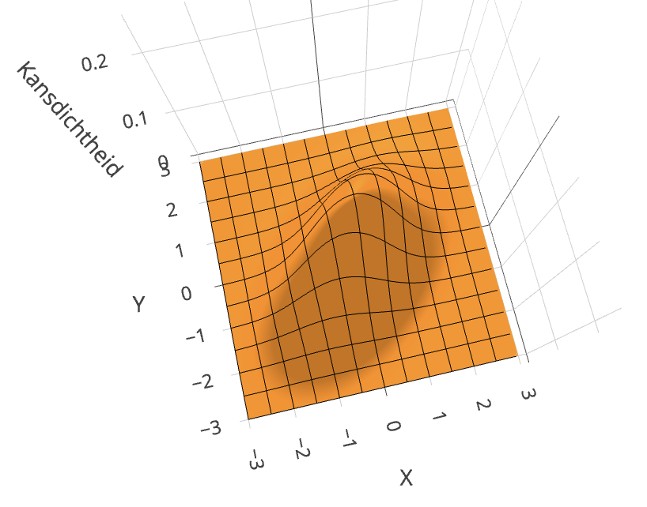
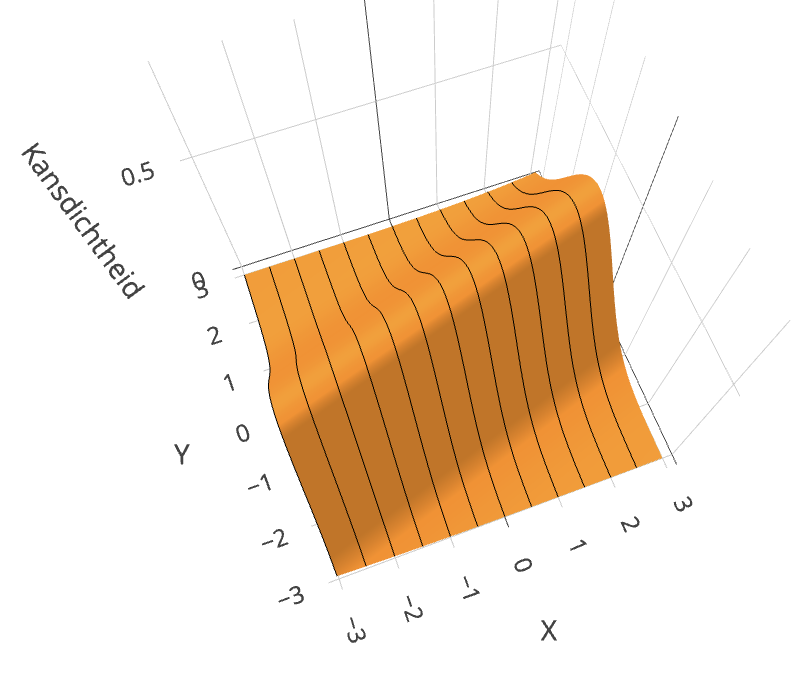



```{r}
#| eval: true
#| echo: false
#| output: false

library(ggplot2)

opvulkleur <- "darkorange"
lijnkleur1 <- "darkorchid"
lijnkleur2 <- "red"
lijnkleur3 <- "blue"

```

# Relaties tussen continue variabelen {#sec-linrel}

In het vorige hoofdstuk hebben we het uitgebreid gehad
over relaties tussen variabelen.
In dit hoofdstuk kijken we specifiek naar relaties tussen twee *continue* variabelen.
De focus zal sterk liggen op **lineaire relaties**.
Dat zijn relaties waarbij het verband tussen de variabelen 
beschreven kan worden met een rechte lijn.
Maar als afsluiter zullen we ook een voorbeeld bekijken
waarbij de relatie niet lineair is. 

## Leerdoelen

Na het bestuderen van dit hoofdstuk kun je:

- uitleggen wat een lineaire relatie is;
- de covariantie tussen twee variabelen berekenen en interpreteren;
- voor een gegeven dataset Pearsons correlatiecoëfficiënt $r$ berekenen en interpreteren;
- toetsen of de correlatiecoëfficiënt van een steekproef
  groot genoeg is om te concluderen dat er in de populatie ook een correlatie is;
- uitleggen welk statistisch model daarvoor gebruikt wordt, en beoordelen
  of de aannames van dat model redelijk zijn;
- uitleggen wat een regressielijn is en hoe die gebruikt kan worden om voorspellingen te doen;
- relaties tussen de covariantie, de correlatiecoëfficiënt, en de regressielijn 
  beschrijven en toepassen;
- de regressiecoëfficiënten berekenen met R, inclusief betrouwbaarheidsintervallen;
- uitleggen welk statistisch model daarvoor gebruikt wordt, en beoordelen
  of de aannames van dat model redelijk zijn;
- het onderscheid tussen interpolatie en extrapolatie uitleggen en de gevaren ervan benoemen;
- uitleggen dat ook de parameters van niet-lineaire modellen geschat kunnen worde
  door ze te "fitten" aan gegevens.

## Lineaire relaties

We beginnen met een voorbeeld.

::: {#exm-galton}
## De ontdekking van Sir Francis Galton.
<br>

{width="50%"}

In @sec-associaties zijn we Francis Galton al tegengekomen.
Rond 1888 deed Galton onderzoek naar de erfelijkheid van lichaamslengte.
Iedereen weet dat lange ouders vaak lange kinderen krijgen,
maar ook dat er soms opvallende verschillen zijn
tussen ouders en hun kinderen.
Galton verzamelde als eerste systematisch gegevens
om te zien in welke mate de lengte van de ouders  
en die van hun kinderen samenhangen.

In het figuur hieronder zijn de gegevens van Galton te zien.
Op de $x$-as staat de \emph{mid-ouder-lengte} uitgezet.
Dat is het gemiddelde van de lengte van beide ouders.
Op de $y$-as staat de lengte van hun (volwassen) kinderen.

```{r}
#| fig-height: 5
#| fig-width: 6
#| fig-align: "center"
#| code-fold: true
#| warning: false
#| fig.cap: "De lichaamslengte van volwassen kinderen is gecorreleerd met de lichaamslengte van de ouders. Op de $x$-as staat de mid-ouder-lengte; dat is het gemiddelde van beide ouders. De lichaamslengtes van alle vrouwen (moeders en kinderen) is vermenigvuldigd met 1,08 om te corrigeren voor het feit dat mannen iets langer zijn dan vrouwen."
#| label: fig-galton
#| out.width: "71.4%"

# Laad benodigde pakketten
if (!("HistData" %in% .packages())) { library(HistData) }
if (!("ggplot2"  %in% .packages())) { library(ggplot2) }

# Laad de GaltonFamilies-dataset
data("GaltonFamilies")

# Definieer omrekenfactoren
inch         <- 2.54
factor_vrouw <- 1.08

# Corrigeer ouderlengte naar cm en pas factor toe voor moeders
GaltonFamilies$mid_parent_height <- inch * (
  GaltonFamilies$father +
  factor_vrouw * GaltonFamilies$mother
) / 2

# Corrigeer kindlengte naar cm
GaltonFamilies$childHeightCorrected <- inch *
  GaltonFamilies$childHeight

# Pas correctie toe voor vrouwelijke kinderen
GaltonFamilies$childHeightCorrected[
  GaltonFamilies$gender == "female"
] <- factor_vrouw *
  GaltonFamilies$childHeightCorrected[
    GaltonFamilies$gender == "female"
  ]

# Hernoem eindvariabelen voor plot
GaltonFamilies$lengte_ouders     <- GaltonFamilies$mid_parent_height
GaltonFamilies$lengte_kinderen  <- GaltonFamilies$childHeightCorrected

# Maak scatterplot
ggplot(
  GaltonFamilies,
  aes(x = lengte_ouders, y = lengte_kinderen)
) +
  geom_point(
    alpha = 0.8,
    size  = 1,
    color = "darkorange"
  ) +
#  geom_abline(
#    slope     = 1,
#    intercept = 0,
#    linetype  = "dashed",
#    color     = "black"
#  ) +
  xlim(150, 205) +
  ylim(150, 205) +
  labs(
    x = "Mid-ouder-lengte (cm)",
    y = "Lengte kind (cm)",
    title = ""
  ) +
  theme_minimal()

```

Het figuur laat zien dat
lange ouders gemiddeld lange kinderen krijgen.
Maar je kunt ook zien dat kinderen van even lange ouders
flink in lengte kunnen verschillen.

De gegevens roepen allerlei vragen op.
Kunnen we de relatie tussen twee variabelen kwantificeren?
Is er een manier om te toetsen 
of deze samenhang ook het toevallige gevolg kan zijn
van steekproevenvariabiliteit?
Op deze en andere vragen gaan we hieronder in.

:::


### Wat is een lineaire relatie?

Stel dat we uit een populatie een steekproef van grootte $n$ hebben genomen 
en van iedere eenheid twee variabelen hebben gemeten: $X$ en $Y$.
De gemeten waarden van eenheid $i$ noemen we $x_i$ en $y_i$. 
We tekenen vervolgens een spreidingsdiagram waarbij we $Y$ uitzetten tegen $X$.

We zeggen dat de twee variabelen
een **lineaire relatie** hebben als de datapunten 
op of in de buurt van een rechte lijn liggen
die stijgt of daalt.
(De lijn moet wel stijgen of dalen, 
want als de lijn horizontaal loopt 
hangen de waarden van $Y$ niet af van die van $X$,
en is er dus geen relatie.)
@Fig-voorbeeld laat een duidelijk voorbeeld zien. 

:::{#fig-voorbeeld}

```{r}
#| fig-width: 3
#| fig-height: 3
#| out-width: "43%"
#| warning: false
#| code-fold: true

# Laad vereiste pakketten als ze nog niet geladen zijn
if (!("MASS" %in% .packages())) { library(MASS) }
if (!("ggplot2" %in% .packages())) { library(ggplot2) }


# Stel parameters in
steekproef_grootte <- 100
gemiddelden <- c(0, 0)
covariantie_matrix <- matrix(c(1, 0.95, 0.95, 1), nrow = 2)

# Genereer bivariate normale steekproef
set.seed(122)  # voor reproduceerbaarheid
data <- as.data.frame(mvrnorm(n = steekproef_grootte,
                              mu = gemiddelden,
                              Sigma = covariantie_matrix))
names(data) <- c("X", "Y")

# Maak de plot
ggplot(data, aes(x = X, y = Y)) +
  geom_point(color = "gray50") +
  geom_smooth(method = "lm", se = FALSE, color = "darkorange", linewidth = 1) +
  labs(x = expression(italic(X)), y = expression(italic(Y))) +
  theme_minimal() + 
  theme(
      axis.text.x = element_blank(),
      axis.text.y = element_blank()
    )
```

Variabelen $X$ en $Y$ met een lineaire relatie.
:::

### Pearsons correlatiecoëfficiënt $r$

Als twee variabelen een lineaire relatie hebben,
kunnen we de sterkte van die relatie kwantificeren
door **Pearsons correlatiecoëfficiënt** $r$ uit te rekenen.
(In de praktijk zeggen we vaak kortaf correlatiecoëfficiënt.)

Hier zijn een paar eigenschappen:

- De correlatiecoëfficiënt is **dimensieloos** en heeft dus geen eenheid.

- De waarde van $r$ ligt altijd in het interval $[-1, 1]$.

- Het *teken* van $r$ (positief of negatief) geeft aan of het om een stijgend (positief) of een dalend (negatief) verband gaat.

- De absolute waarde van $r$  geeft aan hoe sterk het verband is; 
  dat wil zeggen, hoe precies de punten op een lijn liggen.

  Als $r = 1$ of $-1$, dan is er een perfect lineair verband
  en liggen alle punten exact op een rechte lijn.
  Als $r = 0$, dan is er géén lineair verband tussen de variabelen.

@Fig-correl-coefs toont een aantal voorbeelden van puntenwolken met de bijbehorende waarden van $r$.

```{r}
#| out-width: "100%"
#| fig-width: 7
#| code-fold: true
#| warning: false
#| fig.cap: "Voorbeelden van steekproeven met verschillende correlatiecoëfficiënten."
#| label: fig-correl-coefs

# Laad benodigde pakketten
if (!("ggplot2" %in% .packages())) { library(ggplot2) }
if (!("MASS" %in% .packages())) { library(MASS) }
if (!("dplyr" %in% .packages())) { library(dplyr) }

# Definieer parameters
n <- 200  # Steekproefgrootte
correlaties <- c(1, 0.75, 0.5, 0.25, 0, -0.33, -0.67, -1)

set.seed(123)

# Functie om een bivariate normale steekproef te genereren
genereer_data <- function(rho, n, groep) {
  sigma <- matrix(c(1, rho, rho, 1), nrow = 2)
  data <- MASS::mvrnorm(n, mu = c(0, 0), Sigma = sigma)
  data.frame(X = data[, 1], Y = data[, 2], groep = groep)
}

# Genereer datasets voor verschillende correlaties
datasets <- do.call(rbind, Map(genereer_data, correlaties, n = n, groep = 1:8))

# Bereken sample correlaties per groep
correlatie_labels <- datasets %>%
  group_by(groep) %>%
  summarise(sample_cor = cor(X, Y)) %>%
  mutate(label = sprintf("r = %.2f", sample_cor))

# Maak de ggplot met facet_wrap
p <- ggplot(datasets, aes(x = X, y = Y)) +
  geom_point(color = "darkorange", alpha = 0.8, size = 1) +
  facet_wrap(~ groep, nrow = 2, 
             labeller = as_labeller(setNames(correlatie_labels$label, 1:8))) +
  coord_fixed(xlim = c(-3, 3), ylim = c(-3, 3)) +
#  theme_minimal() +
  theme(
    axis.text = element_blank(),
    axis.ticks = element_blank(),
    strip.text = element_text(size = 12),
    plot.margin = margin(0, 0, 0, 0)
  ) +
  labs(x = NULL, y = NULL)

# Print de plot
print(p)

```

### De correlatiecoëfficiënt is niet de richtingscoëfficiënt

De correlatiecoëfficiënt geeft aan of het verband positief of negatief is,
en hoe dicht de punten bij de lijn liggen.
Maar hij vertelt niet hoe *steil* de lijn is.
Een correlatiecoëfficiënt is dus geen richtingscoëfficiënt (hellingsgetal).

Bijvoorbeeld, de steekproeven in @fig-correl-sd hieronder
verschillen sterk in hun richtingscoëfficiënt, 
maar hebben allemaal $r = 1$ of $-1$.

```{r}
#| out-width: "100%"
#| fig-width: 7
#| fig-height: 2.6
#| code-fold: true
#| warning: false
#| fig.cap: "Bij al deze steekproeven is de correlatiecoëfficiënt 1 of -1. De correlatiecoëfficiënt geeft aan in hoeverre de punten op een rechte lijn vallen, niet hoe steil die lijn is."
#| label: fig-correl-sd

# Laad benodigde pakketten
if (!("ggplot2" %in% .packages())) { library(ggplot2) }
if (!("MASS" %in% .packages())) { library(MASS) }
if (!("dplyr" %in% .packages())) { library(dplyr) }

# Definieer parameters
n <- 50
correlaties <- c(1, 1, -1, -1)
std_y <- c(1, 0.4, 0.1, 0.7)

custom_labels <- c("1" = "r = 1", 
                   "2" = "r = 1", 
                   "3" = "r = -1", 
                   "4" = "r = -1")

# Functie om bivariate normaal verdeelde data te genereren
genereer_data <- function(rho, sigma_y, groep) {
  sigma <- matrix(c(1, rho * sigma_y, rho * sigma_y, sigma_y^2), nrow = 2)
  set.seed(groep)
  data <- MASS::mvrnorm(n, mu = c(0, 0), Sigma = sigma)
  data.frame(X = data[, 1], Y = data[, 2], groep = groep)
}

# Genereer datasets
datasets <- do.call(
  rbind, 
  Map(genereer_data, correlaties, std_y, groep = 1:4)
  )

# Maak de ggplot met facet_wrap
p <- ggplot(datasets, aes(x = X, y = Y)) +
  geom_point(color = "darkorange", alpha = 0.8, size = 1) +
  facet_wrap(~ groep, nrow = 1, labeller = as_labeller(custom_labels)) +
  coord_fixed(xlim = c(-3, 3), ylim = c(-3, 3)) +
#  theme_minimal() +
  theme(
    axis.text = element_blank(),
    axis.ticks = element_blank(),
    strip.text = element_text(size = 12),
    plot.margin = margin(0, 0, 0, 0)
  ) +
  labs(x = NULL, y = NULL)

# Print de plot
print(p)
```

::: {#exr-schatten-r .pepexr}
## Correlatiecoëfficiënten schatten
<br>

a.  Kijk terug naar de gegevens van Galton, @fig-galton, 
    en vergelijk de plot met de puntenwolken in @fig-correl-coefs.
    Schat op het oog de correlatiecoëfficiënt van Galtons gegevens.

b.  Hieronder zijn 8 puntenwolken gegeven. 
    Schat op het oog de correlatiecoëfficiënten.

```{r}
#| out-width: "100%"
#| fig-width: 7
#| echo: false
#| warning: false
#| fig.cap: "Wat zijn de correlatiecoëfficiënten?"
#| label: fig-correl-coefs-schatten

# Laad benodigde pakketten
if (!("ggplot2" %in% .packages())) { library(ggplot2) }
if (!("MASS" %in% .packages())) { library(MASS) }
if (!("dplyr" %in% .packages())) { library(dplyr) }

# Parameters
n <- 200  # Steekproefgrootte
aantal_panels <- 8
set.seed(42)  # Voor reproduceerbaarheid

# Genereer willekeurige correlaties tussen -1 en 1
correlaties <- runif(aantal_panels, min = -1, max = 1)

# Functie om bivariate normale steekproef te genereren
genereer_data <- function(rho, n, groep) {
  sigma <- matrix(c(1, rho, rho, 1), nrow = 2)
  data <- MASS::mvrnorm(n, mu = c(0, 0), Sigma = sigma)
  data.frame(X = data[, 1], Y = data[, 2], groep = groep)
}

# Genereer datasets
datasets <- do.call(
  rbind,
  Map(genereer_data, correlaties, n = n, groep = 1:aantal_panels)
)

# Bereken steekproefcorrelaties
correlatie_labels <- datasets %>%
  group_by(groep) %>%
  summarise(sample_cor = cor(X, Y))

# Print correlaties in console
# cat("Steekproefcorrelaties:\n")
# for (i in 1:aantal_panels) {
#   cat(sprintf("(%s): r = %.2f\n",
#               letters[i],
#               correlatie_labels$sample_cor[i]))
# }

# Genereer labels (a)–(h)
panel_labels <- setNames(
  paste0("(", letters[1:aantal_panels], ")"),
  1:aantal_panels
)

# Plot
p <- ggplot(datasets, aes(x = X, y = Y)) +
  geom_point(color = "darkorange", alpha = 0.8, size = 1) +
  facet_wrap(
    ~ groep,
    nrow = 2,
    labeller = as_labeller(panel_labels)
  ) +
  coord_fixed(xlim = c(-3, 3), ylim = c(-3, 3)) +
  theme(
    axis.text = element_blank(),
    axis.ticks = element_blank(),
    strip.text = element_text(size = 12),
    plot.margin = margin(0, 0, 0, 0)
  ) +
  labs(x = NULL, y = NULL)

print(p)
```


:::

### De correlatiecoëfficiënt is alleen betekenisvol voor lineaire relaties

Pearsons correlatiecoëfficiënt is bedoeld om *lineaire* relaties te beschrijven.
De grafieken  in @fig-nonlinear hieronder laten variabelen $X$ en $Y$ zien die wel een relatie hebben---de waarde van $Y$ hangt wel af van de waarde van $X$---maar
de relaties zijn steeds niet lineair.
Het is dan niet nuttig om $r$ uit te rekenen.

```{r}
#| out-width: "100%"
#| fig-width: 7
#| fig-height: 2.6
#| code-fold: true
#| warning: false
#| fig.cap: "Voorbeelden van niet-lineaire relaties. Als een relatie niet lineair is, vertelt $r$ je weinig tot niets. Het heeft dan geen zin om $r$ uit te rekenen."
#| label: fig-nonlinear

# Laad benodigde pakketten
if (!("ggplot2" %in% .packages())) { library(ggplot2) }
if (!("dplyr" %in% .packages())) { library(dplyr) }

# Definieer parameters
n <- 100
sigma_y <- 0.1  # Kleine variantie voor de fouten

custom_labels <- c("1" = "parabool", 
                   "2" = "exponentieel", 
                   "3" = "1 / X", 
                   "4" = "sinus")

# Functie om niet-lineaire relaties te genereren
genereer_data <- function(x, f, groep) {
  set.seed(groep)
  y <- f(x) + rnorm(n, mean = 0, sd = sigma_y)
  data.frame(X = x, Y = y, groep = groep)
}

# Genereer waarden voor X
set.seed(42)
x <- rnorm(n, mean = 0, sd = 1)

# Definieer niet-lineaire functies
functies <- list(
  function(x) .8*x^2 -2,         # Parabool
  function(x) exp(x) -2,       # Exponentiële groei
  function(x) 1 / (x),  # 1/x, met verschuiving om singulariteit te vermijden
  function(x) 2*sin(x)        # Sinusfunctie
)

# Genereer datasets
datasets <- do.call(
  rbind, 
  Map(genereer_data, list(x, x, x, x), functies, groep = 1:4)
  )

# Maak de ggplot met facet_wrap
p <- ggplot(datasets, aes(x = X, y = Y)) +
  geom_point(color = "darkorange", alpha = 0.8, size = 1) +
  facet_wrap(~ groep, nrow = 1, labeller = as_labeller(custom_labels)) +
  coord_fixed(xlim = c(-3, 3), ylim = c(-3, 3)) +
#  theme_minimal() +
  theme(
    axis.text = element_blank(),
    axis.ticks = element_blank(),
    strip.text = element_text(size = 12),
    plot.margin = margin(0, 0, 0, 0)
  ) +
  labs(x = NULL, y = NULL)

# Print de plot
print(p)
```

### De correlatiecoëfficiënt is gevoelig voor uitbijters

De correlatiecoëfficiënt is erg gevoelig voor uitbijters.
Zie @fig-outlier hieronder.
*Zonder* de uitbijter rechtsboven zou
de correlatiecoëfficiënt 0 zijn, 
maar door dat ene datapunt is de waarde 0,4.
Bekijk je gegevens dus altijd nauwkeurig
voordat je $r$ uitrekent. 
Als het verband er niet lineair uitziet óf er opvallende uitbijters zijn,
is de waarde van $r$ niet betekenisvol.
Omdat dit punt heel belangrijk is,
komen we er in @exr-anscombe nog een keer op terug.

::: {#fig-outlier}

```{r}
#| fig.width: 3
#| fig.height: 3
#| out.width: "43%"
#| warning: false
#| message: false
#| code-fold: true

# Laad vereiste pakketten als ze nog niet geladen zijn
if (!("ggplot2" %in% .packages())) { library(ggplot2) }

# Genereer data met constante Y behalve één uitschieter
set.seed(456)
n <- 20
X <- runif(n, -2, 2)
Y <- rep(0, n)
Y[n] <- 5  # uitschieter op laatste punt
X[n] <- 2

data <- data.frame(X = X, Y = Y)

# Bereken de correlatiecoëfficiënt
#correlatie <- cor(data$X, data$Y)
#cat("Correlatiecoëfficiënt:", round(correlatie, 3), "\n")

# Maak de plot
ggplot(data, aes(x = X, y = Y)) +
  geom_point(color = "darkorange") +
#  geom_smooth(method = "lm", se = FALSE,
#              color = "orange", linewidth = 1) +
  labs(x = expression(italic(X)), y = expression(italic(Y))) +
  theme_minimal() +
  theme(
    axis.text.x = element_blank(),
    axis.text.y = element_blank()
  ) +
  annotate("text", x = -1.5, y = 4.5,
           label = expression(italic(r) == 0.4),
           size = 4) +
  coord_cartesian( ylim = c(-1, 5.5) )

```

De correlatiecoëfficiënt is erg gevoelig voor uitbijters.
Zonder uitbijter zou de correlatiecoëfficiënt 0 zijn;
met de uitbijter 0,4. 

:::

### De correlatiecoëfficiënt kan afhangen van het bereik van de $X$-waarden

@Fig-bereik-a is een plot van variabelen die sterk met elkaar samenhangen.
De correlatiecoëfficiënt is dan ook $r = 0{,}79$.

Maar stel dat we de analyse beperken tot alleen het middelste gedeelte van het domein.
We selecteren de oranje datapunten en plotten die los in @fig-bereik-b.
Nu is de correlatiecoëfficiënt een stuk kleiner: $r = 0{,}36$!
Op het oog kun je ook goed zien waarom: als het bereik zo klein is,
volgen de datapunten veel minder duidelijk een lineaire trend.

Hou dit goed in gedachte 
bij het interpreteren van gegevens.
Als er tussen twee variabelen geen duidelijk verband wordt gevonden,
kan dat liggen aan een gebrek aan variatie in de $X$-waarden.
Een andere studie met meer variatie
kan dan mogelijk wél een correlatie aantonen.

::: {#fig-bereik layout="[[1],[1]]"}

```{r}
#| fig.height: 4
#| fig.width: 4
#| out.width: "64%"
#| warning: false
#| code-fold: true
#| label: fig-bereik-a
#| fig-cap: "Dataset met een sterk positieve correlatie ($r = 0{,}79$)."

# Laad benodigde bibliotheken
if (!("ggplot2" %in% .packages())) { library(ggplot2) }
if (!("MASS" %in% .packages())) { library(MASS) }

# Stel parameters in
set.seed(123)
n_punten      <- 500
correlatie    <- 0.8
sigma         <- 1
x_bereik_vol  <- c(-2.7, 2.7)
x_bereik_zoom <- c(-0.5, 0.5)

# Covariantiematrix op basis van gewenste correlatie
cov_matrix <- matrix(
  c(sigma^2, correlatie * sigma^2,
    correlatie * sigma^2, sigma^2),
  nrow = 2
)

# Simuleer data uit een bivariate normale verdeling
data <- MASS::mvrnorm(
  n     = n_punten,
  mu    = c(0, 0),
  Sigma = cov_matrix
)

df <- data.frame(
  x = data[, 1],
  y = data[, 2]
)

# Bepaal of punt binnen zoomgebied valt
df$kleur <- ifelse(
  df$x >= x_bereik_zoom[1] &
  df$x <= x_bereik_zoom[2],
  "in_zoom",
  "buiten_zoom"
)

# Filter voor zoom-in
df_zoom <- subset(
  df,
  kleur == "in_zoom"
)

# Grijs gearceerd gebied in bovenste plot
rect_data <- data.frame(
  xmin = x_bereik_zoom[1],
  xmax = x_bereik_zoom[2],
  ymin = min(df$y),
  ymax = max(df$y)
)

# Grijs gearceerd gebied in bovenste plot
rect_data_zoom <- data.frame(
  xmin = x_bereik_zoom[1],
  xmax = x_bereik_zoom[2],
  ymin = floor(df_zoom$y),
  ymax = ceiling(df_zoom$y)
)

# Plot A (volledig bereik)
plot_a <- ggplot(df, aes(x = x, y = y)) +
  geom_rect(
    data = rect_data,
    aes(
      xmin = xmin, xmax = xmax,
      ymin = ymin, ymax = ymax
    ),
    fill = "grey90",
    inherit.aes = FALSE
  ) +
  geom_point(
    data = subset(df, kleur == "buiten_zoom"),
    alpha = 0.6,
    color = "grey50"
  ) +
  geom_point(
    data = subset(df, kleur == "in_zoom"),
    alpha = 0.8,
    color = "darkorange"
  ) +
  geom_vline(
    xintercept = x_bereik_zoom,
    linetype   = "dashed",
    color      = "grey30"
  ) +
  annotate(
    "text",
    x     = min(x_bereik_vol) + 0.2,
    y     = max(df$y),
    label = paste0("italic(r) == ", round(cor(df$x, df$y), 2)),
    hjust = 0,
    vjust = 1,
    size  = 4,
    parse = TRUE
  ) +
  xlim(x_bereik_vol) +
  xlab(expression(italic(X))) +
  ylab(expression(italic(Y))) +
  theme_minimal()

# Plot B (ingezoomd)
plot_b <- ggplot(df_zoom, aes(x = x, y = y)) +
  geom_rect(
    data = rect_data_zoom,
    aes(
      xmin = xmin, xmax = xmax,
      ymin = ymin, ymax = ymax
    ),
    fill = "grey90",
    inherit.aes = FALSE
  ) +
  geom_vline(
    xintercept = x_bereik_zoom,
    linetype   = "dashed",
    color      = "grey30"
  ) +
  geom_point(
    alpha = 0.8,
    color = "darkorange"
  ) +
  annotate(
    "text",
    x     = min(x_bereik_zoom) + 0.05,
    y     = max(df_zoom$y),
    label = paste0("italic(r) == ", round(cor(df_zoom$x, df_zoom$y), 2)),
    hjust = 0,
    vjust = 1,
    size  = 4,
    parse = TRUE
  ) +
  xlim(x_bereik_zoom) +
  xlab(expression(italic(X))) +
  ylab(expression(italic(Y))) +
  theme_minimal()

plot_a
```


```{r}
#| fig.height: 4
#| fig.width: 4
#| out.width: "64%"
#| label: fig-bereik-b
#| fig-cap: "Als de dataset wordt beperkt tot een kleiner domein---het oranje gedeelte van panel(a)---wordt de correlatiecoëfficiënt een stuk kleiner ($r = 0{,}36$). Dat is niet gek: de puntenwolk volgt nu ook veel minder duidelijk een rechte lijn."

plot_b
```

Het bereik van de dataset kan een grote invloed hebben op de correlatiecoëfficiënt.

:::


### De covariantie

Tot nu toe hebben we de eigenschappen van de correlatiecoëfficiënt besproken
zonder te vertellen hoe je die uitrekent.
Dat is het volgende op het programma.

Het is handig om eerst de **covariantie** te definiëren tussen de gegevens $x_i$ en $y_i$
in een steekproef of serie waarnemingen:

$$ \covD{X}{Y} = \frac{\sum_{i=1}^{n} (x_i - \bar{x})(y_i - \bar{y})}{n-1}.$$ {#eq-cov}

Voor iedere eenheid $i$ uit onze waarnemingen
rekenen we eerst de afwijkingen $x_i - \mean{x}$ en $y_i - \mean{y}$ uit 
en vermenigvuldigen die.
Vervolgens tellen we de resultaten op en delen we door $n - 1$.

De covariantie meet de mate waarin de $x$- en $y$-waarden lineair met elkaar samenhangen.
@Fig-annotated-scatter illustreert dat.

```{r}
#| out-width: "64%"
#| fig-width: 4.5
#| fig-height: 4.5
#| code-fold: true
#| warning: false
#| fig.cap: "Spreidingsdiagram met vier kwadranten. De covariantie wordt positief beïnvloed door punten in de kwadranten rechtsboven en linksonder, en negatief door punten in de kwadranten linksboven en rechtsonder."
#| label: fig-annotated-scatter

# Laad benodigde pakketten
if (!("ggplot2" %in% .packages())) { library(ggplot2) }
if (!("MASS" %in% .packages())) { library(MASS) }

# Definieer parameters
n <- 100  # Steekproefgrootte
rho <- 0.85  # Correlatiecoëfficiënt

set.seed(158)

# Genereer bivariate normale data
sigma <- matrix(c(1, rho, rho, 1), nrow = 2)
data <- MASS::mvrnorm(n, mu = c(0, 0), Sigma = sigma)
df <- data.frame(X = data[, 1], Y = data[, 2])

# Bereken gemiddelden
mean_x <- mean(df$X)
mean_y <- mean(df$Y)
df$X <- df$X - mean_x
df$Y <- df$Y - mean_y

# Maak de scatterplot
p <- ggplot(df, aes(x = X, y = Y)) +
  geom_point(color = "darkorange", alpha = 0.8, size = 2) +
  geom_vline(xintercept = 0, linetype = "dashed") +
  geom_hline(yintercept = 0, linetype = "dashed") +
  annotate("text", x = 2.3, y = 3.5, 
           label = expression(atop(italic(x) > bar(italic(x)), 
                                   italic(y) > bar(italic(y)))), 
           size = 5, hjust = 0) +
  annotate("text", x = -2.7, y = 3.5, 
           label = expression(atop(italic(x) < bar(italic(x)), 
                                   italic(y) > bar(italic(y)))), 
           size = 5, hjust = 0) +
  annotate("text", x = 2.3, y = -3.5, 
           label = expression(atop(italic(x) > bar(italic(x)), 
                                   italic(y) < bar(italic(y)))), 
           size = 5, hjust = 0) +
  annotate("text", x = -2.7, y = -3.5, 
           label = expression(atop(italic(x) < bar(italic(x)), 
                                   italic(y) < bar(italic(y)))), 
           size = 5, hjust = 0) +
  theme_minimal() + 
  theme(
    axis.text = element_blank(),
    axis.ticks = element_blank()
  ) +
  labs(x = expression(bar(italic(x))), y = expression(bar(italic(y)))) +
  coord_cartesian(xlim = c(-3, 3), ylim = c(-4, 4))

# Print de plot
print(p)
```

Het figuur laat een spreidingsdiagram zien met een positieve correlatie.
Het diagram is in vier kwadranten verdeeld
door met een verticale onderbroken lijn het gemiddelde van $x$ aan te geven
en met een horizontale onderbroken lijn het gemiddelde van $y$.

- In het **kwadrant rechtsboven** liggen alle datapunten waarbij $x_i > \mean{x}$,
en $y_i > \mean{y}$.
Het product $(x_i - \mean{x})(y_i - \mean{y})$ is voor die punten
dus *positief*.
Deze punten dragen dus positief bij aan de waarde van de covariantie (@eq-cov).
Punten die ver in de rechts-bovenhoek van het diagram liggen,
dragen het sterkst bij, want daarvoor zijn $x_i - \mean{x}$
en $y_i - \mean{y}$ het grootst.

- In het **kwadrant linksonder** liggen alle datapunten waarbij $x_i < \mean{x}$,
en $y_i < \mean{y}$.
Het product $(x_i - \mean{x})(y_i - \mean{y})$ is voor die punten ook *positief*.
Punten in dit kwadrant dragen dus óók positief bij;
de punten ver in de links-onderhoek het sterkst.

- In het **kwadrant linksboven** liggen alle datapunten waarbij $x_i < \mean{x}$,
en $y_i > \mean{y}$.
Het product $(x_i - \mean{x})(y_i - \mean{y})$ is nu altijd *negatief*.
In @eq-cov leveren deze punten dus een negatieve bijdrage.
Hetzelfde geldt voor het **kwadrant rechtsonder**, waar $x_i > \mean{x}$,
en $y_i < \mean{y}$.

Het gevolg is dat de covariantie positief is
als de meeste datapunten rechtsboven of linksonder in de plot 
te vinden zijn.
Dat zou inderdaad betekenen dat er een positieve relatie is.

Bij de berekening van de covariantie vermenigvuldigen we steeds
een waarde van $X$ met een waarde van $Y$.
Daardoor is de dimensie van de covariantie gelijk aan
de dimensie van $X$ 
vermenigvuldigd met de dimensie van $Y$.
Bijvoorbeeld,
in de gegevens van Galton 
hebben $X$ en $Y$ allebei de dimensie van *lengte*, met eenheid cm.
De covariantie van die gegevens heeft dus dimensie lengte$^2$ en eenheid cm$^2$.

::: {#exr-covariantie .pepexr}

## De relatie tussen variantie en covariantie
<br>

Kijk nog eens naar @eq-cov voor de covariantie.

a.  Stel dat we de covariantie van $X$ met zichzelf berekenen, $\covD{X}{X}$.
    Wat is daarvoor de formule?
    (Vervang in @eq-cov elke $y$ door een $x$, en versimpel de
    vergelijking een beetje.)
    
b.  Vergelijk het resultaat van onderdeel **a** met @eq-variantie. Wat valt je op?

c.  De variantie $V_{X}$ is altijd positief, en dus $\covD{X}{X}$ ook.
    Had je dat kunnen verwachten?

:::

### De formule voor Pearsons correlatiecoëfficiënt

Nu we weten wat de covariantie is,
kunnen we de formule voor Pearsons correlatiecoëfficiënt schrijven als:

$$
r = \frac{\covD{X}{Y}}
         {s_X s_Y}.
$$ {#eq-pearson}

De correlatiecoëfficiënt is dus de covariantie gedeeld door de standaarddeviaties
van $X$ en $Y$. 
Het delen door beide standaarddeviaties zorgt ervoor dat $r$ tussen -1 en 1 ligt.

Omdat $s_X$ en $s_Y$ alleen maar positief kunnen zijn,
heeft $r$ altijd hetzelfde teken als $\covD{X}{Y}$.
Als de covariantie positief is, is $r$ dat dus ook.

::: {#exr-covariantie-2 .pepexr}

## De correlatie van $X$ met $X$
<br>

In @exr-covariantie heb je laten zien dat $\covD{X}{X}$ gelijk is aan $V_X$.

Wat is volgens @eq-pearson dan de correlatiecoëfficiënt van $X$ met zichzelf?
Is dat wat je zou verwachten?

:::

### Correlatie-coëfficiënt berekenen met R

Met R kun je de covariantie tussen twee vectoren heel eenvoudig berekenen.
Laten we dat doen voor de gegevens van Galton.
Het dataframe heet `GaltonFamilies`:

```{r}
cov( GaltonFamilies$lengte_ouders, GaltonFamilies$lengte_kinderen )
```

De covariantie is positief, zoals verwacht.
Maar omdat de covariantie afhangt van de eenheden en schaal
van de variabelen, is het getal zelf lastig te interpreteren.

Daarom berekenen we de correlatiecoëfficiënt. 
Dat gaat ook erg gemakkelijk:

```{r}
cor( GaltonFamilies$lengte_ouders, GaltonFamilies$lengte_kinderen )
```
De correlatiecoëfficiënt tussen de lengte van ouders en hun kinderen
is in de dataset van Galton dus 0,50.
(Had je dat in @exr-schatten-r al zo ingeschat?)

## Toets van de correlatiecoëfficiënt

Als we in een *steekproef of serie waarnemingen* 
een correlatie zien tussen twee variabelen,
dan kan dat betekenen dat deze variabelen
gecorreleerd zijn *in de populatie*.
Maar het is ook mogelijk 
dat de correlatie in de waarnemingen
het gevolg is van toevallige steekproevenvariabiliteit.
Is er een manier om dat te toetsen?
In andere woorden: kunnen we laten zien dat deze gegevens
sterk bewijs leveren tegen de hypothese
dat de correlatiecoëfficiënt van de *populatie*,
$\rho$, gelijk is aan 0?

Omdat we al meerdere hypothesetoetsen besproken hebben,
kunnen we deze toets snel behandelen.
We lopen de 6 stappen door:

**Stap 1: Kies een statistisch model.**\
In eerdere hoofdstukken ging het statistisch model 
steeds over de kans op een waarneming $X$.
Nu moeten we een stapje verder gaan,
omdat iedere waarneming nu twee waardes inhoudt: 
een waarde van $X$ en een waarde van $Y$.
We hebben dus een statistisch model nodig voor 
de verdeling van van datapunten $(X, Y)$ in de populatie.

Bij deze toets nemen we aan dat de verdeling in de populatie **bivariaat normaal** is.
@Fig-bivariaat laat zien hoe een bivariate normale verdeling eruit ziet.
Het is een 3D plot: de hoogte van de grafiek geeft de kansdichtheid, 
die afhangt van zowel de waarde van $X$ als van de waarde van $Y$.
Je kunt met je muis de grafiek bewegen om 'm van alle kanten te bekijken.


We nemen ook aan
dat ieder datapunt **onafhankelijk** uit de verdeling getrokken is.


:::{.print-only}

<center>*Interactieve content beschikbaar op de website:*</center>


Visualisatie van de bivariate normale verdeling met $\rho = 0.5$.

:::


:::{.screen-only}
::: {#fig-bivariaat}

```{r}
#| echo: false
#| warning: false
#| out-width: "71%"
#| fig-width: 5
#| fig-height: 5
# Laad benodigde bibliotheken
if (!("mnormt" %in% .packages()))   { library(mnormt) }
if (!("plotly" %in% .packages()))  { library(plotly) }

# Definieer parameters
rho      <- 0.5
sigma_x  <- 1
sigma_y  <- 1
mu_x     <- 0
mu_y     <- 0

# Covariantiematrix
sigma_matrix <- matrix(
  c(sigma_x^2,        rho * sigma_x * sigma_y,
    rho * sigma_x * sigma_y, sigma_y^2),
  nrow = 2
)

# Raster voor x en y
x_vals <- seq(-3, 3, length.out = 100)
y_vals <- seq(-3, 3, length.out = 100)

raster <- expand.grid(
  x = x_vals,
  y = y_vals
)

# Bereken dichtheid
raster$z <- dmnorm(
  x      = cbind(raster$x, raster$y),
  mean   = c(mu_x, mu_y),
  varcov = sigma_matrix
)

# Zet om in matrix voor 3D-plot
z_mat <- matrix(raster$z, nrow = length(x_vals))

# Maak wireframe-plot met effen kleur (donkeroranje)
plot_ly(
  x = x_vals,
  y = y_vals,
  z = z_mat,
  type = "surface",
  showscale = FALSE,
  surfacecolor = matrix(1, nrow = 100, ncol = 100),
  colorscale = list(c(0, "darkorange"), c(1, "darkorange")),
  contours = list(
    x = list(show = TRUE, color = "black", highlight = FALSE, start = -3, end = 3, size = 0.5),
    y = list(show = TRUE, color = "black", highlight = FALSE, start = -3, end = 3, size = 0.5),
    z = list(show = FALSE, color = "black", highlight = FALSE, start = 0, end = 0, size = 0.04)
  )
) |>
  layout(
    title = NULL,
    scene = list(
      xaxis = list(title = "X"),
      yaxis = list(title = "Y"),
      zaxis = list(
        title = "Kansdichtheid",
        range = c(0, 0.25)
      ),
      camera = list(
        eye = list(x = -0.5, y = -1.25, z = 1.9)  # Aangepaste kijkhoek
        )  
    )
  )
```

Visualisatie van de bivariate normale verdeling met $\rho = 0.5$.
Je kunt met je muis de grafiek ronddraaien en in- en uitzoomen. 
:::

:::


De bivariate normale verdeling heeft een aantal belangrijke eigenschappen.

- **Vijf parameters:** De bivariate normale verdeling heeft vijf parameters: 
  de gemiddelden van $X$ en $Y$, de standaarddeviaties van $X$ en $Y$, en de correlatiecoëfficiënt 
  van de populatie $\rho$. In het voorbeeld van @fig-bivariaat is $\mu_X = \mu_Y = 0$, 
  $\sigma_X = \sigma_Y = 1$, en $\rho = 0{,}5$.
  
- **Beide variabelen zijn normaal verdeeld:** Zowel $X$ als $Y$ zijn normaal verdeeld.

- **De contour-lijnen zijn ovaal:** De hoogtelijnen van de bivariate normale verdeling,
  ook wel contour-lijnen genoemd, zijn ovaal. @Fig-contours laat een aantal voorbeelden zien
  voor verschillende waarden van $\rho$.
  
  Het gevolg is dat steekproeven uit de bivariate normale verdeling ook *ongeveer* een 
  ovale of ronde puntenwolk vormen. 
  De steekproeven die we in @fig-correl-coefs als voorbeeld gebruikten,
  zijn ieder uit een bivariate normale verdeling getrokken.

```{r}
#| echo: false
#| warning: false

# Laad benodigde bibliotheken
if (!("mnormt" %in% .packages()))   { library(mnormt) }
if (!("ggplot2" %in% .packages())) { library(ggplot2) }

# Definitie van de functie
plot_bivariate_normal_contours <- function(rho) {

  # Definieer vaste parameters
  sigma_x <- 1
  sigma_y <- 1
  mu_x    <- 0
  mu_y    <- 0

  # Covariantiematrix
  sigma_matrix <- matrix(
    c(sigma_x^2, rho * sigma_x * sigma_y,
      rho * sigma_x * sigma_y, sigma_y^2),
    nrow = 2
  )

  # Raster voor x en y
  x_vals <- seq(-3, 3, length.out = 100)
  y_vals <- seq(-3, 3, length.out = 100)

  raster <- expand.grid(
    x = x_vals,
    y = y_vals
  )

  # Bereken dichtheid
  raster$z <- dmnorm(
    x      = cbind(raster$x, raster$y),
    mean   = c(mu_x, mu_y),
    varcov = sigma_matrix
  )

  # Bepaal labelpositie (linksboven)
  label_x <- min(x_vals) + 0.2
  label_y <- max(y_vals) - 0.2
  
  label_rho <- paste0("italic(rho) == ", rho)  
    # Maak contourplot
  ggplot(raster, aes(x = x, y = y, z = z)) +
    geom_contour(
      color = "darkorange",
      size  = 0.7
    ) +
    annotate(
      geom  = "text",
      x     = label_x,
      y     = label_y,
      label = label_rho,
      hjust = 0,
      vjust = 1,
      parse = TRUE,
      size  = 4.5
    ) +
    coord_fixed() +
    labs(
      x     = expression(italic(X)),
      y     = expression(italic(Y)),
      title = NULL
    ) +
    theme_minimal() +
    theme(
      axis.text.x = element_blank(),
      axis.text.y = element_blank()
    )  +
    xlim(-3, 3) + ylim(-3, 3)
}

correlaties <- c(1, 0.75, 0.5, 0.25, 0, -0.33, -0.67, -1)

```

::: {#fig-contours layout="[[1,1,1],[1,1,1]]"}

```{r}
#| echo: false
#| warning: false
#| out-width: "100%"
#| fig-width: 2.33
#| fig-height: 2.33
plot_bivariate_normal_contours(correlaties[2])
```

```{r}
#| echo: false
#| warning: false
#| out-width: "100%"
#| fig-width: 2.33
#| fig-height: 2.33
plot_bivariate_normal_contours(correlaties[3])
```

```{r}
#| echo: false
#| warning: false
#| out-width: "100%"
#| fig-width: 2.33
#| fig-height: 2.33
plot_bivariate_normal_contours(correlaties[4])
```

```{r}
#| echo: false
#| warning: false
#| out-width: "100%"
#| fig-width: 2.33
#| fig-height: 2.33
plot_bivariate_normal_contours(correlaties[5])
```

```{r}
#| echo: false
#| warning: false
#| out-width: "100%"
#| fig-width: 2.33
#| fig-height: 2.33
plot_bivariate_normal_contours(correlaties[6])
```

```{r}
#| echo: false
#| warning: false
#| out-width: "100%"
#| fig-width: 2.33
#| fig-height: 2.33
plot_bivariate_normal_contours(correlaties[7])
```

Contour-plots voor verschillende bivariaat-normale verdelingen.

:::


**Stap 2: Stel de hypotheses $\HO$ en $\HA$ op.**\
De nulhypothese is dat $X$ en $Y$ niet gecorreleerd zijn in de populatie.
Dat wil zeggen:

$\HO:\qquad \rho = 0,$

$\HA:\qquad \rho \neq 0.$

**Stap 3: Kies de toetsingsgrootheid en bepaal zijn kansverdeling onder $\HO$.**\

Als **toetsingsgrootheid** gebruiken we de correlatiecoëfficiënt uit de steekproef $r$,
gedeeld door de bijbehorende standaardfout:

$$ t = \frac{r}{\se{r}}.$$ {#eq-t-cor}

Die standaardfout kan met deze formule worden berekend:

$$ \se{r} = \sqrt{\frac{1 - r^2}{n - 2}}.$$ {#eq-t-se}
Je voelt het misschien al aankomen: de **kansverdeling onder $\HO$** van deze $t$ 
is weer een $t$-verdeling.
Maar deze keer met $n - 2$ vrijheidsgraden.

**Stap 4: Bereken de toetsingsgrootheid op basis van de daadwerkelijke waarnemingen.**
Hiervoor vul je dus de formules @eq-t-se en @eq-t-cor in op basis van de steekproef.

**Stap 5: Bereken de $P$-waarde.**\
Net als bij de $t$-toetsen in @sec-toetsen-gemiddelden
kun je de $P$-waarde berekenen met de functie `pt()`.
Let wel op dat je het juiste aantal vrijheidsgraden gebruikt:

```{r}
#| eval: false
P <- 2 * pt(-abs(t), df = n - 2)
```

**Stap 6: Trek je conclusies**\
Trek op basis van $P$ je conclusies.

::: {#exr-galton-onafhankelijk .pepexr}
## Correlatietoets van de gegevens van Galton
<br>

We zouden de correlatietoets graag willen toepassen op de gegevens van Galton,
om te zien of we uit zijn gegevens kunnen concluderen
dat lichaamslengte inderdaad deels erfelijk is.

a.  Kijk nog eens naar het spreidingsdiagram van de gegevens, @fig-galton.
    Geven deze gegevens de indruk afkomstig te zijn uit een 
    bivariate normale verdeling, of zie je afwijkingen?
    
b.  Als de verdeling bivariaat normaal is,
    dan zouden de lengtes van de ouders 
    en de lengtes van de kinderen
    allebei normaal verdeeld moeten zijn.
    We kunnen kijken of we afwijkingen zien 
    door histogrammen en QQ-plots te maken van beide variabelen:
    
    ::: {layout="[[1,1],[1,1]]"}
    
    ```{r}
    #| code-fold: true
    #| fig-width: 3.5
    #| fig-height: 3.5
    
    hist(GaltonFamilies$lengte_ouders, main = "ouders")
    ```
    
    ```{r}
    #| code-fold: true
    #| fig-width: 3.5
    #| fig-height: 3.5
    
    hist(GaltonFamilies$lengte_kinderen, main = "kinderen")
    ```
    
    ```{r}
    #| code-fold: true
    #| fig-width: 3.5
    #| fig-height: 3.5
    
    qqnorm(GaltonFamilies$lengte_ouders, main = "ouders")
    qqline(GaltonFamilies$lengte_ouders)
    ```
    
    ```{r}
    #| code-fold: true
    #| fig-width: 3.5
    #| fig-height: 3.5
    
    qqnorm(GaltonFamilies$lengte_kinderen, main = "kinderen")
    qqline(GaltonFamilies$lengte_kinderen)
    ```
    
    :::
    
    Wat is jouw oordeel?
    
c.  Het statistische model neemt ook aan 
    dat alle paren datapunten $(x_i, y_i)$
    onafhankelijk uit de bivariaat normale kansverdeling zijn getrokken.
    
    Om te bepalen of dat een redelijke aanname is,
    moeten we meer weten over de manier waarop Galton
    deze dataset samenstelde.
    
    Lees de beschrijving van de dataset via [deze link](https://search.r-project.org/CRAN/refmans/HistData/html/GaltonFamilies.html).
    
    Lijkt het je redelijk om aan te nemen dat de datapunten onafhankelijk zijn?

:::

### De toets uitvoeren met R

Het is weer veel eenvoudiger om de volledige toets
met R uit te voeren, met de functie `cor.test()`.
We laten het aan de hand van een voorbeeld zien:

:::{#exm-cor-test}

## De correlatie tussen flipper-lengte en gewicht bij Adelie-pinguïns
<br>

In @sec-toetsen-gemiddelden heb je al kennisgemaakt met de dataset `palmerpenguins`,
met gegevens over pinguïns in de Palmer-archipel.
In die dataset is ook voor alle pinguïns de flipperlengte (`flipper_length_mm`) en het lichaamsgewicht (`body_mass_g`) opgenomen.
Je zou verwachten dat dat zwaardere pinguïns ook typisch langer flippers hebben.
We gaan dat testen voor de soort Adelie.
Bestudeer ook de code voor ieder stap, zodat je het straks ook zelf kunt.

```{r}
#| echo: false
# Laad vereiste pakketten
if (!("palmerpenguins" %in% .packages())) { library(palmerpenguins) }
if (!("ggplot2" %in% .packages())) { library(ggplot2) }
if (!("dplyr" %in% .packages())) { library(dplyr) }

# Filter enkel de Adelie-pinguïns met volledige data
adelie <- penguins %>%
  filter(species == "Adelie",
         !is.na(flipper_length_mm),
         !is.na(body_mass_g))

adelie <- as.data.frame(adelie[, c("flipper_length_mm", "body_mass_g")])
```

We hebben de gegevens over de Adelie-pinguïns
opgeslagen in een dataframe `adelie`.

```{r}
str(adelie)
```
We hebben dus gegevens voor 151 pinguïns.

We bekijken de gegevens eens:

```{r}
#| fig-width: 3.5
#| fig-height: 4
#| out-width: "50%"
#| code-fold: true
# Scatterplot: flipperlengte vs lichaamsgewicht
plot(
  adelie$body_mass_g, 
  adelie$flipper_length_mm,
  xlab = "Lichaamsgewicht (g)",
  ylab = "Flipperlengte (mm)"
)
```

Er lijkt inderdaad een positief verband te bestaan tussen lichaamsgewicht
en flipperlengte.
De puntenwolk ziet er redelijk ovaal uit, 
consistent met een bivariate normale verdeling, 
en er zijn geen bijzondere uitbijters te zien.

Om verder te controleren of het bivariate model redelijk is,
bekijken we de verdelingen van beide variabelen:

:::{layout="[[1,1],[1,1]]"}

```{r}
#| code-fold: true
#| fig-width: 3
#| fig-height: 3
#| out-width: "80%"

# Histogrammen met base R
hist(adelie$body_mass_g,
     main = NULL,
     xlab = "Lichaamsgewicht (g)",
     col = "darkorange", border = "black")
```

```{r}
#| code-fold: true
#| fig-width: 3
#| fig-height: 3
#| out-width: "80%"

hist(adelie$flipper_length_mm,
     main = NULL,
     xlab = "Flipperlengte (mm)",
     col = "darkorange", border = "black")
```

```{r}
#| code-fold: true
#| fig-width: 3
#| fig-height: 3
#| out-width: "80%"

# QQ-plots
qqnorm(adelie$body_mass_g, main = "QQ-plot lichaamsgewicht")
qqline(adelie$body_mass_g)
```

```{r}
#| code-fold: true
#| fig-width: 3
#| fig-height: 3
#| out-width: "80%"

qqnorm(adelie$flipper_length_mm, main = "QQ-plot flipperlengte")
qqline(adelie$flipper_length_mm)
```

:::

Lichaamsgewicht lijkt iets asymmetrisch,
maar de afwijking is erg subtiel.

Aangenomen dat de steekproef redelijk aselect heeft plaatsgevonden,
kunnen we de toets uitvoeren:

```{r}
cor.test(adelie$body_mass_g, adelie$flipper_length_mm)
```

De uitvoer geeft direct de $P$-waarde: $P = 1{,}3\times 10^{-9}$.
Die $P$-waarde is heel erg klein en laat weinig ruimte voor twijfel
over de samenhang tussen gewicht en flipperlengte.

De uitvoer geeft ook een 95%-BHI
voor de correlatiecoëfficiënt van de populatie: 
$[0{,}33, 0{,}58]$.
We zijn dus 95% zeker dat de ware correlatiecoëfficiënt 
in dat interval ligt. 

:::

::: {#exr-galton-2 .Rexr}

## *Assorted mating* bij mensen?
<br>

Met de gegevens van Galton kan nog een andere vraag worden onderzocht:
is er een correlatie tussen de lichaamslengtes van mannen en vrouwen 
binnen een echtpaar?
Dat zou een voorbeeld zijn van *assorted mating* bij mensen!

De gegevens van Galton zijn te vinden in de library `HistData`.
Als je die nog niet geïnstalleerd hebt, 
doe dat dan nu even:

```{r}
#| eval: false
install.packages("HistData", dependencies = TRUE)
```

```{r}
#| echo: false
# Laad de benodigde pakketten
if (!("HistData" %in% .packages())) { library(HistData) }

data("GaltonFamilies")
```

a.  Begin een nieuw script. Kopieer de volgende code om de dataset in te lezen en de gegevens te bekijken:

    ```{r}
    #| eval: false
    library("HistData")
    data("GaltonFamilies")
    View(GaltonFamilies)
    ```
    
b.  Merk op dat iedere regel de gegevens bevat van een kind en de bijbehorende ouders.
    Omdat dezelfde ouders vaak meerdere kinderen hebben,
    staan dezelfde ouders meerdere keren in de dataset.
    Wij willen voor deze analyse ieder ouderpaar maar één keer analyseren,
    en dus moeten we de gegevens filteren.
    
    Kopieer de volgende code naar je script en voer die uit:
    
    ```{r}
    #| eval: false

    # Vind de eerste rij per unieke familie
    eerste_index <- match(
      unique(GaltonFamilies$family),
      GaltonFamilies$family
    )

    # Selecteer alleen die rijen, en houd alleen de relevante kolommen
    ouders_uniek <- GaltonFamilies[
      eerste_index, 
      c("family", "father", "mother")
      ]
    ```
    
    Bekijk `ouders_uniek`, bijvoorbeeld met `str(ouders_uniek)`.

c.  Voeg een regel code toe om een plot te maken waarin
    de lichaamslengte van de moeder wordt uitgezet 
    tegen die van de vader. Vermoed jij een verband?
    
d.  We moeten controleren of het statistische model voor de correlatietoets
    redelijk is voor deze gegevens. 
    Maak daarom histogrammen en QQ-plots voor beide variabelen.
    Wat concludeer je?

e.  Voer de toets uit met de functie `cor.test()`, bekijk de uitvoer,
    en trek je conclusies. 
    Zie je bewijs voor *assorted mating*?

:::


## De regressielijn

Wanneer $X$ en $Y$ lineair met elkaar samenhangen, 
geeft de waarde van $X$ informatie over de waarde van $Y$.
We kunnen $Y$ dan tot op zekere hoogte voorspellen als we $X$ weten.

Om dat te kunnen doen, zoeken we een rechte lijn
die de puntenwolk het beste beschrijft.
Zo'n lijn wordt de **regressielijn** genoemd.
Hieronder hebben we de gegevens uit @exm-cor-test opnieuw weergegeven,
maar nu is de regressielijn toegevoegd:

```{r}
#| echo: false
#| warning: false
#| fig-width: 4
#| fig-height: 4
#| out-width: "57%"
#| label: fig-regressie-adelie
#| fig-cap: "De regressielijn waarmee de flipper-lengte van Adelie-pinguïns voorspeld kan worden op basis van hun gewicht."
ggplot(adelie, aes(x = body_mass_g, y = flipper_length_mm)) +
  geom_point() +
  geom_smooth( method = "lm", se = FALSE, color = "orange", linewidth = 1) +
  theme_minimal() +
  xlab("Lichaamsgewicht (g)") + ylab("Flipperlengte (mm)")
```

We kunnen deze lijn gebruiken om voorspellingen te doen.
Bijvoorbeeld, als je te weten komt dat een pinguïn 
een gewicht heeft van 4500 g, 
dan zegt de lijn dat zijn flipperlengte rond de 195mm zal liggen.
Bij een pinguïn van 3000g ligt dat meer rond 185mm.
Omdat het verband tussen gewicht en flipperlengte niet volmaakt is,
is die voorspelling natuurlijk een schatting;
de daadwerkelijke flipperlengte kan wat groter of kleiner zijn.
Hoe sterker het verband is, hoe beter de voorspelling.

### De definitie van de regressielijn

Zoals je weet, heeft een rechte lijn de volgende vorm:
$$ Y = a + b X . $$
Hier is $a$ het startgetal, en $b$ de richtingscoëfficiënt.
De parameters $a$ en $b$ van de regressielijn
worden **regressiecoëfficiënten** genoemd.

::: {.callout-warning}

## Verwarring over $a$ en $b$!

Let op: in veel Nederlandse schoolboeken worden 
in de definitie van een rechte lijn 
de symbolen $a$ en $b$ precies andersom gebruikt:
het startgetal heet dan $b$ en de richtingscoëfficiënt $a$.
Als je dat gewend bent, zul je even scherp moeten zijn.
:::

Om de regressielijn te bepalen moeten we dus waarden voor $a$ en $b$ vastleggen.
We willen $a$ en $b$ zo kiezen dat de lijn zo goed mogelijk de puntenwolk beschrijft.
Om precies te zijn: we willen dat de lijn voor iedere waarde $X$
een schatting geeft voor de *gemiddelde* waarde van $Y$.
@Fig-lineair-reg hieronder illustreert hoe we dat doen.

```{r}
#| code-fold: true
#| warning: false
#| fig.cap: "De regressielijn minimaliseert de som van gekwadrateerde residuen. Het is alsof de grijze lijntjes elastiekjes zijn die de lijn naar de datapunten toetrekken."
#| label: fig-lineair-reg
#| fig.width: 3
#| fig.height: 3
#| out.width: "43%"

set.seed(885)

# Definieer parameters
helling      <- 2
intercept    <- 1
opvulkleur   <- "darkorange"

# Genereer gegevens
x_waarden    <- runif(10, 0, 4)
y_waarden    <- helling * x_waarden +
                intercept +
                rnorm(10)

gegevens     <- data.frame(
  x = x_waarden,
  y = y_waarden
)

# Pas lineaire regressie toe
model        <- lm(y ~ x, gegevens)
voorspeld_y  <- predict(model)

# Bepaal gemiddelden
gem_x        <- mean(gegevens$x)
gem_y        <- mean(gegevens$y)

# Teken de plot
ggplot(gegevens, aes(x = x, y = y)) +
  # Gestippelde lijnen voor gemiddelden
  geom_vline(
    xintercept = gem_x,
    linetype   = "dotted"
  ) +
  geom_hline(
    yintercept = gem_y,
    linetype   = "dotted"
  ) +
  geom_segment(
    aes(
      x = x, xend = x,
      y = y, yend = voorspeld_y
    ),
    color    = "SlateGray",
    size     = 1
  ) +
  geom_point(
    shape    = 21,
    fill     = "SlateGray",
    size     = 3
  ) +
  geom_abline(
    intercept = coef(model)[1],
    slope     = coef(model)[2],
    color     = opvulkleur,
    size      = 1
  ) +
  # Labels voor de lijnen
  annotate(
    "text",
    x        = gem_x + 0.05,
    y        = min(gegevens$y) + 0.2,
    label    = expression(bar(italic(x))),
    vjust    = -1,
    hjust    = -0.2,
    parse    = TRUE
  ) +
  annotate(
    "text",
    x        = min(gegevens$x) + 0.1,
    y        = gem_y + 0.1,
    label    = expression(bar(italic(y))),
    vjust    = -0.2,
    hjust    = -0.2,
    parse    = TRUE
  ) +
  theme_classic() +
  theme(
    axis.text.x  = element_blank(),
    axis.text.y  = element_blank(),
    axis.ticks.x = element_blank(),
    axis.ticks.y = element_blank()
  ) +
  xlab(expression(italic(X))) +
  ylab(expression(italic(Y)))
```

Als het goed is, doet @fig-lineair-reg je denken aan @fig-res-1 uit @sec-gem.
Daar lieten we zien dat het gemiddelde van een reeks getallen
de waarde is waarvoor de som van de gekwadrateerde **residuen**
zo klein mogelijk was.
In @fig-res-1 waren de residuen (afwijkingen van het gemiddelde)
met grijze lijntjes aangegeven.
We konden ons voorstellen dat de grijze lijntjes elastiekjes waren
die de oranje lijn verticaal naar de datapunten probeerden te trekken.

Het bepalen van de regressielijn werkt precies zo.
We zoeken weer de lijn die de som van de gekwadrateerde residuen
zo klein mogelijk maakt.
In @fig-lineair-reg zijn de residuen weer als grijze lijntjes aangegeven.
Je kunt ze weer interpreteren als elastiekjes 
die de lijn verticaal naar de datapunten trekken.
Daardoor schuift en draait de lijn, net zo lang totdat 
de trekkrachten in evenwicht zijn.
Het resultaat is de regressielijn.


::: {.callout-important}

## Definitie van de regressielijn

De regressielijn die hoort bij een serie van $n$ gepaarde gegevens $(x_i, y_i)$
is de rechte lijn die de kwadratensom zo klein mogelijk maakt.
De kwadratensom is de som van de gekwadrateerde residuen.

:::


### Eigenschappen van de regressielijn

De volgende eigenschappen van regressielijnen zijn belangrijk om te weten.

1.  De regressielijn gaat altijd door het zwaartepunt $(\mean{x}, \mean{y})$ van de puntenwolk.
    In @fig-lineair-reg zijn $\mean{x}$ en $\mean{y}$ met stippellijnen aangegeven;
    de regressielijn gaat precies door het kruispunt van die stippellijnen.

2.  De waarde van $b$ 
    (dus de richtingscoëfficiënt van de regressielijn)
    kan worden berekend met deze formule:
    $$ b = \frac{\covD{X}{Y}}{V_X}.$$ {#eq-regression-b}
    Als je die formule vergelijkt met @eq-pearson,
    dan zie je dat je dat ook kunt schrijven als
    $$ b = \left(\frac{s_Y}{s_X}\right)r.$$ {#eq-r-vs-b}
    Deze formule laat zien dat de regressiecoëfficiënt $b$
    en de correlatiecoëfficiënt $r$
    met elkaar samenhangen.
    Als $b$ positief is, 
    dan is $r$ dat ook;
    een stijgende regressielijn betekent dus 
    een positieve correlatie.
    Maar @eq-r-vs-b benadrukt ook dat $b$ en $r$ niet gelijk zijn:

    - $r$ geeft aan hoe strak de datapunten op of langs de lijn liggen.
      $r$ heeft geen dimensie (en dus geen eenheid) en ligt altijd tussen -1 en 1.
    - $b$ geeft aan hoeveel $Y$ gemiddeld stijgt als je $X$ verhoogt.
      $b$ heeft als dimensie de dimensie van $Y$ gedeeld door de dimensie van $X$,
      en kan iedere waarde aannemen.

### De regressielijn berekenen in R

In de praktijk zul je regressiecoëfficiënten altijd met R uitrekenen.

Stel dat de gegevens zijn opgeslagen in een dataframe `gegevens`
met variabelen (kolommen) `x` en `y`.
Om $a$ en $b$ te berekenen, gebruiken we eerst de functie `lm()`.
Die naam staat voor *linear model*.
Dit is een heel veelzijdige functie die een groot aantal statistische analyses kan uitvoeren.
De functie berekent allerlei resultaten, waarvan we er hier maar een paar 
nodig hebben.
We slaan de resultaten daarom eerst op in een variabele, 
die we hier `resultaatLM` noemen.
Dat werkt als volgt:

```{r}
#| eval: false
resultaatLM <- lm(y ~ x, data = gegevens)
```

Het eerste argument, `y ~ x`, vertelt de functie `lm()`
dat we een regressielijn willen voor variabele/kolom `y`
als functie van `x`.
Als je variabelen/kolommen andere namen hebben,
vul je hier dus die namen in.

Het tweede argument, `data = gegevens`,
vertelt de functie welke dataframe gebruikt moet worden.
Als je dataframe een andere naam heeft, vul je die dus hier in.

Vervolgens kun je met de functie `summary()`
de waarden van $a$ en $b$ uit de resultaten opvragen:

```{r}
#| eval: false
summary(resultaatLM)$coefficients #regressiecoëfficiënten
```

We illustreren dat met een voorbeeld.

::: {#exm-regressie-adelie}

## De regressielijn voor flipperlengte versus gewicht van de Adelie-pinguïn.
<br>

In @exm-cor-test hebben we de correlatie onderzocht
tussen de flipper-lengte en het gewicht van Adelie-pinguins.
In @fig-regressie-adelie was voor dezelfde gegevens 
ook een regressielijn getekend,
die gebruikt kan worden om flipper-lengte te voorspellen
op basis van het gewicht.
We kunnen de coëfficiënten van deze regressielijn zelf met R uitrekenen.

De dataframe had de naam `adelie`, 
en de variabelen (kolomnamen) waren `flipper_length_mm` (met eenheid mm) en `body_mass_g` (met eenheid g).
Dat levert de volgende code op:

```{r}
resultaatLM <- lm(flipper_length_mm ~ body_mass_g, data = adelie)
summary(resultaatLM)$coefficients
```

Je kunt de uitvoer als volgt uitlezen:

- Informatie over $a$ lees je af in de regel die begint met `(Intercept)`.
  ($a$ is het snijpunt met de $Y$-as, wat in het Engels de $Y$-*intercept* wordt genoemd.)
  De waarde is af te lezen in de kolom `Estimate` en is in dit geval $a = 1{,}65\times 10^2\unit{mm}$.
    
- Informatie over $b$ lees je af in de regel die begint met `body_mass_g`.
  Daar vind je de waarde $b = 6{,}7 \times 10^{-3}\unit{mm/g}$.
  
De regressielijn is dus $Y =  1{,}65\times 10^2\unit{mm} + (6{,}7 \times 10^{-3}\unit{mm/g}) X$.

:::

::: {#exr-extrapoleren .pepexr}

## Het voorspellen van de flipperlengte van Adelie-pinguïns.
<br>

Nu we in @exm-regressie-adelie de regressielijn voor de flipperlengte als functie van het gewicht hebben bepaald,
kunnen we de lijn gebruiken om voorspellingen te doen.

a.  We selecteren een willekeurige Adelie-pinguïn uit de populatie. 
    Deze heeft een gewicht van 4000g.
    Wat is jouw beste schatting voor de flipperlengte van deze pinguïn?
    
b.  We vinden een bijzonder kleine pinguïn die maar 500g weegt. Wat is nu jouw voorspelling?

c.  Wat denk je over de betrouwbaarheid van je voorspelling bij onderdeel **b**?

:::


## Betrouwbaarheidsintervallen voor de regressiecoëfficiënten

De regressielijnen die we hierboven hebben gezien,
waren gebaseerd op gegevens
afkomstig uit experimenten of een steekproef.
Als we hetzelfde onderzoek
opnieuw uitvoeren, 
vinden we waarschijnlijk een andere regressielijn.
De regressiecoëfficiënten $a$ en $b$ worden dus geplaagd
door steekproevenvariabiliteit.

Stel dat de *werkelijke* regressielijn van de *populatie*
gegeven is door 
 $$ Y = \alpha + \beta X.$$
Hier zijn $\alpha$ en $\beta$ populatieparameters.
Dan zijn de $a$ en $b$ die we berekenen op basis van onze gegevens
schattingen van die populatieparameters.
We zouden de onzekerheid in die schattingen graag willen kwantificeren met een 95%-BHI.

Die betrouwbaarheidsintervallen zijn met R gemakkelijk te berekenen,
met de functie `confint()` (voor *confidence intervals*).
We gebruiken daarbij het resultaat van de functie `lm()`.
Om dat te laten zien,
berekenen we de 95%-BHIs voor de regressiecoëfficiënten 
van @exm-regressie-adelie:

```{r}
resultaatLM <- lm(flipper_length_mm ~ body_mass_g, data = adelie)
confint(resultaatLM)
```
Deze tabel geeft de ondergrens en de bovengrens 
van de betrouwbaarheidsintervallen van $\alpha$ en $\beta$.
De interpretatie spreekt verder voor zich.

### Het gebruikte statistische model

Op de exacte berekening van de betrouwbaarheidsintervallen zullen we niet verder ingaan.
Wel zijn deze berekeningen gebaseerd op een statistisch model,
en het is belangrijk te weten wat de aannames daarvan zijn,
zodat je weet wanneer je deze BHI's kunt vertrouwen, en wanneer niet.

Het zal je niet verbazen dat het statistische model
weer een variant is van het Normale Model.
De aannames zijn dat voor de populatie geldt:

1.  De verwachtingswaarde (het gemiddelde) van $Y$ 
    hangt lineair af van de waarde van $X$:
    
    $$\ev{Y | X} = \alpha + \beta X.$$
    
2.  Voor iedere waarde van $X$ is $Y$
    normaal verdeeld.

3.  De standaarddeviatie van $Y$ is voor alle waarden van $X$ hetzelfde.

4.  Iedere waarneming is onafhankelijk uit zijn verdeling getrokken.

In @fig-model-regressie is het model gevisualiseerd in een 3D-plot.
Je kunt de plot weer met je muis bewegen
om de vorm van alle kanten te bekijken.
De lijnen op het oppervlak van de verdeling
laten zien dat voor iedere vaste waarde van $X$
de waarde van $Y$ normaal verdeeld is.


:::{.print-only}

<center>*Interactieve content beschikbaar op de website:*</center>

Visualistatie van het statistisch model dat gebruikt wordt bij de toetsen van de regressiecoëfficiënten. Voor iedere waarde van $X$ is $Y$ normaal verdeeld. Het gemiddelde van die verdeling hangt lineair van $X$ af.

:::

:::{.screen-only}

```{r}
#| echo: false
#| warning: false
#| label: fig-model-regressie
#| fig-cap: "Visualistatie van het statistisch model dat gebruikt wordt bij de toetsen van de regressiecoëfficiënten. Voor iedere waarde van $X$ is $Y$ normaal verdeeld. Het gemiddelde van die verdeling
#| hangt lineair van $X$ af."

# Laad benodigde bibliotheken
if (!("plotly" %in% .packages())) { library(plotly) }

# Definieer parameters
beta_0     <- 0       # Intercept
beta_1     <- 0.3     # Richtingcoëfficiënt
sigma_y    <- 1       # Standaarddeviatie van residuen

# Raster voor x en y
x_vals <- seq(-3, 3, length.out = 100)
y_vals <- seq(-3, 3, length.out = 100)

raster <- expand.grid(
  x = x_vals,
  y = y_vals
)

# Voor elke X: bereken verwachte waarde van Y (lineair) en dichtheid
mu_y_x <- beta_0 + beta_1 * raster$x

# Normale kansdichtheid van Y gegeven X
raster$z <- dnorm(
  x    = raster$y,
  mean = mu_y_x,
  sd   = sigma_y
)

# Zet om in matrix voor 3D-plot
z_mat <- matrix(raster$z, nrow = length(y_vals))
z_mat <- t(z_mat)

# Maak wireframe-plot met effen kleur (donkerblauw)
plot_ly(
  x = x_vals,
  y = y_vals,
  z = z_mat,
  type = "surface",
  showscale = FALSE,
  surfacecolor = matrix(1, nrow = 100, ncol = 100),
  colorscale = list(c(0, "darkorange"), c(1, "darkorange")),
  contours = list(
    x = list(show = TRUE, color = "black", highlight = FALSE,
             start = -3, end = 3, size = 0.5),
    y = list(show = FALSE, color = "black", highlight = FALSE,
             start = -3, end = 3, size = 6),
    z = list(show = FALSE, color = "black", highlight = FALSE,
             start = 0, end = 0, size = 0.04)
  )
) |>
  layout(
    title = NULL,
    scene = list(
      xaxis = list(title = "X"),
      yaxis = list(title = "Y"),
      zaxis = list(
        title = "Kansdichtheid",
        range = c(0, 0.8)
        ),
      camera = list(
        eye = list(x = -0.5, y = -1.25, z = 1.9)  # Aangepaste kijkhoek
        )
    )
  )

```

:::

De puntenwolk in @fig-heteroscedastiek(a) past goed bij dit model.
@Fig-heteroscedastiek(b--d) zijn voorbeelden waarbij dat niet het geval is.  

```{r}
#| label: fig-heteroscedastiek
#| fig-cap: "Het statistische model voor de toetsen en de BHI's van de regressiecoëfficiënten. Paneel (a) laat een puntenwolk zien die consistent is met het model: het gemiddelde van $Y$ loopt lineair op, en de standaarddeviatie van $Y$ is voor iedere $X$ ongeveer gelijk. De data in (b), (c), en (d) zijn niet consistent met het model. In (b) neemt de standaarddeviatie van $Y$ toe met $X$. In (c) is de verdeling van $Y$ rechts-scheef en dus niet normaal verdeeld. In (d) is de extreme uitschieter het probleem."
#| fig-width: 7
#| fig-height: 2
#| out-width: "100%"
#| code-fold: true
#| warning: false

# Laad benodigde pakketten
if (!("ggplot2" %in% .packages())) { library(ggplot2) }
if (!("dplyr" %in% .packages())) { library(dplyr) }

# Zet zaad voor reproduceerbaarheid
set.seed(123)

# Definieer parameters
n         <- 100
alpha     <- 2
beta      <- 0.5
sigma     <- 1
x_waarden <- runif(n, min = 0, max = 10)

# Genereer de vier datasets
y1 <- alpha + beta * x_waarden + rnorm(n, mean = 0, sd = sigma)

y2 <- alpha + beta * x_waarden +
      rnorm(n, mean = 0, sd = 0.2 * x_waarden^1.5)

y3 <- alpha + beta * x_waarden +
      rgamma(n, shape = 1.5, scale = 0.5)

y4 <- alpha + beta * x_waarden + rnorm(n, mean = 0, sd = sigma)
y4[which.max(x_waarden)] <- y4[which.max(x_waarden)] + 8  # uitschieter

# Combineer in één dataframe
data <- data.frame(
  X     = rep(x_waarden, 4),
  Y     = c(y1, y2, y3, y4),
  groep = factor(rep(c("(a)", "(b)", "(c)", "(d)"), each = n),
                 levels = c("(a)", "(b)", "(c)", "(d)"))
)

# Plot
p <- ggplot(data, aes(x = X, y = Y)) +
  geom_point(color = "grey50", alpha = 0.8, size = 1.2) +
  geom_smooth(method = "lm", se = FALSE,
              color = "darkorange", size = 0.8) +
  facet_wrap(~ groep, nrow = 1, scales = "free_y") +
  theme_minimal(base_size = 11) +
  theme(
    axis.title = element_blank(),
    axis.text = element_blank(),
    axis.ticks = element_blank(),
    strip.text = element_text(size = 11, face = "bold"),
#    panel.grid = element_blank(),
    panel.spacing = unit(1, "lines")
  )

print(p)
```

## Toetsen van de regressiecoëfficiënten

Stel dat we op basis van onze gegevens een positieve waarde van $b$ vinden.
Dan zijn we geneigd om te concluderen dat er een positieve relatie bestaat
tussen de twee variabelen. 
Maar voordat we dat kunnen concluderen, 
zullen we eerst moeten onderzoeken of het redelijkerwijs ook mogelijk is
dat de regressiecoëfficiënt van de populatie $\beta$ eigenlijk gelijk is aan 0,
en de positieve $b$ enkel het gevolg is van steekproevenvariabiliteit.
Daarvoor kunnen we hypothesetoetsen uitvoeren.

Het is weer gemakkelijk om die toetsen binnen R uit te voeren.
Sterker nog, we hebben er al twee gedaan!
Kijk maar eens terug naar de coëfficiënten die we hadden berekend
voor de regressie tussen `flipper_length_mm` en `body_mass_g`.
Dit was de uitvoer van R:

```{r}
#| echo: false
summary(resultaatLM)$coefficients
```
In de kolom `Estimate` waren de waarden van $a$ en $b$ gegeven.
De andere kolommen geven resultaten van statistische toetsen.

- In de regel `(Intercept)` wordt de nulhypothese getoetst 
  dat $\alpha = 0$.
  Het is een $t$-toets.
  Onder `Std. Error` staat de standaardfout van $a$;
  onder `t value` de $t$-waarde van de toets;
  en onder `Pr(>|t|)` de bijbehorende $P$-waarde.
  Dat de $P$-waarde zo klein is ($P = 8{,}7 \times 10^{-86}$)
  geeft aan dat we erg zeker zijn dat $\alpha \neq 0$.

- In de regel `body_mass_b` wordt de nulhypothese getoetst
  dat $\beta = 0$.
  Dat is dus de hypothese dat er in de populatie
  géén relatie is tussen $X$ en $Y$.
  De $P$-waarde van deze toets is ook erg klein ($P = 1{,}3 \times 10^{-9}$).
  Er is dus sterk bewijs voor een positieve relatie
  tussen $X$ en $Y$.
  
We zullen de onderliggende berekeningen hier niet verder uitspellen.
Wel is het belangrijk dat voor deze resultaten 
hetzelfde statistische model gebruikt wordt 
als voor de berekening van de 95%-BHI's (@fig-model-regressie).

## Interpolatie en extrapolatie {#sec-extrapoleren}

De $X$-waarden van de gegevens die we gebruiken om
een regressielijn mee te berekenen,
zijn altijd beperkt tot een bepaald domein.
Bijvoorbeeld, 
de gewichten van de Adelie-pinguïns liepen van 2850g tot 4775g.
We kiezen de waarden van $a$ en $b$ zo
dat de regressielijn de gegevens binnen dit domein goed beschrijft,
maar kunnen niet weten of dezelfde lijn buiten dat domein
ook nog van toepassing is.
Bij het voorspellen van een $Y$-waarde op basis van een $X$-waarde
kunnen we daarom onderscheid maken tussen twee situaties:

1.  **Interpoleren:** Als de $X$-waarde waarvoor we 
    een voorspelling willen doen
    binnen het domein valt van de gegevens
    waarop de regressielijn gebaseerd was,
    dan heet dat interpoleren.
  
2.  **Extrapoleren:** Als de $X$-waarde waarvoor we een voorspelling willen doen
    buiten dat domein valt, 
    dan noemen we dat extrapoleren.
  
Extrapoleren is gevaarlijk:
het is heel goed mogelijk dat het  lineaire verband
dat is waargenomen binnen het domein van de data
zich niet voortzet buiten dat domein.
In dat geval kunnen de voorspellingen enorm de plank misslaan.

](figuren/extrapolating.png)

## Het fitten van niet-lineaire modellen {#sec-nlf}

Tot nu toe hebben we ons alleen beziggehouden met *lineaire* verbanden.
In werkelijkheid komt het ook vaak voor dat variabelen 
op een niet-lineaire manier met elkaar samenhangen.

Bijvoorbeeld, de snelheid van een chemische reactie
die door een enzym wordt gekatalyseerd
hangt op een niet-lineaire manier af 
van de hoeveelheid substraat.
Je kunt dat in het lab onderzoeken
door voor verschillende substraatconcentraties 
de reactisnelheid te meten. 
@Fig-mm-a laat zien hoe experimentele resultaten eruit zouden kunnen zien.
Als je de substraatconcentratie steeds verder verhoogt,
wordt uiteindelijk de reactiesnelheid niet meer groter
omdat het enzym al op zijn maximale snelheid werkt.
De relatie tussen substraatconcentratie en reactiesnelheid
is dus niet lineair.

::: {#fig-mm layout="[[1,1]]"}

```{r}
#| code-fold: true
#| warning: false
#| fig.cap: "Gemeten reactiesnelheden $v$ bij verschillende substraatconcentraties $S$."
#| label: fig-mm-a
#| fig.width: 3.5
#| fig.height: 2.7
#| out.width: "100%"

data <- data.frame(
  substraatconcentratie = c(0.1, 0.2, 0.5, 1.0, 2.0, 5.0, 10.0),
  reactiesnelheid = c(2.3, 4.1, 8.5, 13.2, 18.4, 22.5, 24.0)
)

ggplot( data, aes(x = substraatconcentratie, y = reactiesnelheid)) +
  geom_point(color = "darkorange") +
  labs(
    x = expression(substraatconcentratie ~ italic(S) ~ (mM)),
    y = expression(reactiesnelheid ~ italic(v) ~ (μM/min))
  ) + 
  geom_hline(yintercept = 0, color = "black") +
  geom_vline(xintercept = 0, color = "black") +
  theme_classic() +
  theme(
    axis.line = element_blank(),        # remove default axes
  )
  
```


```{r}
#| code-fold: true
#| warning: false
#| fig.cap: "Michaelis-Menten-model voor enzymkinetiek."
#| label: fig-mm-b
#| fig.width: 3.5
#| fig.height: 2.5
#| out.width: "100%"

# Definieer parameters
km     <- 3
vmax   <- 10
kleur  <- "darkorange"

# Substraatconcentraties tot ruim boven Km
s_waarden <- seq(0, 6*km, length.out = 300)

# Michaelis-Menten vergelijking
v_waarden <- (vmax * s_waarden) / (km + s_waarden)

# Bereken punt op de kromme bij S = Km
v_bij_km <- vmax/2

# Zet in data.frame
gegevens <- data.frame(
  s = s_waarden,
  v = v_waarden
)

# Teken de grafiek
ggplot(gegevens, aes(x = s, y = v)) +
  geom_line(
    color = kleur,
    size  = 1
  ) +
  # Horizontale lijn op Vmax
  geom_hline(
    yintercept = vmax,
    linetype   = "dashed",
    color      = "gray40"
  ) +
  # Horizontale lijn op Vmax/2
  geom_hline(
    yintercept = v_bij_km,
    linetype   = "dashed",
    color      = "gray40"
  ) +
  # Verticale lijn van x-as tot de kromme bij S = Km
  geom_segment(
    aes(
      x = km, xend = km,
      y = 0,  yend = v_bij_km
    ),
    linetype = "dashed",
    color    = "gray40"
  ) +
  # Labels bij Km, Vmax en Vmax/2
  annotate(
    "text",
    x = km + 0.5,
    y = 0.5,
    label = expression(italic(K)[M]),
    hjust = 0,
    size  = 4
  ) +
  annotate(
    "text",
    x = 1,
    y = vmax - 0.5,
    label = expression(italic(v)[max]),
    hjust = 0,
    size  = 4
  ) +
  annotate(
    "text",
    x = 8,
    y = v_bij_km + 0.6,
    label = expression(italic(v)[max] / 2),
    hjust = 0,
    size  = 4
  ) +
  labs(
    x = expression(substraatconcentratie ~ italic(S)),
    y = expression(reactiesnelheid ~ italic(v))
  ) + 
  geom_hline(yintercept = 0, color = "black") +
  geom_vline(xintercept = 0, color = "black") +
  theme_classic() +
  theme(
    axis.line = element_blank(),        # remove default axes
    axis.text.x  = element_blank(),
    axis.text.y  = element_blank(),
    axis.ticks.x = element_blank(),
    axis.ticks.y = element_blank()
  )
  
```

Voorbeeld van een niet-lineair verband dat met een model beschreven kan worden.
:::

De kinetiek van enzymatische reacties kan vaak
worden beschreven met de volgende formule:
$$
v =  \frac{v\ped{max}\cdot S}{K\ped{M} + S}.
$$ {#eq-mm}
Dit wordt de Michaelis-Menten-curve genoemd; @fig-mm-b illustreert de formule.
Hier is $v$ de snelheid van de reactie, en $S$ de substraatconcentratie.
De parameter $v\ped{max}$ bepaalt de maximumsnelheid van de reactie,
de parameter $K\ped{M}$ bij welke concentratie de reactiesnelheid 
$v\ped{max}/2$ bereikt.

We kunnen voor de gegevens uit @fig-mm-a de waarden
van $v\ped{max}$ en $K\ped{M}$ bepalen
die het beste bij de gegevens passen.
Dit noemen we het "fitten" van het model aan de gegevens.
Dit is de manier waarop de eigenschappen van enzymen in de praktijk ook worden bepaald.

Eerder hebben we de parameters $a$ en $b$ 
van de regressielijn "gefit"
door te zoeken naar de waarden waarbij de kwadratensom minimaal was.
Voor niet-lineaire modellen wordt dezelfde truc gebruikt.
Om $v\ped{max}$ en $K\ped{M}$
te bepalen,
zoeken we ook naar de waarden waarbij de kwadratensom minimaal is.

We kunnen in deze cursus helaas niet meer tijd besteden aan 
het fitten van niet-lineaire modellen.
Maar in @exr-nonlinear helpen we je om met R 
het Michaelis-Menten-model te fitten
aan de gegevens 
van @Fig-mm-a.

## Samenvatting

### Correlatie

We zeggen dat de twee variabelen een lineaire relatie hebben of gecorreleerd zijn als de datapunten zich op of in de buurt van een rechte lijn bevinden die stijgt of daalt. 

**Covariantie:**

Maat van lineaire samenhang tussen $X$ en $Y$, 
in de dimensies en eenheden van $X$ en $Y$.

Definitie:
$$ \covD{X}{Y} = \frac{\sum_{i=1}^{n} (x_i - \bar{x})(y_i - \bar{y})}{n-1}.$$

Eigenschappen:

- $\covD{X}{X} = V_X$.


**Pearson's correlatiecoëfficiënt:**

Maat van lineaire samenhang tussen $X$ en $Y$,
zonder dimensie.

Definitie:
$$
r = \frac{\covD{X}{Y}}
         {s_X s_Y}.
$$

Eigenschappen:

- Ligt altijd in het interval [-1, 1]
- Het *teken* geeft de richting van het verband (positief of negatief)
- De *absolute waarde* geeft de sterkte van het verband.
- Perfect verband: $r = 1$ of $r = -1$.
- Geen verband: $r = 0$.

Waarschuwingen: De correlatiecoëfficiënt is

- geen richtingscoëfficiënt.
- alleen geschikt voor lineaire verbanden.
- gevoelig voor uitbijters.
- afhankelijk van het bereik van de $X$-waarden.

::: {.callout-important}
## De toets voor correlatie in 6 stappen

We zijn geïnteresseerd in twee continue variabelen $X$ en $Y$
en willen de hypothese toetsen dat 
het de correlatiecoëfficiënt tussen die twee variabelen
in de populatie, $\rho$,
gelijk is aan $0$.
We nemen daarom een steekproef van $n$ eenheden
en berekenen de correlatiecoëfficiënt $r$ van die steekproef.

Dan zijn dit de stappen van de toets:

1.  **Kies het statistische model:** het Bivariate Normale Model.
2.  **Formuleer de hypotheses:**\
    $\HO:\qquad \rho = 0$,\
    $\HA:\qquad \rho \neq 0$.
3.  **Kies de toetsingsgrootheid:**

    $$t = \cfrac{r}{\se{r}}.$$
    
    met
    
    $$ \se{r} = \sqrt{\frac{1 - r^2}{n - 2}}.$$
    
    **Verdeling van de toetsingsgrootheid onder $\HO$:**\
    De $t$-verdeling met $\df = n - 2$.
4.  **Bereken de toetsingsgrootheid op basis van de steekproef.**\
    Achtereenvolgens: $r$, $\se{r}$, en dan $t$.
5.  **Bereken de $P$-waarde:**\
    
    Gebruik R:
    
    ```{r}
    #| eval: false
    P <- 2 * pt(-abs(t), df = n - 2)
    ```

6.  **Trek je conclusies.**

:::

### Lineaire regressie

Rechte lijn door de "puntenwolk";
beschrijft de lineaire relatie tussen $X$ en $Y$.
Kan gebruikt worden om $Y$ te voorspellen uit de waarde van $X$.

**Definitie:**

De rechte lijn $Y = a + b X$ waarbij $a$ en $b$ zo gekozen zijn
dat de kwadratensom zo klein mogelijk is.

**Eigenschappen:**

- Gaat altijd door het zwaartepunt $(\mean{x}, \mean{y})$.
- De formule voor $b$ is:
  
  $$ b= \frac{\covD{X}{Y}}{V_X}.$$
- Dat kan ook geschreven worden als
  
  $$ b = \left(\frac{s_Y}{s_X}\right)r.$$

**Waarschuwingen:**

- Ook $b$ is gevoelig voor uitbijters.
- Voorspellingen buiten het domein van de gegevens (**extrapolaties**)
  zijn onbetrouwbaar.

**BHI's en toetsen:**

Voor het berekenen van BHI's voor de regressiecoëfficiënten 
en hypothesetoetsen
wordt gebruik gemaakt van het volgende statistisch model:

1.  De verwachtingswaarde (het gemiddelde) van $Y$ 
    hangt in de populatie lineair af van de waarde van $X$:
    
    $$\ev{Y | X} = \alpha + \beta X.$$
    
2.  Voor iedere waarde van $X$ is $Y$
    normaal verdeeld.

3.  De standaarddeviatie van $Y$ is voor alle waarden van $X$ hetzelfde.

4.  Iedere waarneming is onafhankelijk uit zijn verdeling getrokken.

De details van de berekeningen hebben we niet behandeld;
die laten we voor nu aan R over.

### Het fitten van modellen

- Het vinden van parameters van een model aan de hand van gegevens,
  wordt "fitten" genoemd.
- Bij lineaire regressie is het berekenen van $a$ en $b$ dus 
  het "fitten" van een rechte lijn aan de gegevens.
- De parameters van niet-lineaire modellen kunnen op dezelfde manier 
  bepaald worden, door de parameters te zoeken
  waarbij de kwadratensom zo klein mogelijk is.

## Terminologie


| Nederlands | Engels | Beschrijving |
|:------------------|:---------------------|:------------------------------|
| bivariate kansverdeling | bivariate probability distribution | Functie die de kans(dichtheid) geeft voor een combinatie van twee variabelen, bijvoorbeeld $(X, Y)$.   |
| bivariate normale verdeling | bivariate normal distribution | Bivariate kansverdeling waarbij beide variabelen normaal verdeeld zijn en (mogelijk) gecorreleerd zijn. |
| covariantie | covariance | Maat van de lineaire samenhang tussen twee variabelen. Heeft de dimensies van beide variabelen. |
| dimensieloos | dimensionless | Als een grootheid geen dimensie heeft en dus geen eenheid, is die dimensieloos. Voorbeelden zijn de correlatiecoëfficiënt, verhoudingen, en kansen. |
| extrapolatie | extrapolation | Een model dat is geformuleerd en gefit voor een bepaald domein van $X$-waarden, toepassen buiten dat domein. |
| een model fitten | to fit a model | De parameters van een model kiezen zodat het model een dataset zo goed mogelijk beschrijft. |
| lineaire relatie | linear relation | Een relatie tussen twee variabelen die beschreven kan worden met een rechte lijn.  |
| interpolatie | interpolation | Een model dat is geformuleerd en gefit voor een bepaald domein van $X$-waarden, toepassen voor een $X$-waarde binnen dat domein. |
| (Pearsons) correlatiecoëfficiënt | (Pearson's) correlation coefficient | Dimensieloze maat voor de lineaire samenhang tussen twee variabelen, met waarden tussen -1 en 1. Geeft aan hoe "strak" de datapunten op de rechte lijn liggen. |
| regressiecoëfficiënt | regression coefficient | Parameters van een regressiemodel, zoals de richtingscoëfficiënt $b$ en het snijpunt met de $y$-as $a$ van de regressielijn. |
| regressielijn | regression line | De rechte lijn door de gegevens waarvan de parameters gekozen zijn zodanig dat de kwadratensom zo klein mogelijk is. |


: Woordenlijst @sec-linrel. {#tbl-woorden-linrel .striped .hover}

## Opgaven

::: {#exr-Monod .Rexp}

## Het kalibreren van de nephelometer.
<br>

De beroemde bioloog en Nobelprijswinnaar Jacques Monod beschreef in zijn proefschrift uit 1942
in veel detail de groei van bacterie-culturen.
Om dat te kunnen doen, wilde hij tijdens de groei van een cultuur
de totale biomassa van de cellen kunnen meten
zonder de cultuur te verstoren.

Daarom maakte hij gebruik van een *nephelometer*.
Een nephelometer meet de optische dichtheid (OD) van een suspensie
door er een lichtstraal op te schijnen en de verstrooiing van het licht te meten.
Het idee was dat de OD toeneemt
naarmate de biomassa groeit.
Uit de OD zou je de biomassa dus moeten kunnen berekenen.

Om te bevestingen dat OD inderdaad een goede proxy is voor drooggewicht
en de omrekenfactor te schatten,
mat Monod acht keer
zowel het drooggewicht (in mg per liter groeimedium) en de OD
voor *Bacillus subtilis*-culturen.
Hij vond de volgende waarden:
 
| Experiment | OD | Drooggewicht (mg/L) | 
|---|-------------|----------------------|
| 1 | 31.0                 | 24                     | 
| 2 | 34.6                 | 26                     | 
| 3 | 40.0                 | 32                     | 
| 4 | 35.2                 | 26                     | 
| 5 | 57.5                 | 42                     | 
| 6 | 56.5                 | 44                     | 
| 7 | 57.0                 | 44                     |
| 8 | 56.8                 | 42                     |

  a. Maak in R twee vectoren met de meetgegevens: `OD` en `drooggewicht`.
     Combineer ze tot een dataframe.
     
  b. Plot `drooggewicht` tegen `OD`. Ziet het ernaar uit dat `OD` gebruikt kan worden
     om `drooggewicht` te voorspellen?
     
  c. Bereken de correlatiecoëfficiënt tussen beide variabelen. Wat zegt die waarde?
  
  d. Bepaal een lineaire formule om `OD` te voorspellen uit `drooggewicht`.
     Gebruik daarvoor eerst de functie `lm()` en daarna de functie `summary()`.
     
  e. In een nieuw experiment meet Monod een OD van 45,5. Wat is jouw beste schatting
     van het drooggewicht?
     
  f. In een volgend experiment meet Monod een OD van 100,0. Wat zegt de regressielijn
     over het drooggewicht?
     
:::


::: {#exr-anscombe .Rexr}
### Anscombes kwartet
<br>

In 1973 publiceerde statisticus Francis Anscombe een interessante dataset.^[Anscombe, F. J. (1973). "Graphs in Statistical Analysis". American Statistician. 27 (1): 17–21.]
Deze dataset is beschikbaar via de library `datasets`;
als je die nog niet geïnstalleerd hebt, 
moet je dat eenmalig nog even doen met het commando:

```{r}
#| eval: false
install.packages("datasets")
```

Start een nieuw script. Schrijf al je code in het script,
niet rechtstreeks in de Console.

a.  Laad de dataset in:
    
    ```{r}
    #| eval: false
    library("datasets")
    ```
    
    De dataframe heet `anscombe`. Bekijk de structuur van de dataframe:
    
    ```{r}
    #| eval: false
    str(anscombe)
    ```
    
    Verifieer dat er 8 kolommen zijn en 11 rijen.
    
    De datafame bevat eigenlijk vier datasets:
    `x1` hoort bij `y1`, `x2` bij `y2`, etc.
    
b.  We focussen even op variabelen `x1` en `y1`.
    
    - Bereken het gemiddelde van beide variabelen.
    - Bereken de standaarddeviatie van beide variabelen.
    - Bereken de correlatiecoëfficiënt voor `x1` en `y1`.
    - Bereken de regressiecoëfficiënten voor `y1` als functie van `x1`.
    
c.  Herhaal de berekeningen van onderdeel **b**, 
    maar nu voor `x2` en `y2`.
    
    (Als je de code voor **b** netjes in je script hebt geschreven,
    kun je met copy-paste heel snel klaar zijn.)
    
d.  Doe hetzelfde voor `x3` en `y3`...

e.  ... en tot slot voor `x4` en `y4`.

f.  Wat valt je op als je de resultaten van **b** tot **e** vergelijkt?
    Wat zou je op basis van al deze kengetallen 
    denken over deze vier datasets?

g.  Gebruik de functie `plot()` om een spreidingsdiagram te maken van `y1` versus `x1`.
    Herhaal dit voor de andere drie datasets.
    Vertellen de figuren hetzelfde verhaal?
    
h.  Wat is de moraal van dit verhaal?

:::


::: {#exr-simpson .pepexr}
### Pinguïnparadox
<br>

Tijdens avontuurlijk veldwerk hebben onderzoekers
in de Palmer-archipel 
de snavellengte en flipperlengte van pinguïns gemeten.
De verwachting was dat die twee variabelen
positief met elkaar zouden correleren,
want een pinguïn met lange flippers 
zal typisch in alle opzichten wat groter zijn
dan een pinguïn met korte flippers,
en dus ook typisch een langere snavel hebben.

Groot was dan ook het ongeloof,
toen bleek dat de correlatie *negatief* was:
$r = -0{,}19$!

Om uit te vinden wat er aan de hand was,
doken de onderzoekers dieper de gegevens in.
Het bleek dat er pinguïns van twee soorten 
in de dataset waren opgenomen: 
Chinstrap en Stubbybeak[^stubby].

[^stubby]: Ok, om eerlijk te zijn: de pinguïnsoort 
    Stubbybeak bestaat niet.
    We hebben die soort voor deze opgave uit onze duim gezogen.
    
    De gegevens voor Stubbybeak zijn eigenlijk meetgegevens 
    voor Gentoo-pinguïns uit de dataset "palmerpenguins",
    behalve dat van iedere snavellengte 3mm is afgetrokken.
    De gegevens van Chinstrap zijn wél echt. 

De plot hieronder laat de gehele dataset zien.
De datapunten voor de twee soorten 
hebben verschillende kleuren gekregen.
Ook zijn aparte regressielijnen toegevoegd voor beide soorten (gekleurd)
en voor de gehele dataset (zwarte onderbroken lijn).

```{r}
#| echo: false
#| code-fold: true
#| warning: false
#| fig.cap: "De pinguïnparadox: correleert snavellengte positief met flipperlengte?"
#| label: fig-simpsons-fake
#| fig.width: 5
#| fig.height: 4.5
#| out.width: "60%"

# Laad benodigde bibliotheken
if (!("palmerpenguins" %in% .packages())) {
  library(palmerpenguins)
}
if (!("ggplot2" %in% .packages())) {
  library(ggplot2)
}

# Definieer correcties (in mm)
korter_snavel <- 3
korter_flipper <- 0

# Filter en manipuleer data
pinguins <- subset(
  penguins,
  species %in% c("Chinstrap", "Gentoo") &
    !is.na(bill_length_mm) &
    !is.na(flipper_length_mm)
)

# Pas correctie toe en hernoem soort
soort <- as.character(pinguins$species)
snavel <- pinguins$bill_length_mm
flipper <- pinguins$flipper_length_mm

snavel[soort == "Gentoo"] <- snavel[soort == "Gentoo"] - korter_snavel
flipper[soort == "Gentoo"] <- flipper[soort == "Gentoo"] - korter_flipper
soort[soort == "Gentoo"] <- "Stubbybeak"

# Werk dataset bij
pinguins$species <- factor(
  soort,
  levels = c("Chinstrap", "Stubbybeak")
)
pinguins$bill_length_mm <- snavel
pinguins$flipper_length_mm <- flipper

# Bereken correlaties
cor_chin <- cor(
  pinguins$flipper_length_mm[pinguins$species == "Chinstrap"],
  pinguins$bill_length_mm[pinguins$species == "Chinstrap"]
)

cor_short <- cor(
  pinguins$flipper_length_mm[pinguins$species == "Stubbybeak"],
  pinguins$bill_length_mm[pinguins$species == "Stubbybeak"]
)

cor_samen <- cor(
  pinguins$flipper_length_mm,
  pinguins$bill_length_mm
)

# Toon correlaties
# cat("Correlatie Chinstrap:  ", round(cor_chin, 3), "\n")
# cat("Correlatie Stubbybeak:  ", round(cor_short, 3), "\n")
# cat("Samen genomen:         ", round(cor_samen, 3), "\n")

# Gezamenlijk regressiemodel
model <- lm(
  bill_length_mm ~ flipper_length_mm,
  data = pinguins
)

# Plot
ggplot(
  pinguins,
  aes(x = flipper_length_mm, y = bill_length_mm)
) +
  geom_point(
    aes(color = species),
    size = 2
  ) +
  geom_smooth(
    method = "lm",
    aes(color = species),
    se = FALSE,
    size = 1
  ) +
  geom_abline(
    intercept = coef(model)[1],
    slope     = coef(model)[2],
    linetype  = "dashed",
    color     = "black",
    size      = 1
  ) +
  labs(
    x = "Flipperlengte (mm)",
    y = "Snavellengte (mm)",
    color = "Soort"
  ) +
  scale_color_manual(
    values = c(
      "Chinstrap" = "darkorange",
      "Stubbybeak" = "DarkOrchid"
    )
  ) +
  theme_classic()
```

a.  Is de correlatiecoëfficiënt voor de Chinstrap-pinguïns positief of negatief?

b.  Is de correlatiecoëfficiënt voor de Stubbybeak-pinguïns positief of negatief?

c.  Kun jij begrijpen hoe het kan dat de correlatie voor de gehele dataset toch negatief is?

:::

::: {.callout-note}
## Simpsons paradox

De pinguïnparadox heet in het algemeen **Simpsons paradox**.
De paradox is: 
als twee variabelen positief geassocieerd zijn in twee groepen,
dan kan het zijn dat ze negatief geassocieerd zijn als de twee groepen
worden samengevoegd.
Het is dus belangrijk om goed na te denken voordat je data van meerdere groepen
aggregeert in één dataset.

:::


::: {#exr-nonlinear .Rexr}
## Eigenschappen van een enzymatische reactie, en een niet-lineair model.
<br>

In @sec-nlf hebben we uitgelegd dat de reactiesnelheid ($v$) van een enzymatische reactie 
op een niet-lineaire manier afhangt van de substraatconcentratie $S$.
In @fig-mm-a lieten we meetwaarden zien voor zo'n reactie.

Een veelgebruikt model voor enzymkinetiek is het Michaelis--Menten-model. 
Binnen dat model is de reactiesnelheid gegeven door:
$$
v = \frac{v\ped{max} \cdot S}{K\ped{M} + S},
$$
met de volgende parameters:

- $v\ped{max}$: De maximale reactiesnelheid.
- $K\ped{M}$: De substraatconcentratie waarbij de reactiesnelheid de helft van $v_{\max}$ bereikt.

@Fig-mm-b illustreert de formule.

We gaan de parameters voor het enzym van @fig-mm-a bepalen door het model te fitten aan de gegevens. 
Start hiervoor een nieuw leeg script in R.

a.  Je kunt de gegevens importeren door deze code over te nemen:

    ```{r}
    #| eval: false
    meetgegevens <- data.frame(
      substraatconcentratie = c(0.1, 0.2, 0.5, 1.0, 2.0, 5.0, 10.0),
      reactiesnelheid = c(2.3, 4.1, 8.5, 13.2, 18.4, 22.5, 24.0)
    )
    ```
    
    De substraatconcentratie is gegeven in mM, de reactiesnelheid in μM/min.
    
b.  We moeten R vertellen welke functie we willen fitten.
    Daarom definiëren we in R de Michaelis-Menten-curve als een functie.
    Neem deze code over:
    
    ```{r}
    #| eval: false
    # Definieer de Michaelis-Menten-curve
    michaelis_menten <- function(S, v_max, K_M) {
      v_max * S / (K_M + S)
      }
    ```
    
c.  Nu zijn we klaar om parameters `v_max` en `K_M` te zoeken 
    die de meetgegevens "fitten". 
    We gebruiken hiervoor de functie `nls()`:
    
    ```{r}
    #| eval: false
    # Pas niet-lineaire regressie toe
    fit <- nls(
      reactiesnelheid ~ michaelis_menten(substraatconcentratie, v_max, K_M),
      data = meetgegevens,
      start = list(v_max = 25, K_M = 1) # Startwaarden
    )
    ```

    We vertellen de functie `nls()` om te zoeken naar waarden van `v_max` en `K_M`
    waarbij de functie `michaelis_menten` de variabele `reactiesnelheid` 
    uit de dataset `meetgegevens` zo dicht mogelijk benadert.
    
    Door @fig-mm-a te vergelijken met @fig-mm-b kunnen we grofweg inschatten 
    dat `v_max` in de buurt van 25 zal liggen,
    en `K_M` in de buurt van 1. 
    We vertellen R daarom om te starten met `v_max = 25` en `K_M = 1` 
    en vervolgens in die buurt te zoeken naar de parameterwaarden
    die de kwadratensom minimaliseren.
    Het eindresultaat wordt opgeslagen in de variabele `fit`.
    
    Zorg dat je snapt wat er in de code gebeurt;
    neem deze regels code dan over en voer ze uit.
    
d.  Gebruik de functie `summary()` om de gevonden parameterwaarden te bekijken:

    ```{r}
    #| eval: false

    # Laat de gefitte parameters zien
    summary(fit)$coefficients
    ```
    
    Zijn die ongeveer zoals je verwacht had?
    
e.  Om te controleren hoe goed de Michaelis-Menten-curve de data beschrijft,
    maken we een plot met zowel de gegevens als de gefitte curve:
    
    ```{r}
    #| eval: false
    
    v_max <-  # de gevonden parameterwaarden invullen
    K_M <- 
    
    S_waarden <- seq(0, 10, 0.5)
    # de gefitte MM-curve:
    reactiesnelheid_model <- michaelis_menten(S_waarden, v_max, K_M)
    
    # plot de lijn volgens het model
    plot(
      S_waarden, reactiesnelheid_model, 
      type = "l", col = "black", lwd = 2,
      xlab = "substraat",
      ylab = "reactiesnelheid")
    # voeg de datapunten eraan toe
    points(
      meetgegevens$substraatconcentratie,
      meetgegevens$reactiesnelheid,
      pch = 21, 
      bg = "darkorange", 
      cex = 1.5
      )
    
    ```
    
    Ziet de fit er overtuigend uit?

:::


